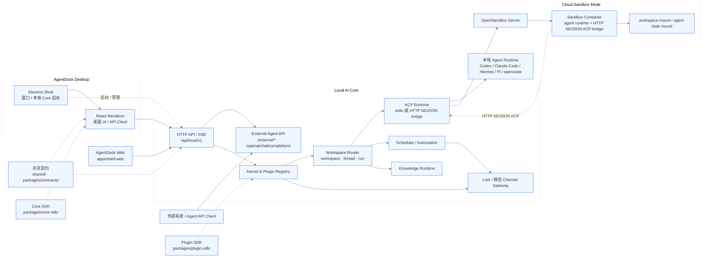

# AgentDock

基于 Local AI Core 的本地桌面 AI 工作台，内置原生 Feishu/Lark 网关与本地 ACP 会话运行时。

## 运行模式

- **桌面模式** — Electron 作为壳进程启动本地 Local AI Core，并加载桌面 UI
- **Local AI Core 模式** — 通过本地 `127.0.0.1:9831` 提供 runtime、chat、知识库与 Lark 网关能力

## 技术栈

React 19 · Electron 35 · Vite · TypeScript · Tailwind CSS · Zustand · i18next · react-markdown

## 系统架构

AgentDock 由 Electron 桌面壳、React/Web 渲染入口、Local AI Core、OpenSandbox 云端运行层和外部 Agent API 组成。Electron 只负责桌面生命周期、窗口和本地 core 启动；React/Web 通过 API client 访问 Local AI Core；Local AI Core 统一管理 workspace、thread、run、ACP 流式事件、channel 网关、定时任务、知识库、sandbox 启动与外部系统映射。云端 sandbox 模式通过 OpenSandbox 创建隔离容器，容器内 agent runtime 通过 HTTP NDJSON ACP bridge 与 Local AI Core 通信。外部系统可通过 `/api/local/v1/external/*` 创建或复用项目、发起 agent run，并通过 per-run SSE 订阅过程。



后台关键模块说明：

- [架构总览](docs/architecture/overview.md)
- [云端 Sandbox 与外部 Agent API](docs/architecture/cloud-sandbox-and-external-api.md)
- [Local AI Core Kernel 与插件装配](docs/architecture/local-core-kernel.md)
- [Workspace Router 路由层](docs/architecture/workspace-router.md)
- [ACP 会话运行时](docs/architecture/acp-protocol.md)
- [Channel Gateway 通道网关](docs/architecture/channel-gateways.md)
- [Scheduler 定时投递](docs/architecture/scheduled-delivery.md)
- [Knowledge Runtime 知识库运行时](docs/architecture/knowledge-runtime.md)

## New

### 2026-07-08

- Automation script packages are staged immutably with manifest-declared permissions, limits, and package-hash validation before approval workflows use them.

### 2026-06-21

- 桌面端统一通过 Core SDK 访问 Local AI Core，移除旧登录、项目、会话和 renderer API 双轨实现。
- Workspace Registry 成为项目配置权威数据源，并使用不随显示名称变化的稳定 workspace ID。
- Local AI Core HTTP API 增加统一请求校验与 400 错误语义；Agent 工具策略和知识库上下文统一由 Core 注入。
- 简化插件 capability/runtime 装配，拆分 bridge event stream 与知识库 domain contracts，并将类型检查纳入测试门禁。

### 2026-06-20

- 发布 AgentDock 0.1.56。
- 将 ACP `session/prompt` 超时从 15 分钟提高到 180 分钟，避免长任务（如凌晨定时归档）在 Agent 仍在流式输出时被硬切断。
- 修复 LocalCoreError 日志泄漏 `[object Object]` 的问题：`LocalCoreError` 构造器、`toLocalCoreErrorInfo`、`formatLogError` 三处入口都对 message 做了字符串化兜底，后续报错能记录到真实文本。

### 2026-06-19

- Lark/Feishu 与微信 channel 共用流式 inbound 附件存储接口，统一执行安全命名、大小限制、临时文件清理和原子落盘；微信文件下载改为流式 AES 解密，图片同时保留 Agent 可访问的落盘 URI（如适用）与多模态 Base64 数据。
- 发布 AgentDock 0.1.55。
- Lark/Feishu 收到的普通文件改为流式下载到工作区 `.agentdock/channel-uploads/lark/<instanceId>/`，并以本地路径传给 Agent，避免整文件读入内存并转换为 Base64；可通过平台选项 `downloads_dir` 覆盖目录。

### 2026-06-15

- Local AI Core 项目配置从 `runtime/config.toml` 迁移到 `runtime/local-core.db` 的 SQLite 持久化存储；旧 TOML 会在首次读取时导入，但后续不再回写。

### 2026-06-14

- 聊天输入框下方新增权限模式选择器，可在请求批准和完全访问之间切换，并随当前线程保存。
- 在 channel（Lark/Feishu/WeChat）里执行 `/agent use` 切换 Agent 时，选择会持久化到频道级偏好；后续 `/new` 创建新会话或重启后，新线程会自动继承该偏好。
- 修复定时任务（side-thread 模式）在创建调度线程时忽略频道级 Agent 偏好、总是回退到 workspace 默认 Agent 的问题；现在调度线程也按频道偏好选择 Agent，未设置时仍回退到 workspace 默认。
- 修复 `lac scheduler edit <id> --cron "..."` 只改 cron 时会清空定时任务 message/description 的问题。

### 2026-05-24

- 重构 Local AI Core 控制器：提取 ChannelService 与 ExternalService 为独立领域服务，Controller 缩至约 20 个方法，只保留生命周期、配置和事件编排。
- 拆分 Server 路由：102 路 switch 替换为 Map-based handler 调度，按 domain 提取为 14 个独立 handler 模块（runtime、runtimes、thread、workspace、security、task、scheduler、automation、knowledge、capabilities、provider、channel、external、openai），server.ts 从 1518 行缩减至 396 行。
- 修复 lac-cli 与 knowledge-skill-script 测试在沙箱环境下的兼容性：用全局 fetch mock 替代 TCP server.listen，EPERM 时优雅跳过。

### 2026-05-16

- 优化桌面与 Web 聊天界面视觉层级：统一会话列表、消息气泡、工具结果卡片和输入区样式，降低装饰噪音，提升长对话可读性。
- 统一工作区、概览、知识库、自动化、系统诊断、项目与会话列表页面的轻量面板、列表行、状态摘要和操作按钮样式。

### 2026-05-15

- 删除旧的 sandbox WebSocket proxy 兼容路径，云端 sandbox ACP 通信统一走 HTTP NDJSON bridge。
- 云端模式默认按 thread 复用 sandbox/ACP session，并增加 idle TTL 与阶段耗时日志，降低连续对话的首 token 延迟。
- 新增外部系统 API，可按 `user_id` 创建/复用项目、发起 agent run，并通过 per-run SSE 订阅回答过程；compose 模式下外部 workspace 默认持久化到 `AGENTDOCK_EXTERNAL_WORKSPACE_ROOT`。
- 新增 OpenAI Chat Completions 兼容入口 `/api/local/v1/openai/chat/completions`，通过 `metadata.user_id/project_id/thread_id` 映射外部身份，统一在 sandbox + yolo 模式下运行，并以 OpenAI chunk + `agentdock` 扩展字段流式返回思考、规划和工具进度。

### 2026-05-14

- Docker Compose 支持一键启动 AgentDock Web、Local AI Core 和 OpenSandbox，Core 容器默认通过 compose 内网访问 OpenSandbox。
- 工作区“云端模式”改为选择 Deployment Profile，项目只保存 Sandbox Provider / Runtime Image 引用、state scope 和资源覆盖项。
- Sandbox 模式下工作区路径作为 OpenSandbox host mount 使用，Core 启动代理不再要求该路径在 Core 容器内可见。
- 新增部署诊断接口与 `pnpm e2e:compose`，用于检查 Web/Core/OpenSandbox/Docker socket/工作区挂载和 sandbox 镜像注册。
- Docker Compose 云端模式支持通过 `AGENTDOCK_SANDBOX_STATE_HOST_ROOT` 将 agent state 持久化到 OpenSandbox 可挂载的宿主机路径。
- Sandbox 镜像改为通用 HTTP NDJSON ACP bridge：容器 HTTP 接口只转发标准 ACP JSON-RPC，和具体 agent runtime 解耦。
- 云端模式新增 execution 元数据、user/project/thread/run state scope、配置迁移和 Pi provider 规范化，便于多用户云端部署与运行排障。
- Provider 从工作区配置中独立为共享模块，工作区现在选择 provider，并支持旧项目内嵌 provider 自动迁移。

### 2026-05-12

- 新增 OpenSandbox 沙箱运行基础：提供 `docker-compose.yaml` 手动启动 OpenSandbox server，项目可开启 sandbox 模式后通过一次性容器运行 agent ACP server，并为 Pi sandbox 预留按用户/项目/Agent 持久化的 runtime state 挂载。
- 发布 AgentDock 0.1.44。
- 本地线程与 Lark/微信通道支持 `/help` 查看命令清单，支持 `/stop` 停止当前正在运行的任务。
- Local AI Core 新增结构化错误模型，ACP runtime 与微信通道会把启动失败、会话过期等问题回写为可诊断状态，并提供 diagnostics 错误摘要与 doctor 自检接口。
- 拆分超大测试文件，按 Local Core 路由、ACP 进度、Lark/Weixin channel gateway 等边界组织集成测试。

### 2026-05-11

- 发布 AgentDock 0.1.43。
- Lark channel 支持群聊 @ 机器人触发，默认忽略未 @ 的群消息，并在转发给 Agent 前清理机器人 mention、保留其他被 @ 用户名。
- 新增事件监控任务框架与 `lac monitor` 子命令，支持通过对话创建股票价格监控，触发后在 side-thread 分析并把过程回传到 channel。
- Lark、微信和桌面会话新增 `/new`、`/list`、`/switch`、`/history`、`/name`、`/search`、`/del` 会话命令；Lark 可通过会话卡片按钮切换和删除。
- 会话命令执行路径改为 effects 模型，并抽出 channel 共享 runtime；桌面 `/new`、`/switch` 现在会跟随激活目标会话。
- 发布 AgentDock 0.1.42。
- 线程级 `/mode` 与 `/agent` 命令处理抽取为独立 command service，ACP backend 只负责消息落库、bridge 回复和运行时调度，后续扩展 `/model`、`/knowledge` 等命令更容易复用。

### 2026-05-09

- 发布 AgentDock 0.1.41。
- 支持在线程内使用 `/agent` 命令查看、切换或重置当前 Agent；Lark、微信、桌面会话走同一条线程级配置路径。
- Lark channel 的 Markdown 表格回复改用 schema 2.0 卡片渲染，避免 Post `md` 消息吞掉表格行；超过飞书卡片表格上限时会自动降级为可见列表文本。
- Lark 文本消息发送新增独立渲染层，统一记录 `msgType`、渲染原因和表格数量，便于排查不同飞书消息格式的显示差异。
- 发布 AgentDock 0.1.40。
- Lark channel 的 Post 消息改用 `md` 元素承载 Markdown，避免工具参数代码块显示为灰底富文本块。
- 发布 AgentDock 0.1.39。
- Lark channel 的普通消息改用富文本 Post 发送，Markdown 与工具参数代码块现在会正常渲染。
- 发布 AgentDock 0.1.38。
- Lark channel 的工具调用和最终回答改为发送普通消息，工具参数直接放在 Markdown 代码块中，避免卡片 Markdown 渲染问题。

### 2026-05-08

- 发布 AgentDock 0.1.37。
- 定时任务的 Lark/微信投递现在会回传执行过程、工具进度和最终回答，并记录 delivery 状态便于排查。
- Lark/微信定时任务开始时会先发送任务标题，方便在 channel 中识别当前正在执行的任务。

### 2026-05-07

- 发布 AgentDock 0.1.36。
- 修复 Lark/微信定时任务在 Local AI Core 启动期提前捕获未初始化 workspace router，导致任务触发后无法发送到会话的问题。
- 发布 AgentDock 0.1.35。
- 发布 AgentDock 0.1.33。
- README 新增系统架构简要介绍与 Mermaid 架构图。
- 新增后台关键模块架构文档索引，并补充 kernel、router、channel gateway、knowledge runtime 与 ACP 流程图。
- Local AI Core 日志统一写入 `~/.agentdock/logs`，按 `sys/info/warn/error/debug` 分级文件记录并按文件大小轮动。

### 2026-05-06

- 新增 Hermes 原生 ACP runtime，可通过 `agent.type = "hermes"` 使用 `hermes acp` 对接本地会话运行时。
- Hermes runtime 默认以 YOLO 权限模式启动，先绕开 Hermes ACP 审批回调兼容问题，避免危险命令审批被提前拒绝。
- LAC 定时任务不再固化线程路由，改为按项目和 channel 投递目标动态解析当前线程，避免切换线程后 same-thread 任务失败。
- 收紧公开仓库前的 CI/CD 安全边界：Release 改为 tag-only，部署目标改由 GitHub Secrets 提供，Actions 依赖固定到 commit SHA。
- 项目采用 PolyForm Noncommercial License 1.0.0；商业使用需单独授权。
### 2026-05-04

- LAC 定时任务创建改由 Local Core 根据当前线程绑定解析 Lark/微信路由，agent 仍可直接使用 `lac scheduler add`，避免飞书创建的任务误落到 local route。
- LAC 定时任务运行默认使用 yolo 权限，自动执行工具调用，避免后台任务卡在权限确认上。

### 2026-05-03

- Lark 回传拆分为独立卡片：思考过程按阶段汇总发送，工具调用只发送一次，最终回答使用本轮独立卡片，避免覆盖旧消息。
- 新增内置 Pi Agent runtime，可通过 `agent.type = "pi"` 使用 bundled Pi coding agent 与 ACP adapter，无需额外安装 Claude Code、Codex 或 opencode。
- 新增 Lark 机器人扫码新建/绑定入口，基于官方 Device Flow 自动创建应用，扫码确认后自动感知、写回 App ID/App Secret，并立即激活到可发送消息状态。
- 支持同一个 workspace 绑定多个 Lark/微信 channel 实例，实例级隔离运行时、扫码绑定和消息路由。
- Lark 扫码创建机器人改用官方 OpenClaw 一键配置入口，默认带上 `card.action.trigger` 卡片回传交互回调，并自动启用卡片按钮处理。
- 优化 channel 工具与权限交互：Lark 工具结果默认隐藏详细输出，权限按钮点击完成后移除可重复点击按钮。
- 新增通用 channel outbound 文件回传能力，支持通过当前或指定 Lark/微信会话发送本地文件。
- LAC 定时任务 ID 改为短 ID 展示与操作，`list/info/edit/del/run` 可直接使用列表中的短 ID。
- 调整 Local AI Core channel 目录结构，将 Lark、微信实现隔离到独立模块，并保留公共文件处理能力。
- app、web、Lark/微信 channel 支持线程级 `/mode` 命令，`/mode yolo` 可长期切换为跳过工具权限申请，直到 `/mode default` 恢复。

### 2026-05-02

- 新增通用 channel 图片消息到 ACP 多模态传递。
- 新增 Codex Agent ACP 支持，并接入 runtime 检测与交互权限流程。

## 快速开始

```bash
pnpm install
pnpm dev          # 启动开发环境（Vite + Electron）
pnpm start:core   # 启动已构建的 Local AI Core
```

## Docker Compose

```bash
docker compose up --build
```

默认会启动 AgentDock Web、Local AI Core 和 OpenSandbox：

| 服务 | 地址 |
|---|---|
| AgentDock Web | `http://127.0.0.1:14173` |
| Local AI Core | `http://127.0.0.1:9831/api/local/v1` |
| OpenSandbox | `http://127.0.0.1:8080` |

Compose 模式下 Core 容器通过 `http://opensandbox-server:8080` 访问 OpenSandbox；桌面本地模式仍默认使用 `http://127.0.0.1:8080`。Core 数据默认保存在 Docker volume `agentdock-core-data`。

## macOS 打开应用

如果安装后提示应用无法打开，可先清除隔离属性再启动：

```bash
xattr -cr /Applications/AgentDock.app
```

## 常用命令

| 命令 | 说明 |
|---|---|
| `pnpm dev` | 启动开发环境 |
| `pnpm dev:web` | 仅启动 Web 开发服务器 |
| `pnpm dev:core` | 构建并启动 Local AI Core |
| `pnpm build` | 完整生产构建 |
| `pnpm build:renderer` | 仅构建 React 前端 |
| `pnpm build:electron` | 仅构建 Electron 主进程 |
| `pnpm build:core` | 构建 Local AI Core 产物 |
| `pnpm start:core` | 运行已构建的 Local AI Core |
| `pnpm start:prod` | 运行已构建的 Electron 应用 |
| `pnpm e2e:smoke` | E2E 冒烟测试 |

## 环境变量

| 变量 | 说明 |
|---|---|
| `AI_WORKSTATION_USER_DATA_DIR` | 用户数据目录 |
| `AI_WORKSTATION_SMOKE_OUTPUT` | 冒烟测试输出路径 |
| `AI_WORKSTATION_SMOKE_SCENARIO` | 冒烟测试场景 |
| `AI_WORKSTATION_FORCE_RUNTIME_STATUS_ERROR` | 强制触发运行时状态错误，用于测试 |
| `AI_WORKSTATION_DEV_SERVER_URL` | Electron 开发模式连接的前端地址 |
| `OPEN_SANDBOX_API_KEY` | OpenSandbox API key，compose 默认 `agentdock-local` |
| `AGENTDOCK_OPENSANDBOX_SERVER_URL` | OpenSandbox server 地址，容器内默认可设为 `http://opensandbox-server:8080` |
| `AGENTDOCK_LOG_DIR` | 日志目录，默认 `~/.agentdock/logs` |
| `AGENTDOCK_LOG_MAX_BYTES` | 单个日志文件轮动大小，默认 10MB |
| `AGENTDOCK_LOG_MAX_FILES` | 单个日志保留的轮动文件数，默认 5 |

## 项目结构

```
├── electron/        # Electron 主进程壳
├── apps/            # 未来的桌面/Web 前端壳目录
├── packages/        # contracts、core-sdk、knowledge-api
├── services/        # Local AI Core
├── src/             # React 渲染进程
│   ├── pages/       # 页面组件
│   ├── components/  # UI 组件库
│   ├── api/         # API 客户端
│   ├── store/       # Zustand 状态管理
│   └── types/       # 类型定义
├── shared/          # 跨进程共享类型
└── scripts/         # 构建/启动脚本
```

## License

AgentDock is source-available under the [PolyForm Noncommercial License 1.0.0](./LICENSE.md). Commercial use requires a separate commercial license.
