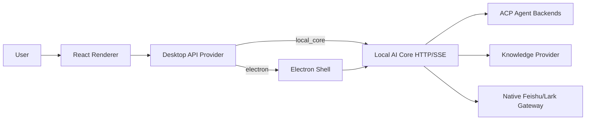

# AI-WorkStation Architecture

## Summary

AI-WorkStation now runs as a Local AI Core-first desktop app:

- Electron is only the desktop shell
- Local AI Core owns runtime, threads, streaming, knowledge, and native Lark ingress
- The renderer talks to Local AI Core APIs directly or through the Electron shell

There is no `cc-connect` runtime, management API, or bridge compatibility path in the active architecture.

## Top-Level Flow

## Main Layers

### Renderer

- lives in `src/`
- renders Dashboard, Workspace, Threads, Knowledge
- consumes Local AI Core runtime and SSE events

### Electron

- lives in `electron/`
- opens the desktop window
- starts Local AI Core as a local companion process
- does not own chat routing or platform gateway logic

### Local AI Core

- lives in `services/local-ai-core/`
- exposes `/api/local/v1/*`
- owns thread routing, SQLite persistence, ACP streaming, and Lark ingress

### Shared Packages

- `packages/contracts`: shared API and data contracts
- `packages/core-sdk`: Local AI Core browser client
- `packages/knowledge-api`: knowledge abstraction and `ai_vector` implementation

## Runtime Model

The renderer uses one of two local providers:

- `electron`: desktop shell is available
- `local_core`: direct Local AI Core access is available

Both providers target the same Local AI Core API surface.
