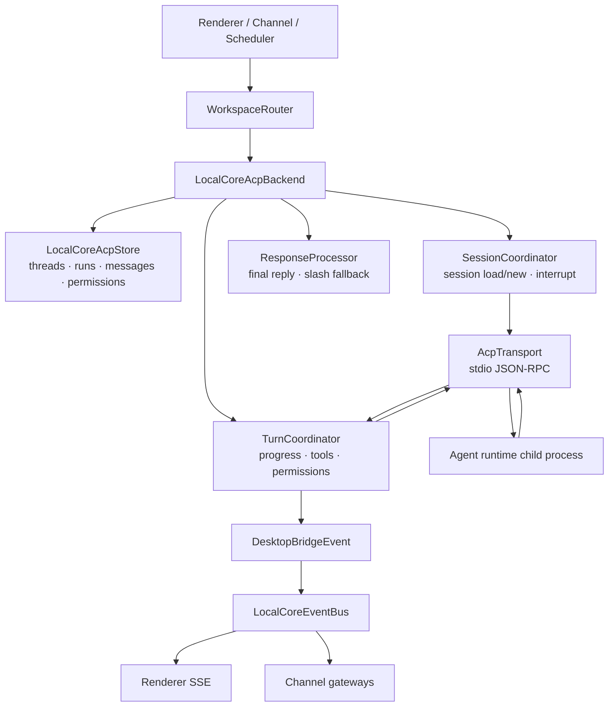
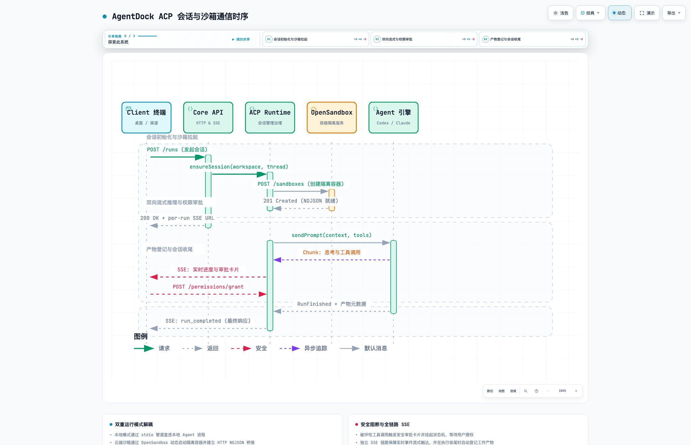

# ACP Protocol Fields And Examples

This document describes the ACP fields AgentDock currently sends, receives, stores, and forwards. It is implementation-facing documentation for the Local AI Core ACP backend, not a full upstream ACP specification.

## Module Flow

ACP is the runtime bridge between Local AI Core threads and agent child processes. `WorkspaceRouter` owns entry into the backend, `LocalCoreAcpBackend` wires the store and coordinators, and `LocalCoreAcpTransport` owns the stdio JSON-RPC stream.



<p align="center">
  <picture>
    <source media="(prefers-color-scheme: dark)" srcset="acp-session-flow.dark.png">
    
  </picture>
</p>

> 💡 **交互式时序图**：可在浏览器中打开 [acp-session-flow.html](acp-session-flow.html)，体验动态事件流向轨迹、分步引导导览与深浅色切换。


## Scope

AgentDock uses ACP over newline-delimited JSON-RPC 2.0 on a child process stdio stream. One JSON object is written per line.

The integration has three protocol surfaces:

- AgentDock to ACP runtime: JSON-RPC requests sent to the agent process.
- ACP runtime to AgentDock: JSON-RPC responses, notifications, and permission requests emitted by the agent process.
- AgentDock internal bridge: `DesktopBridgeEvent` objects emitted from Local AI Core to renderer and channel gateways.

## Transport Envelope

Requests from AgentDock to the runtime:

```json
{
  "jsonrpc": "2.0",
  "id": 1,
  "method": "session/prompt",
  "params": {}
}
```

Responses from the runtime to AgentDock:

```json
{
  "jsonrpc": "2.0",
  "id": 1,
  "result": {}
}
```

Runtime requests to AgentDock:

```json
{
  "jsonrpc": "2.0",
  "id": 7,
  "method": "session/request_permission",
  "params": {}
}
```

Runtime notifications to AgentDock:

```json
{
  "jsonrpc": "2.0",
  "method": "session/update",
  "params": {}
}
```

Errors follow the JSON-RPC error envelope:

```json
{
  "jsonrpc": "2.0",
  "id": 7,
  "error": {
    "code": -32601,
    "message": "Unsupported ACP client method: example/method"
  }
}
```

## AgentDock To Runtime

### `initialize`

Sent once after the runtime process is spawned.

Fields:

- `protocolVersion`: number. Currently `1`.
- `clientCapabilities.fs.readTextFile`: boolean. Currently `false`.
- `clientCapabilities.fs.writeTextFile`: boolean. Currently `false`.
- `clientCapabilities.terminal`: boolean. Currently `false`.
- `clientInfo.name`: string. Currently `agentdock`.
- `clientInfo.title`: string. Currently `AgentDock`.
- `clientInfo.version`: string.

Example:

```json
{
  "jsonrpc": "2.0",
  "id": 1,
  "method": "initialize",
  "params": {
    "protocolVersion": 1,
    "clientCapabilities": {
      "fs": {
        "readTextFile": false,
        "writeTextFile": false
      },
      "terminal": false
    },
    "clientInfo": {
      "name": "agentdock",
      "title": "AgentDock",
      "version": "0.1.0"
    }
  }
}
```

Expected response fields:

- `agentCapabilities.loadSession`: optional boolean. When true, AgentDock may attempt session load through the session coordinator.

Example response:

```json
{
  "jsonrpc": "2.0",
  "id": 1,
  "result": {
    "agentCapabilities": {
      "loadSession": true
    }
  }
}
```

### `session/prompt`

Sent for each user message.

Fields:

- `sessionId`: string. Runtime session id returned by session creation/load.
- `messageId`: string. AgentDock-generated UUID for the prompt.
- `prompt`: array of content blocks.
- `prompt[].type`: string. Currently `text`.
- `prompt[].text`: string. User message text.

Example:

```json
{
  "jsonrpc": "2.0",
  "id": 2,
  "method": "session/prompt",
  "params": {
    "sessionId": "acp-session-1",
    "messageId": "147a7d2e-4f8b-4e87-9b13-1ef917e86581",
    "prompt": [
      {
        "type": "text",
        "text": "List files on my Desktop."
      }
    ]
  }
}
```

Expected response fields:

- `stopReason`: optional string. Stored only as runtime result context; visible reply content is assembled from streamed updates.

Example response:

```json
{
  "jsonrpc": "2.0",
  "id": 2,
  "result": {
    "stopReason": "end_turn"
  }
}
```

### Permission Response

Sent as a JSON-RPC response to a runtime `session/request_permission` request. AgentDock does not send this as a method call; it responds using the original permission request id.

Fields:

- `result.outcome.outcome`: string. Currently `selected` when the user chooses an option.
- `result.outcome.optionId`: string. The runtime-provided option id selected by the user.

Example:

```json
{
  "jsonrpc": "2.0",
  "id": 7,
  "result": {
    "outcome": {
      "outcome": "selected",
      "optionId": "allow-once"
    }
  }
}
```

Automatic cancellation response:

```json
{
  "jsonrpc": "2.0",
  "id": 7,
  "result": {
    "outcome": {
      "outcome": "cancelled"
    }
  }
}
```

AgentDock uses cancellation when there is no active run, or when a duplicate scheduler creation request is blocked by the current run policy.

## Runtime To AgentDock

### `session/update`

All supported runtime progress notifications use:

```json
{
  "jsonrpc": "2.0",
  "method": "session/update",
  "params": {
    "update": {
      "sessionUpdate": "agent_message_chunk"
    }
  }
}
```

AgentDock ignores `session/update` while `loadReplayMode` is active.

#### `agent_message_chunk`

Streams assistant-visible text.

Fields:

- `params.update.sessionUpdate`: string. `agent_message_chunk`.
- `params.update.content.type`: string. Currently handled when `text`.
- `params.update.content.text`: string. Text chunk.

Example:

```json
{
  "jsonrpc": "2.0",
  "method": "session/update",
  "params": {
    "update": {
      "sessionUpdate": "agent_message_chunk",
      "content": {
        "type": "text",
        "text": "The Desktop contains these files:"
      }
    }
  }
}
```

AgentDock behavior:

- Appends chunk text to the current turn assistant buffer.
- Emits `preview_start` for the first chunk.
- Emits `update_message` for later chunks.
- On prompt completion, persists the processed assistant response as a final assistant message.

#### `agent_thought_chunk`

Streams model thought/progress text.

Fields:

- `params.update.sessionUpdate`: string. `agent_thought_chunk`.
- `params.update.content.type`: string. Currently handled when `text`.
- `params.update.content.text`: string. Thought chunk.

Example:

```json
{
  "jsonrpc": "2.0",
  "method": "session/update",
  "params": {
    "update": {
      "sessionUpdate": "agent_thought_chunk",
      "content": {
        "type": "text",
        "text": "I should inspect the Desktop directory."
      }
    }
  }
}
```

AgentDock behavior:

- Prefixes the accumulated thought content with `💭 `.
- Upserts a durable progress message using the current turn thought message id.
- Emits `preview_start` or `update_message` with a stable thought preview handle.

#### `tool_call`

Announces a tool invocation. This notification starts a pending tool card but does not emit a visible card until a tool update arrives or the pending call is flushed before later assistant text/thought/plan output.

Fields:

- `params.update.sessionUpdate`: string. `tool_call`.
- `params.update.title`: optional string. Tool display name. Defaults to `Running tool`.

Example:

```json
{
  "jsonrpc": "2.0",
  "method": "session/update",
  "params": {
    "update": {
      "sessionUpdate": "tool_call",
      "title": "Terminal"
    }
  }
}
```

AgentDock behavior:

- Flushes any previous pending tool call.
- Stores `pendingToolCallTitle`.
- Creates a stable `pendingToolCallId` in the form `${runId}-tool-${sequence}`.
- Clears `pendingToolCallDetail`.

#### `tool_call_update`

Updates the current tool card.

Fields:

- `params.update.sessionUpdate`: string. `tool_call_update`.
- `params.update.title`: optional string. Tool invocation detail or generic `Tool update`.
- `params.update.status`: optional string. Common values are `running`, `completed`, `failed`, `error`, `cancelled`, or `canceled`.
- `params.update.content`: optional array of content entries.
- `params.update.content[].type`: string. AgentDock reads entries whose `type` is `content`.
- `params.update.content[].content.type`: string. AgentDock reads nested content whose type is `text`.
- `params.update.content[].content.text`: string. Tool output text.

Running example:

```json
{
  "jsonrpc": "2.0",
  "method": "session/update",
  "params": {
    "update": {
      "sessionUpdate": "tool_call_update",
      "title": "ls -la ~/Desktop/",
      "status": "running"
    }
  }
}
```

Completed example:

```json
{
  "jsonrpc": "2.0",
  "method": "session/update",
  "params": {
    "update": {
      "sessionUpdate": "tool_call_update",
      "title": "Tool update",
      "status": "completed",
      "content": [
        {
          "type": "content",
          "content": {
            "type": "text",
            "text": "total 0\ndrwx------@ 11 user staff 352 ."
          }
        }
      ]
    }
  }
}
```

AgentDock behavior:

- Skips empty generic running updates where title is empty or `Tool update`, status is `running`, and content is empty.
- Stores non-terminal detail titles as `pendingToolCallDetail`.
- For terminal statuses, reuses the stored detail when the update title is generic.
- Upserts a progress message using `pendingToolCallId` when available.
- Emits a `reply` bridge event with `messageId` set to the stable tool id.
- Clears pending tool fields when the status is terminal.

The emitted progress content is text-formatted as:

```text
🔧 Terminal: ls -la ~/Desktop/ - completed - total 0
```

When a permission request supplied richer tool detail, that detail may include structured fields such as `parameters`.

#### `plan`

Streams plan/progress entries.

Fields:

- `params.update.sessionUpdate`: string. `plan`.
- `params.update.entries`: array.
- `params.update.entries[].content`: string.

Example:

```json
{
  "jsonrpc": "2.0",
  "method": "session/update",
  "params": {
    "update": {
      "sessionUpdate": "plan",
      "entries": [
        { "content": "Inspect the Desktop directory" },
        { "content": "Summarize the visible files" }
      ]
    }
  }
}
```

AgentDock behavior:

- Joins non-empty entries with ` | `.
- Persists and emits one progress message prefixed with `💭 `.

### `session/request_permission`

Runtime request asking AgentDock to let the user choose a permission option.

Fields:

- `id`: JSON-RPC request id. Required so AgentDock can respond with the selected option.
- `method`: string. `session/request_permission`.
- `params.toolCall`: optional object. Used to build the approval description, permission card, and tool-card call detail.
- `params.toolCall.title`: optional string.
- `params.toolCall.content`: optional array of content entries. AgentDock extracts text from direct `text` fields and nested `{ content: { type: "text", text } }` fields.
- `params.toolCall.parameters`: optional value. Included in the displayed tool call detail when present.
- `params.toolCall.parameter`: optional value. Included in the displayed tool call detail when present.
- `params.toolCall.params`: optional value. Included in the displayed tool call detail when present.
- `params.toolCall.arguments`: optional value. Included in the displayed tool call detail when present.
- `params.toolCall.args`: optional value. Included in the displayed tool call detail when present.
- `params.toolCall.input`: optional value. Included in the displayed tool call detail when present.
- `params.options`: array of selectable options.
- `params.options[].optionId`: string. Required.
- `params.options[].name`: optional string.
- `params.options[].kind`: optional string. Normalized to `allow all`, `allow`, or `deny` for UI actions.

Example:

```json
{
  "jsonrpc": "2.0",
  "id": 7,
  "method": "session/request_permission",
  "params": {
    "toolCall": {
      "title": "Terminal",
      "parameters": {
        "command": "ls -la ~/Desktop/",
        "cwd": "/Users/example"
      }
    },
    "options": [
      {
        "optionId": "allow-once",
        "name": "Allow",
        "kind": "allow_once"
      },
      {
        "optionId": "reject-once",
        "name": "Deny",
        "kind": "reject_once"
      }
    ]
  }
}
```

AgentDock behavior:

- Creates or updates the pending permission state for the current run.
- Creates a durable approval request when approval persistence is available.
- Emits a `buttons` bridge event for the renderer and channel gateways.
- Stores formatted tool call detail in `pendingToolCallDetail` so a later terminal `tool_call_update` can retain command parameters.
- If the request is an extra scheduler creation already handled in this run, AgentDock returns `cancelled` and emits a progress message explaining the duplicate block.

Formatted permission/tool detail example:

```text
Terminal

parameters:
{
  "command": "ls -la ~/Desktop/",
  "cwd": "/Users/example"
}
```

## Internal Bridge Events

`DesktopBridgeEvent` is AgentDock's internal streaming event shape. It is emitted by Local AI Core and consumed by the renderer and channel gateways.

Common fields:

- `type`: event type.
- `sessionKey`: optional string. Bridge session key, for example `localcore-acp:project-1:thread-id`.
- `replyCtx`: optional string. Current run id.
- `previewHandle`: optional string. Stable id for streaming preview updates.
- `content`: optional string. Display text.
- `messageId`: optional string. Stable message id for upserted progress messages, especially tool cards.
- `ok`: optional boolean.
- `error`: optional string.
- `card`: optional object.
- `buttons`: optional unknown legacy button payload.
- `buttonRows`: optional two-dimensional button array.

Supported event types:

- `register_ack`: bridge registration acknowledgement.
- `typing_start`: run has started or resumed.
- `typing_stop`: run has stopped streaming.
- `preview_start`: create a streaming preview message.
- `update_message`: update an existing streaming preview message.
- `delete_message`: delete a preview message by `previewHandle`.
- `reply`: append or upsert a message. When `messageId` exists, the renderer upserts by id.
- `buttons`: show action buttons, usually for permission.
- `card`: show a generic card.
- `status`: show runtime status text.

Tool card bridge event example:

```json
{
  "type": "reply",
  "sessionKey": "localcore-acp:project-1:thread-1",
  "replyCtx": "run:thread-1:1714280000000",
  "messageId": "run:thread-1:1714280000000-tool-1",
  "content": "🔧 Terminal: ls -la ~/Desktop/ - completed - total 0"
}
```

Permission bridge event example:

```json
{
  "type": "buttons",
  "sessionKey": "localcore-acp:project-1:thread-1",
  "replyCtx": "run:thread-1:1714280000000",
  "content": "等待工具确认\n\nTerminal\n\n请选择一个选项继续执行。\n\n若按钮没有显示，请直接回复：allow all / allow / deny",
  "buttonRows": [
    [
      {
        "text": "allow",
        "data": "perm:allow"
      },
      {
        "text": "deny",
        "data": "perm:deny"
      }
    ]
  ]
}
```

## End-To-End Example

This sequence lists a Desktop directory and requires permission.

1. AgentDock sends `session/prompt`.

```json
{
  "jsonrpc": "2.0",
  "id": 2,
  "method": "session/prompt",
  "params": {
    "sessionId": "acp-session-1",
    "messageId": "prompt-1",
    "prompt": [
      {
        "type": "text",
        "text": "List files on my Desktop."
      }
    ]
  }
}
```

2. Runtime emits thought.

```json
{
  "jsonrpc": "2.0",
  "method": "session/update",
  "params": {
    "update": {
      "sessionUpdate": "agent_thought_chunk",
      "content": {
        "type": "text",
        "text": "I need to inspect the Desktop directory."
      }
    }
  }
}
```

3. Runtime announces tool.

```json
{
  "jsonrpc": "2.0",
  "method": "session/update",
  "params": {
    "update": {
      "sessionUpdate": "tool_call",
      "title": "Terminal"
    }
  }
}
```

4. Runtime requests permission.

```json
{
  "jsonrpc": "2.0",
  "id": 7,
  "method": "session/request_permission",
  "params": {
    "toolCall": {
      "title": "Terminal",
      "parameters": {
        "command": "ls -la ~/Desktop/"
      }
    },
    "options": [
      {
        "optionId": "allow-once",
        "name": "Allow",
        "kind": "allow_once"
      }
    ]
  }
}
```

5. User chooses allow; AgentDock responds.

```json
{
  "jsonrpc": "2.0",
  "id": 7,
  "result": {
    "outcome": {
      "outcome": "selected",
      "optionId": "allow-once"
    }
  }
}
```

6. Runtime emits completed tool result.

```json
{
  "jsonrpc": "2.0",
  "method": "session/update",
  "params": {
    "update": {
      "sessionUpdate": "tool_call_update",
      "title": "Tool update",
      "status": "completed",
      "content": [
        {
          "type": "content",
          "content": {
            "type": "text",
            "text": "total 0\ndrwx------@ 11 user staff 352 ."
          }
        }
      ]
    }
  }
}
```

7. Runtime completes the prompt.

```json
{
  "jsonrpc": "2.0",
  "id": 2,
  "result": {
    "stopReason": "end_turn"
  }
}
```

## Persistence And Ordering Notes

- User messages are appended before `session/prompt` is sent.
- Assistant final messages are appended after prompt completion and response processing.
- Thought progress messages are upserted by stable thought message id.
- Tool progress messages are upserted by stable tool message id when a pending tool id exists.
- The renderer sorts loaded history by stored message order before timestamp. This keeps history stable when an upsert updates a message timestamp.
- Permission button responses are not echoed as user chat messages for interactive permission prompts.
