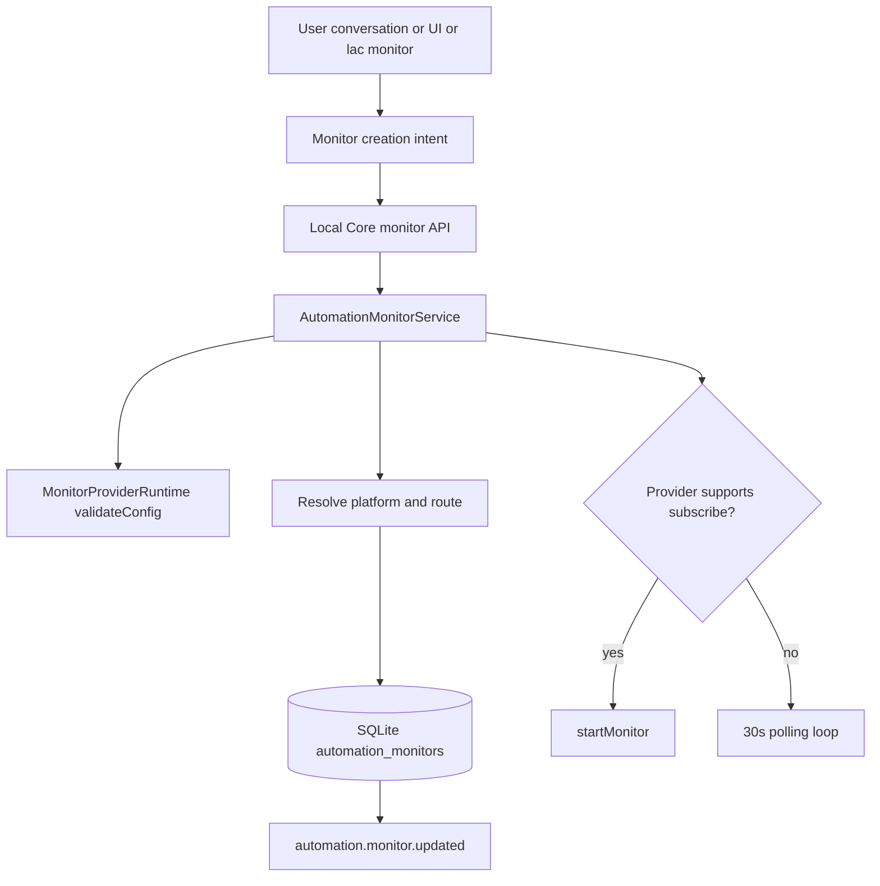
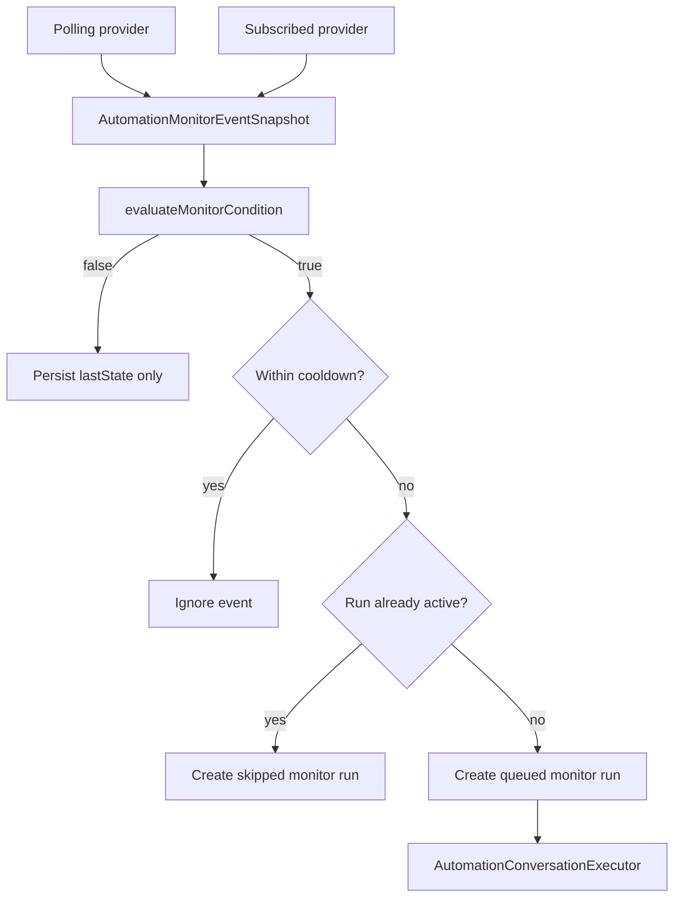
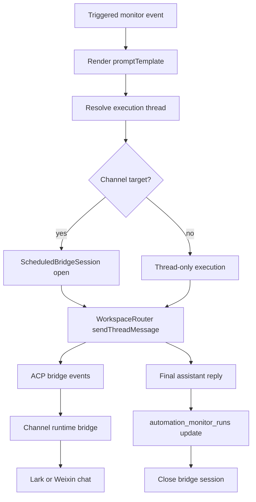

# Automation Monitor Architecture

> Compatibility status: monitors are exposed through the unified [Conditional Automation](conditional-automation.md) model. This document describes the legacy provider-event facade and its channel bridge details; new cross-source state and security invariants belong to the Automation engine.

This document describes how Local AI Core creates, evaluates, executes, and delivers automation monitors. Monitors are similar to scheduled jobs in that they start background work and can stream results back to a channel, but their trigger source is an observed event rather than a time expression.

## Ownership

Automation monitor state belongs to Local AI Core. Renderer, CLI, channel slash commands, and ACP conversations can request monitor operations, but they do not own provider execution, condition evaluation, route resolution, or delivery lifecycle. Provider event collection stays with the monitor plugin/runtime; activation admission, condition state, and action decisions are owned by the unified Automation services.

| Area | Owner | Responsibility |
| --- | --- | --- |
| Contracts | `packages/contracts/src/local-core.ts` | Public monitor, run, condition, API, and SSE event shapes. |
| Plugin protocol | `packages/plugin-sdk/src/index.ts` | `MonitorPlugin`, `MonitorCapability`, and `MonitorProviderRuntime` definitions. |
| Built-in provider | `src/plugins/builtin/monitor-stock-plugin.ts` | Registers the stock quote monitor capability and provider runtime. |
| Application service | `src/automation/automation-monitor-service.ts` | Create/update/delete monitors, start provider subscriptions, poll providers, evaluate conditions, throttle runs, and emit monitor events. |
| Repository | `src/automation/automation-monitor-repository.ts` | Facade over Local Core ACP store monitor methods. |
| Condition evaluator | `src/automation/condition-evaluator.ts` | Evaluate simple metric comparisons and restricted boolean expressions. |
| Conversation executor | `src/automation/automation-conversation-executor.ts` | Turn a triggered monitor event into an ACP thread run and optional channel bridge delivery. |
| Persistence | `src/acp/store/automation-monitor-store.ts` | Persist `automation_monitors` and `automation_monitor_runs`. |
| Channel gateway | Lark/Weixin channel runtime | Send monitor notices, progress, permission cards, and final replies through the existing bridge path. |

## Creation Flow



Monitor creation persists a declarative monitor definition, not arbitrary generated code. The conversation or CLI should produce structured input:

- `title`
- `sourceType`
- `sourceConfig`
- `condition`
- `promptTemplate`
- `threadId` or explicit `platform` + `route`
- `executionMode`
- `cooldownMs`
- `enabled`

Local AI Core resolves the delivery target with the same route invariants as scheduled delivery:

- If `platform` and `route` are provided, the route is normalized and `threadId` is stripped from the persisted route.
- If a `threadId` is provided and it has a `platform_thread_bindings` row, the monitor targets that channel route.
- If no channel binding is available, the monitor is local with `platform: 'local'` and `route.type: 'local.thread'`.

The important boundary is that provider code is supplied by plugins. A conversation may generate the monitor configuration and prompt template, but it should not generate runtime polling or event-subscription code inside the user's task.

## Provider Plugin Protocol

Monitor sources are plugin-provided. A monitor plugin declares one or more capabilities:

```ts
export interface MonitorCapability {
  id: string;
  sourceTypes: string[];
  modes?: Array<'poll' | 'subscribe'>;
  enabled?: boolean;
  displayName?: string;
}
```

The runtime provider owns source-specific validation and event collection:

```ts
export interface MonitorProviderRuntime {
  readonly sourceType: string;
  readonly modes: Array<'poll' | 'subscribe'>;
  validateConfig?(config: Record<string, unknown>): void;
  poll?(input: {
    monitorId: string;
    workspaceId: string;
    sourceConfig: Record<string, unknown>;
    lastState?: Record<string, unknown>;
  }): Promise<MonitorEvent | null> | MonitorEvent | null;
  startMonitor?(input: {
    monitorId: string;
    workspaceId: string;
    sourceConfig: Record<string, unknown>;
    lastState?: Record<string, unknown>;
    emit: (event: MonitorEvent) => void | Promise<void>;
  }): Promise<MonitorProviderHandle> | MonitorProviderHandle;
}
```

Provider modes mean:

- `poll`: Local AI Core calls `provider.poll(...)` from the monitor service loop. Current loop interval is 30 seconds.
- `subscribe`: Local AI Core calls `provider.startMonitor(...)` once per enabled monitor. The provider owns external subscription state and emits events when they arrive.

Providers should emit normalized `AutomationMonitorEventSnapshot` objects. The event snapshot is the only input to condition evaluation and prompt rendering.

The current built-in stock monitor is registered by `builtin.monitor-stock` with source type `stock.quote`. It is intentionally implemented as a provider plugin so future monitor sources can be added without changing the monitor service state machine.

## Trigger Flow



Condition evaluation supports two forms:

- Simple comparison: `metric`, `operator`, `value`
- Restricted expression: comparisons joined by `&&` and `||`

Examples:

```txt
latestPrice > 200
abs_change_percent >= 3 && symbol == "AAPL"
```

The evaluator deliberately supports a small expression language instead of arbitrary JavaScript. This keeps monitor definitions portable, serializable, and safe to create from conversation.

When a condition is false, the monitor still updates `lastState` so the next poll can compare against the latest observed source state. When a condition is true, `cooldownMs` prevents repeated triggers for noisy sources.

## Execution And Delivery Flow



`AutomationConversationExecutor` shares the scheduled delivery bridge instead of adding a separate monitor-specific channel delivery stack. This keeps process messages, tool progress, permission cards, and final replies consistent with scheduled jobs.

Execution behavior:

- `same-thread` first tries to reuse the current channel binding thread or route thread.
- `side-thread` and fallback execution use a dedicated thread title such as `[Monitor] <title>` or `[Monitor:lark] <title>`.
- Channel monitor runs use `deliveryMode: 'bridge-stream'`.
- Local monitor runs use `deliveryMode: 'thread-only'`.
- Monitor ACP runs use `permissionMode: 'bypassPermissions'`.
- Runtime environment includes channel context when available: `LOCAL_AI_PLATFORM`, `LOCAL_AI_ROUTE_TYPE`, `LOCAL_AI_PLATFORM_INSTANCE_ID`, `LOCAL_AI_CHAT_ID`, and `LOCAL_AI_PLATFORM_USER_ID`.

The bridge session sends a leading monitor notice before ACP execution. Stock quote monitors use a market-oriented icon, while generic monitor sources use a notification icon.

## State Model

Persisted monitor state lives in SQLite:

- `automation_monitors`
  - monitor definition, source config, condition, prompt template, route, execution mode, enabled flag, cooldown, last state, and latest status.
- `automation_monitor_runs`
  - per-trigger lifecycle, event snapshot, ACP `threadId` / `runId`, delivery mode/status/error, and latest bridge activity timestamp.

Runtime-only state lives in `AutomationMonitorService`:

- `runningMonitors`
  - prevents concurrent execution of the same monitor.
- `subscriptionHandles`
  - tracks active provider subscriptions and stops them when a monitor is disabled, deleted, or service stops.
- `pollInFlight`
  - prevents overlapping polling ticks.

SSE events are emitted through the Local Core event bus:

- `automation.monitor.updated`
- `automation.monitor.run.updated`

These events let renderer and channel-facing surfaces refresh monitor lists, run status, and last execution result without owning monitor state.

## Conversation-Created Monitors

Conversation-created monitors should use the same API as UI and CLI creation. The model should produce structured monitor input, not source-code patches.

Recommended generation strategy:

1. Identify the intended `sourceType`.
2. Match it against registered monitor capabilities.
3. Generate `sourceConfig` using that provider's documented schema.
4. Generate a safe condition expression or simple comparison.
5. Generate a `promptTemplate` that references event fields such as `{{subject}}`, `{{latestPrice}}`, `{{change_percent}}`, or `{{timestamp}}`.
6. Resolve channel route from the current thread when available.
7. Call Local Core monitor creation.

If no provider supports the requested source type, the system should ask for or install a plugin rather than generating ad hoc monitor code.

## Change Rules

When changing monitor behavior:

- Add or update coverage in `tests/electron/automation-monitor.test.ts` and `tests/electron/lac-cli.test.ts`.
- Verify both polling and subscription providers when provider lifecycle changes.
- Verify route resolution from channel-bound threads and local fallback behavior.
- Verify `same-thread` and `side-thread` execution behavior.
- Verify bridge-stream delivery emits process updates and final replies through the channel gateway.
- Keep condition evaluation restricted; do not introduce arbitrary JavaScript execution for conversation-created monitors.
- Keep source-specific polling/subscription logic in provider plugins, not in `AutomationMonitorService`.
- Keep monitor persistence behind `LocalCoreAcpStore` / `AutomationMonitorRepository`; do not let controllers or plugins write SQLite tables directly.
