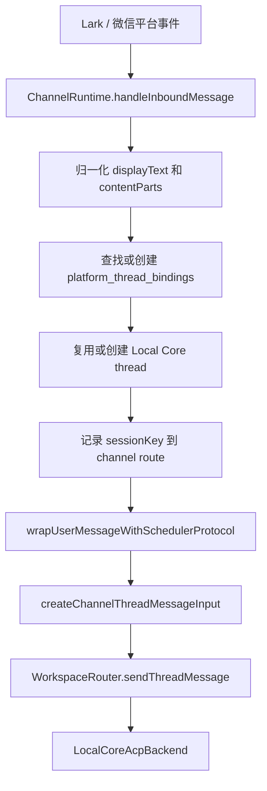
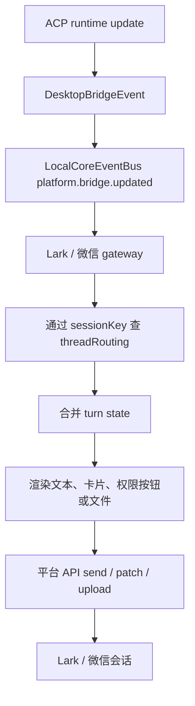
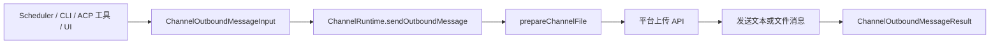

# Channel Gateway Architecture

Channel gateway 负责把平台消息转换成 Local AI Core 的统一 channel contract，并把 ACP bridge event 渲染回平台。当前内置平台为 Lark 和微信。

## 职责边界

| 模块 | 关键文件 | 职责 |
| --- | --- | --- |
| Lark gateway | `services/local-ai-core/src/channel/lark/local-core-lark-gateway.ts` | Lark 绑定、扫码注册、事件入口、卡片回传、文件发送。 |
| Weixin gateway | `services/local-ai-core/src/channel/weixin/local-core-weixin-gateway.ts` | 微信登录状态、长轮询入口、消息去重、分段回传、文件发送。 |
| Shared content | `services/local-ai-core/src/channel/shared/content.ts` | 将平台 inbound parts 封装成 thread message input。 |
| Shared file utils | `services/local-ai-core/src/channel/shared/file-utils.ts` | 统一准备 outbound 文件发送。 |
| Channel contracts | `packages/contracts/src/index.ts` | `ChannelInboundMessageContent`、`ChannelOutboundMessageInput`、`ChannelRoute` 等共享契约。 |

## Inbound 消息流程

Lark/Feishu 普通文件使用流式下载，默认落到工作区 `.agentdock/channel-uploads/lark/<instanceId>/`，再通过 `ChannelInboundContentPart.path` 交给 ACP。平台配置的 `downloads_dir` 可覆盖该目录；相对路径以工作区根目录为基准。图片仍保留多模态 Base64 数据形式。

## Outbound 回传流程

ACP runtime 的流式状态先转成 `DesktopBridgeEvent`，再由 channel gateway 按平台能力渲染。

## Outbound 文件与定时投递

定时任务有两种 channel 相关路径：

- Lark/微信定时任务执行期使用 `ChannelRuntime.registerScheduledThreadBridge`，把 scheduler 解析出的 delivery route 临时绑定到 ACP `sessionKey`。后续过程消息、工具进度、权限卡片和最终回答都复用 gateway 的 bridge 渲染、节流、patch 和发送逻辑。
- bridge 注册完成后，scheduler 会先通过 `status` bridge event 发送 `⏰ <任务描述>`，再启动 ACP 执行；gateway 应把这条消息当作普通过程状态处理。
- 文件、图片或显式 channel send 仍走 `ChannelOutboundMessageInput` / `sendOutboundMessage`。scheduler 不应绕过 gateway 直接调用平台 API。

side-thread 定时任务的按钮上下文必须使用本次执行 thread id，而不是原 `platform_thread_bindings` 里的默认 thread id。这样权限按钮和后续操作才会回到定时任务的执行线程。

## 平台差异

| 差异点 | Lark | 微信 |
| --- | --- | --- |
| 入口 | OpenAPI event 和 card action | 长轮询 updates |
| 权限交互 | 独立权限卡片，支持按钮回调时可更新卡片 | 文本分段回传，权限降级为可读文本上下文 |
| 回传形态 | 卡片 patch 和最终卡片 | 文本消息分段和发送预算控制 |
| 去重 | 依赖平台 message/context 与 thread routing | `processedInboundMessages` TTL 去重 |

## 变更规则

- 平台 payload 只在 gateway 内解析，core workflow 消费共享 channel contract。
- 发送文件、图片和显式 outbound 文本应走 `ChannelOutboundMessageInput`；定时任务过程回传应走 scheduled bridge session。不要让 scheduler 或 ACP 工具直接调用平台 API。
- `platform_thread_bindings` 是 channel thread 和 Local Core thread 的桥；新入口必须维护该绑定。
- 多实例平台必须保留 `route.instanceId`，避免 Lark/微信多 bot 或多账号串投。
