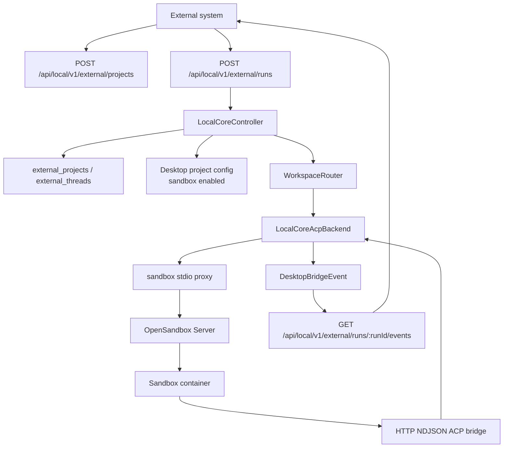

# Cloud Sandbox And External Agent API

This document describes the current cloud execution path: Local AI Core creates or reuses external workspaces, starts sandboxed ACP runtimes through OpenSandbox, and exposes per-run streaming APIs for non-renderer callers.

## Top-Level Flow

## Sandbox Mode

Cloud sandbox mode is project configuration, not a renderer-only mode. A project selects a sandbox provider and runtime image through `agent.options.sandbox`; Local AI Core materializes that into an `AgentSandboxLaunchConfig` before launching the agent runtime.

Key behavior:

- Transport is normalized to `http-ndjson`; the old sandbox WebSocket proxy path is no longer the active compatibility path.
- OpenSandbox defaults to `http://127.0.0.1:8080`, or `AGENTDOCK_OPENSANDBOX_SERVER_URL` when set.
- Sandbox auth uses the configured provider `api_key_env`, defaulting to `OPEN_SANDBOX_API_KEY`.
- The workspace is mounted into the container at `/workspace` by default.
- Agent state is mounted at `/agent-state` by default and is scoped by `user`, `project`, `thread`, or `run`; the default for normal project config is `project`.
- Sandbox lifecycle defaults to `per_thread`, so a thread can reuse its sandbox/ACP session until the idle TTL expires.
- Resource overrides include timeout, idle seconds, warm pool size, CPU, memory, workspace mount path, and state mount path.
- Compose deployments can override the host-side state root with `AGENTDOCK_SANDBOX_STATE_HOST_ROOT`.

OpenSandbox launch requests carry workspace volumes, state volumes, resource settings, environment, and Kubernetes-safe metadata. Raw ids stay available in environment/config where exact values matter.

## External Agent API

The external API is for systems that need to run AgentDock without driving the desktop UI. It lives under `/api/local/v1/external/*` and still routes through the same Local AI Core workspace, thread, run, task, and ACP machinery as the renderer.

| Endpoint | Purpose |
| --- | --- |
| `POST /api/local/v1/external/projects` | Create or reuse a workspace for `user_id` and `external_project_id`. |
| `POST /api/local/v1/external/runs` | Ensure the project/thread, send the prompt, and return `workspace_id`, `thread_id`, `run_id`, optional `task_id`, and `events_url`. |
| `GET /api/local/v1/external/runs/:runId/events` | Stream a snapshot plus bridge updates for one run over SSE. |

`ExternalProjectEnsureInput` accepts `user_id`, `external_project_id`, optional display name, agent type, provider id, model, and metadata. `ExternalRunCreateInput` adds `external_thread_id`, title, and prompt.

Local AI Core maps external identities to internal state:

- `external_projects` stores the stable mapping from `(user_id, external_project_id)` to `workspaceId` and workspace path.
- `external_threads` stores the mapping from `(user_id, external_project_id, external_thread_id)` to a Local AI Core `threadId`.
- Workspace files default to `AGENTDOCK_EXTERNAL_WORKSPACE_ROOT`, or `<userData>/external-workspaces` when the environment variable is not set.
- External projects are persisted into the workspace registry with `deviceId: "external"` and metadata marking the external owner.
- External project config enables sandbox mode with `state_scope: "project"` and `sandbox_lifecycle: "per_thread"` by default.

## Event Stream

External run SSE is scoped to one `runId`. New clients receive `external.run.snapshot`, then subsequent bridge events are sent as `external.run.stream` when the bridge `replyCtx` matches that run.

This keeps external API clients decoupled from global renderer events while preserving the same ACP progress model: assistant chunks, thinking, tool progress, permission state, final replies, and structured errors all originate from Local AI Core.

## Ownership Rules

- External callers own only their external ids and prompt input.
- Local AI Core owns project/thread/run/task persistence, workspace config, sandbox launch, and SSE delivery.
- OpenSandbox owns container creation and lifecycle after Local AI Core submits the launch request.
- Sandbox containers own agent runtime execution, but communicate only through the HTTP NDJSON ACP bridge.
- Renderer and Electron are not in the external run path.

## Diagnostics

Sandbox and external runs reuse the shared structured error model. Important sandbox error codes include `sandbox_unavailable`, `sandbox_unauthorized`, `sandbox_request_failed`, `sandbox_start_failed`, `sandbox_start_timeout`, and `sandbox_endpoint_missing`.

Use deployment diagnostics to verify Web/Core/OpenSandbox connectivity, Docker socket access, workspace mounts, state host paths, and registered sandbox images before relying on external runs in compose deployments.
