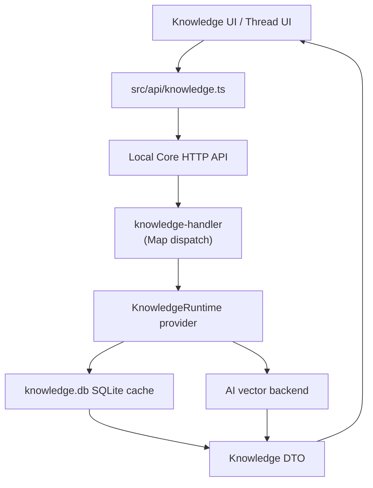
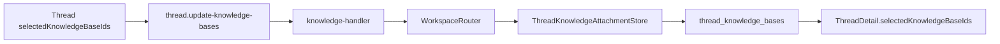
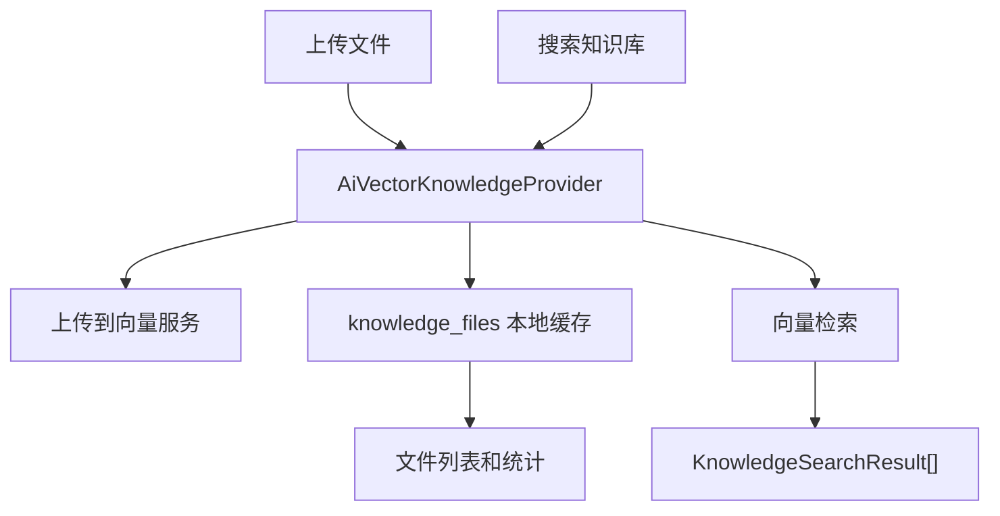

# Knowledge Runtime Architecture

Knowledge runtime 通过 Local AI Core plugin 接入 renderer、thread attachment store 和 `packages/knowledge-api`。当前默认实现是 `knowledge.ai-vector`，禁用时回退到 `knowledge.noop`。

## 职责边界

| 模块 | 关键文件 | 职责 |
| --- | --- | --- |
| Knowledge plugin | `services/local-ai-core/src/plugins/builtin/knowledge-ai-vector-plugin.ts` | 将 `packages/knowledge-api` 的 ai-vector provider 注册为 Local Core 插件。 |
| Provider | `packages/knowledge-api/src/ai-vector-provider.ts` | 知识库、文件、搜索和远端向量服务适配。 |
| SQLite store | `packages/knowledge-api/src/sqlite-store.ts` | 本地知识库、文件缓存、thread 绑定表。 |
| Thread attachment store | `packages/knowledge-api/src/thread-knowledge-store.ts` | 维护 thread 到 knowledge base 的选择关系。 |
| Controller API | `services/local-ai-core/src/runtime/handlers/knowledge-handler.ts` | 将 knowledge HTTP 路由映射到 KnowledgeRuntime provider，不再通过 Controller 中转。 |

## API 请求流程

## Thread 绑定流程

## 上传与搜索流程

## 变更规则

- renderer 不直接访问知识库存储或向量服务，只通过 Local Core API。
- thread 选择的知识库保存在 attachment store，不写入 transient UI state 作为事实来源。
- 本地缓存和远端向量状态需要保持可恢复；删除知识库时应同步清理 thread 绑定和文件缓存。
- 新 knowledge provider 应通过 plugin capability 暴露，不在 controller 中硬编码 provider 类型。
