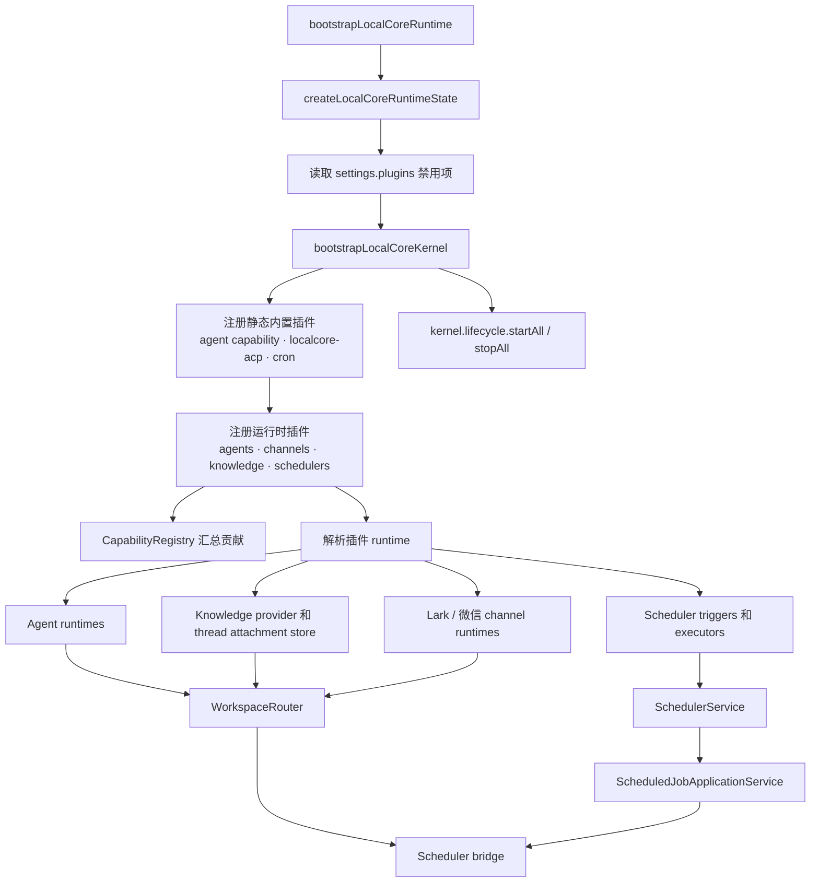
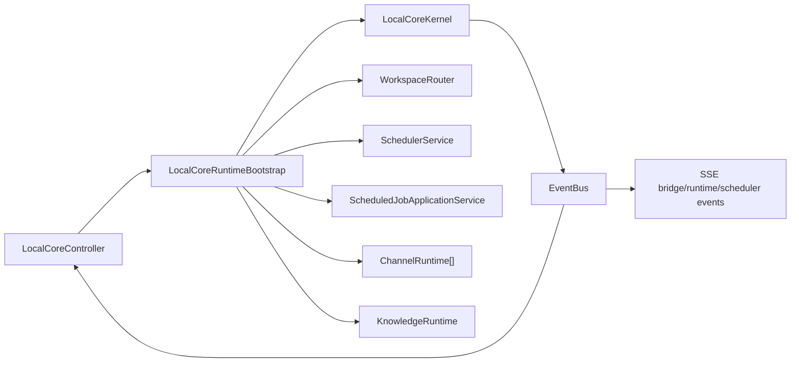

# Local AI Core Kernel And Plugin Composition

本文说明 Local AI Core 的 kernel、插件注册和运行时装配流程。核心目标是让 agent、channel、knowledge、scheduler 能力通过静态内置插件贡献，而不是散落在 controller 中硬编码。

## 职责边界

| 模块 | 关键文件 | 职责 |
| --- | --- | --- |
| Kernel bootstrap | `services/local-ai-core/src/kernel/bootstrap.ts` | 创建 kernel context、注册内置插件、解析 runtime、装配 router 和 scheduler。 |
| Plugin registry | `services/local-ai-core/src/kernel/plugin-registry.ts` | 按依赖顺序列出插件，处理禁用插件和重复注册。 |
| Capability registry | `services/local-ai-core/src/kernel/capability-registry.ts` | 汇总 agent、channel、knowledge、scheduler、UI 能力快照。 |
| Lifecycle manager | `services/local-ai-core/src/kernel/lifecycle-manager.ts` | 启停启用插件的生命周期 hook。 |
| Diagnostics | `services/local-ai-core/src/kernel/diagnostics.ts` | 暴露插件诊断状态。 |

## 装配流程

## 运行时关系

`LocalCoreController` 不直接构造具体 agent、channel 或 knowledge 实现。它接收 `bootstrapLocalCoreRuntime` 返回的 runtime bundle，然后把 HTTP API、SSE 事件和业务调用委托给 `WorkspaceRouter`、`SchedulerService`、channel runtime 或 knowledge provider。

## 变更规则

- 新能力优先通过 `services/local-ai-core/src/plugins/builtin/` 或 `services/local-ai-core/src/agents/` 注册插件。
- 共享基础设施放在 `services/local-ai-core/src/kernel/`，不要塞进单个插件。
- controller 只做 API 编排和事件转发，不承载插件依赖顺序、capability 拼装或 runtime 实例化。
- 动态插件加载尚未启用；当前架构以静态注册的内置插件为稳定路径。
