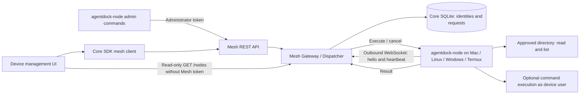

# AgentDock Mesh v1

Mesh adds device tool execution to Local AI Core. ACP sessions, threads and agent tasks retain their existing execution paths. A Mesh request is a separate operation with its own identity and history; it is not an ACP run or an agent runtime installation.



## Ownership and transport

- Contracts: `packages/contracts/src/mesh.ts`; API client: `packages/core-sdk/src/mesh.ts`.
- Core owns identities, allowed capabilities and execution history in `mesh_nodes` / `mesh_executions`, in the existing `runtime/local-core.db`. Only hashes of pairing and device credentials are retained.
- `MeshGateway` attaches to the existing Core HTTP server. Nodes initiate WebSocket connections, so devices need no inbound listener or public IP. Internet, LAN and Tailscale are transport choices; no specific overlay is required.
- `bin/agentdock.mjs` forwards the Mesh WebSocket upgrade through the bundled web server, in addition to existing REST forwarding.
- The node owns its approved root, local credentials and command opt-in. Credentials are created exclusively with mode 0600; existing files are not overwritten. Use an operating-system ACL on Windows to restrict the credential and pairing files to the node user (POSIX mode bits do not establish a Windows ACL).
- The renderer owns temporary UI state. The Mesh page reads node overview data without the Mesh admin token and refreshes every three seconds. It does not expose administrative controls.

## Trust boundaries

Mesh is disabled unless `AGENTDOCK_MESH_ADMIN_TOKEN` is set. Generate a high-entropy random value and supply it securely to Core and administration clients. This token protects Mesh management endpoints; it does not add authentication to pre-existing Core APIs. While Mesh is enabled, `GET /mesh/nodes` is the sole Mesh REST route that does not require the administrator token. It reveals node ID, label, platform, advertised and allowed capabilities, presence and timestamps to anyone who can reach the Core route. Pairing, revocation, execution, request history and cancellation remain administrator-authenticated. Protect the complete Core surface when deploying publicly.

An administrator creates a device-specific, single-use pairing token valid for ten minutes. `/enroll` exchanges it for the device credential. The first WebSocket message supplies that credential; protocol v1 accepts only text messages, known capabilities and bounded payloads. A node cannot act as an administrator or finish another device's requests. Revocation invalidates both enrollment and connection credentials, closes the active connection and interrupts pending work.

The client requires HTTPS/WSS outside loopback, follows no redirects, and verifies TLS normally. `--allow-insecure` explicitly permits HTTP/WS on a trusted private network; it does not disable certificate verification. Termux's Android platform identification is descriptive metadata, not an attestation.

`filesystem.list` and `filesystem.read` resolve paths inside the configured root; absolute paths and symlink escapes are rejected. Files must be regular files and at most 32 KiB; the protocol returns base64 for binary-safe reads. Listing returns at most 100 entries. `filesystem.write` supports atomic file writes up to 1 MiB with automatic parent directory creation and path confinement within the approved root. These checks do not provide OS isolation against a hostile local process racing filesystem mutations. Choose a root writable only by trusted processes.

`shell.exec` is available only when pairing allows it and the node uses `--allow-shell`. It uses a program and argument array with `shell:false`, the approved root as the working directory, and a 32 KiB combined output limit. It runs with the device user's permissions and inherited environment; the working directory is not a filesystem or network sandbox. A successful Mesh result can contain a nonzero command `exitCode`, which callers must inspect.

## Remote Workspace Mesh Execution

When a Workspace is configured with `deviceId: 'node:<uuid>'`:
1. **Agent Process**: Runs on the Server (Local AI Core daemon host) with a physical working directory anchored at `<baseDir>/remote-shadow/<workspaceId>`.
2. **Transparent Shell Proxy (`agentdock-mesh-shell`)**: Injected via `SHELL` environment variable into Agent processes on remote workspaces. When the agent uses its native Bash tool (`$SHELL -c "<cmd>"`), the proxy delegates the command directly to `MeshGateway.executeAndWait()` (`shell.exec`). Output and exit codes are transparently streamed back to the agent's native terminal tool.
3. **Multi-Device Dynamic Context**: Local AI Core resolves the target node's `label` and `platform` (Android/Termux, Linux, macOS, Windows) and dynamically generates `CLAUDE.md` and ACP `systemPrompt.append` inside the shadow directory. No hardcoded device names or operating system assumptions.
4. **Host Tool Disallowance**: Cloud server filesystem tools (`FileEdit`, `GlobTool`) are disabled in ACP session initialization for remote mesh workspaces to prevent server-host filesystem operations from leaking or interfering with the remote session.
5. **ACP Protocol Bridge**: When agents issue ACP filesystem requests (`fs/read_text_file`, `fs/write_text_file`), LocalCoreAcpTurnCoordinator routes them directly to `MeshGateway.executeAndWait()`, transparently returning UTF-8 contents.
6. **Zero Awareness**: To the LLM, the environment operates naturally as a native shell on the target device, requiring zero specialized prompts or MCP prefix awareness.

## Requests and failure semantics

The administrator selects a node and advertised capability. Core validates capability authorization, online presence, bounded arguments and a 100–120000 ms deadline before dispatch. There are at most 256 pending requests in Core, 128 node connections and eight concurrent executions per node. Recent history APIs return up to 100 records; durable records are retained in SQLite.

Each request uses `mesh-request:<uuid>`; each paired identity uses `node:<uuid>`. Node heartbeat acknowledgements update presence; both sides detect stale connections. Reconnect uses bounded exponential backoff. Replacing a connection interrupts its outstanding work and fences old callbacks and results.

Terminal states are `completed`, `failed`, `cancelled`, `timed_out` and `interrupted`. Late results cannot overwrite terminal history. Cancellation and timeout send an abort to the node; the node kills a spawned command process group on Unix (the immediate process on Windows). Already completed effects cannot be undone, and detached descendants outside that group can outlive cancellation. `cancelled` means cancellation was requested, not proof that no effects occurred.

Disconnect and Core restart mark pending requests `interrupted`: the outcome is unknown and requests are never automatically replayed. Users must inspect device state before retrying side effects. Offline devices return a conflict instead of silently redirecting requests to another device. Durable waiting queues, artifact streaming, remote ACP runtimes and Android-specific APIs are future capabilities.

## API

Prefix: `/api/local/v1/mesh`. `GET /nodes` returns read-only node metadata without a Mesh administrator token while Mesh is enabled. All other REST routes except enrollment require `Authorization: Bearer <administrator token>`; the WebSocket handshake uses the device credential protocol.

| Method | Path | Purpose |
| --- | --- | --- |
| GET | `/nodes` | List devices and presence (read-only; no Mesh admin token required while Mesh is enabled) |
| POST | `/pairings` | Create pairing (`label`, optional `allowShell`) |
| POST | `/enroll` | Consume `pairingToken`, return device credential |
| WebSocket | `/connect` | Device-authenticated protocol v1 |
| POST | `/nodes/:id/revoke` | Revoke a device |
| POST | `/requests` | Dispatch `nodeId`, `capability`, `args`, optional `timeoutMs` |
| GET | `/requests` | Recent history |
| GET | `/requests/:id` | Request status/result |
| POST | `/requests/:id/cancel` | Request cancellation |

## Running two devices

Build with `pnpm build`. Set `AGENTDOCK_MESH_ADMIN_TOKEN` securely before `pnpm start:core` or `agentdock serve`. The Device Mesh navigation entry opens the read-only node overview. Use the CLI with the same administration credential to pair and manage devices.

Alternatively, use CLI commands from the repository root (an npm installation exposes `agentdock-node` directly):

```bash
# Administrator machine; AGENTDOCK_MESH_ADMIN_TOKEN is already injected.
node bin/agentdock-node.mjs pair --server https://agent.example.com \
  --label home-mac --output /secure/path/mac-pairing.json
```

Transfer the pairing file securely to the intended device, then run:

```bash
chmod 600 /secure/path/mac-pairing.json
node bin/agentdock-node.mjs connect --server https://agent.example.com \
  --root /path/to/shared-files --pairing-file /secure/path/mac-pairing.json \
  --state /secure/path/mac-node.json
```

Repeat pairing for a second device with its own label, approved directory and credential file. On reconnect, omit `--pairing-file`; reuse the existing state. A state file is bound to one server; use separate state files for separate servers. Securely remove consumed pairing files. If enrollment succeeded but the credential write failed, revoke that identity and pair again rather than replacing an unrelated credential file.

The default state path is `~/.agentdock/mesh-node.json`. The node needs the built package and Node.js 22 or newer; no Electron GUI is needed. Android Termux nodes are fully supported and verified on production hardware (such as Xiaomi HyperOS/MIUI), equipped with built-in mobile app intent dispatching (`mobile-apps`, 37 actions) and detached supervisor self-update (`agentdock-node-update`). See [Android / Termux 手机节点接入与移动端指令指南](../operations/android-termux-mesh-guide.md) for complete setup and operational instructions.

```bash
node bin/agentdock-node.mjs list --server https://agent.example.com
node bin/agentdock-node.mjs execute --server https://agent.example.com \
  --node 'node:<uuid>' --capability filesystem.read --args '{"path":"notes.txt"}'
node bin/agentdock-node.mjs status --server https://agent.example.com \
  --request 'mesh-request:<uuid>'
```

For command execution, add `--allow-shell` to both `pair` and `connect`, then dispatch `shell.exec` with `{"program":"git","arguments":["status","--short"]}`. The CLI outputs a request identity immediately; use `status`, `requests` or the UI to inspect the terminal outcome. SDK callers can use `mesh.createMeshClient(token, coreBaseUrl)` for the same operations. When configured as a Remote Workspace, Agent runtimes are automatically and transparently equipped with the Transparent Shell Proxy (`agentdock-mesh-shell`) and ACP filesystem bridges.

## Validation evidence

`tests/integration/mesh.test.ts` exercises two independent nodes with separate roots over real HTTP/WebSocket connections, device authentication, enrollment reuse rejection, capability policy, file confinement, dispatch, results, timeout, cancellation, disconnect/reconnect and revocation. `tests/electron/mesh-store.test.ts` checks hash-only persistence, pairing expiry and restart recovery. `tests/electron/mesh-node-policy.test.ts` checks local shell opt-in, output/read/write bounds, cancellation and private credential-file handling. `tests/integration/mesh-auth.test.ts` checks role separation, disabled-by-default behavior, cross-device forged results, connection replacement and late-result fencing. `tests/integration/remote-workspace-mesh.test.ts` and `tests/integration/transparent-remote-mesh-shell.test.ts` exercise end-to-end transparent tool dispatching, ACP filesystem RPC bridging, and Transparent Shell Proxy execution. Live validation additionally exercised two CLI processes through the bundled WebSocket proxy, reconnect with saved credentials, and Chromium page operations including a byte-verified file download.

The L1 Archify specification has passed all 9 showcase checks via `pnpm lint:arch`. The interactive showcase HTML (`system-architecture.html`) has been delivered alongside the Mermaid reference view.
