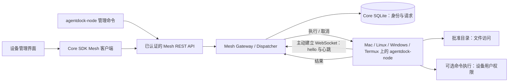

# AgentDock Mesh v1

Mesh 为 Local AI Core 增加了在设备上执行工具的能力。ACP 会话、thread 和 Agent 任务仍按原有方式运行。每个 Mesh 请求都是有独立身份和历史记录的一次操作；它不是 ACP run，也不代表设备安装了 Agent runtime。



## 归属与传输

- 协议契约：`packages/contracts/src/mesh.ts`；API 客户端：`packages/core-sdk/src/mesh.ts`。
- Core 在现有的 `runtime/local-core.db` 中，通过 `mesh_nodes` / `mesh_executions` 管理设备身份、允许的能力和执行历史。配对凭证与设备凭证只保存哈希。
- `MeshGateway` 挂载在现有 Core HTTP 服务上。节点主动建立 WebSocket 连接，因此设备不需要开放入站监听端口或公网 IP。可以使用互联网、局域网或 Tailscale 传输，不要求特定的虚拟组网方案。
- 除了转发现有 REST 请求，`bin/agentdock.mjs` 也会通过内置 Web 服务转发 Mesh WebSocket 升级请求。
- 节点负责管理自己的批准根目录、本地凭证和命令执行授权。凭证文件一律以权限 `0600` 创建，且不会覆盖已有文件。在 Windows 上，应使用操作系统 ACL 限制只有节点用户能访问凭证和配对文件；POSIX 权限位不能代替 Windows ACL。
- Renderer 只保存临时 UI 状态。管理员 token 只放在页面内存中，不进入 URL 或浏览器存储。连接期间每三秒获取一次执行结果。

## 信任边界

只有设置了 `AGENTDOCK_MESH_ADMIN_TOKEN` 后才能启用 Mesh。请生成高熵随机 token，并安全地提供给 Core 和管理客户端。这个 token 只保护 Mesh API，不会自动为原有 Core API 增加身份认证；如果 Core 部署在公网，必须保护完整的 Core 接口。

管理员创建一个只对特定设备有效、十分钟后过期且只能使用一次的配对 token。`/enroll` 使用该 token 换取设备凭证。WebSocket 第一条消息携带设备凭证；v1 协议只接受文本消息、已知能力和有界请求数据。节点不能充当管理员，也不能完成其他设备的请求。撤销设备后，配对凭证和连接凭证都会失效，活动连接会关闭，未完成请求会被中断。

除 loopback 外，客户端要求使用 HTTPS/WSS；客户端不会跟随重定向，并照常验证 TLS 证书。`--allow-insecure` 明确允许在可信私有网络中使用 HTTP/WS，但不会关闭证书验证。Termux 上报的 Android 平台信息只是描述性信息，不是设备身份认证或安全证明。

`filesystem.list` 和 `filesystem.read` 只在配置的根目录内解析路径；绝对路径和通过符号链接逃逸的路径都会被拒绝。文件必须是普通文件，大小不得超过 32 KiB；协议用 base64 保证二进制读取安全。目录列表最多返回 100 个条目。`filesystem.write` 支持原子写入，最大 1 MiB，可自动创建父目录，并将路径限制在批准根目录内。这些检查不能抵御本地恶意进程在文件系统变更时进行竞态攻击。请选择仅可信进程可写入的根目录。

只有配对设置允许，且节点使用 `--allow-shell` 启动时，才开放 `shell.exec`。请求使用程序名与参数数组、`shell:false`，并以批准根目录作为工作目录；标准输出和错误输出合计最多 32 KiB。Shell 仍使用设备用户的权限和继承的环境变量；工作目录不是文件系统沙箱或网络沙箱。Mesh 请求状态即使是 `completed`，命令本身的 `exitCode` 仍可能非零，调用方必须检查。

## Mesh 远程工作区执行

当 Workspace 的 `deviceId` 设置为 `node:<uuid>` 时：

1. **Agent 进程与执行目标**：ACP Agent 进程、运行时目录/配置和凭证仍在 Local AI Core 宿主机上。只有运行时明确路由到 Mesh 的工作区操作才会在配对节点执行；Agent 会收到准确的拓扑说明。
2. **Shell 路由**：Mesh Shell 代理通过 `MeshGateway.executeAndWait()` 调用 `shell.exec`，并以节点批准根目录作为起始工作目录。只有 Core 策略和节点配对设置都授权时才能使用 Shell。它仍使用配对设备用户本身的操作系统权限，不会被限制在批准根目录内，也不是 OS 沙箱；宿主机影子目录并没有挂载到设备上。
3. **文件路由**：兼容 Mesh 的运行时通过明确提供的 Mesh 文件工具执行 read、write、edit、list 和 glob。文件代理把相对路径映射到节点批准根目录；Mesh 错误会原样返回，不会回退到宿主机。Claude Code 通过 ACP 会话元数据禁用宿主机文件工具；OpenCode 拒绝其本地文件工具，并把 Shell 配置到 Mesh 代理；Pi 通过启动包装器替换本地内置工具，改用 Mesh 扩展。
4. **运行时支持情况**：Claude Code、OpenCode 和 Pi 已配置文件操作约束。其他已注册运行时在适配器能路由或禁用本地文件工具，并能通过已核实的方式传递真实上下文之前，会被拒绝启动 Mesh 工作区。适配器覆盖范围和验证说明见 [Mesh 运行时兼容矩阵](mesh-runtime-compatibility.md)。
5. **操作说明**：宿主机影子目录会收到运行时指令文件（`CLAUDE.md`、`AGENTS.md`、`GEMINI.md`），用于说明宿主机控制面、配对设备、已路由的工具和失败时的处理方式。指令负责说明边界；运行时适配器和 Mesh Gateway 负责执行边界。
6. **记忆**：Agent 私有运行时记忆保存在宿主机对应的运行时目录。AgentDock Core 的 Mesh 工作区记忆保存在 Core 用户数据目录，与 Mesh 影子目录分开。首次访问时会复制旧 Markdown 文件，但不删除原文件。设备笔记和产物归设备工作区所有；设备进程状态等变化信息必须在设备上实时复查后才能当作当前状态报告。

宿主机影子目录仍为 ACP/runtime 兼容而保留，但它不是设备工作区。Mesh 会话期间，运行时不能用本地文件工具访问该目录。无法安全实施这一限制的运行时必须拒绝启动 Mesh 会话，并说明具体原因。

## 请求与失败处理

管理员选择设备和设备公布的能力。Core 会在分发前检查能力授权、设备在线状态、参数范围，以及 100–120000 毫秒的超时期限。Core 最多同时保留 256 个待处理请求、128 个节点连接；每个节点最多同时执行 8 项任务。历史查询最多返回 100 条记录，执行记录持久化保存在 SQLite。

每个请求使用 `mesh-request:<uuid>`，每个配对身份使用 `node:<uuid>`。节点通过心跳确认连接，双方都会检测连接是否过期。重连使用有上限的指数退避。替换连接时，旧连接的未完成请求会被中断，旧回调和结果也会被拦截。

终态包括 `completed`、`failed`、`cancelled`、`timed_out` 和 `interrupted`。终态请求不能被迟到的结果覆盖。取消或超时会向节点发送中止请求；节点在 Unix 上会结束命令进程组，在 Windows 上会结束直接子进程。已经产生的副作用无法撤销；脱离该进程组的后台进程也可能继续运行。因此，`cancelled` 只表示已请求取消，不保证副作用没有发生。

断连或 Core 重启会把未完成请求标为 `interrupted`：实际结果未知，系统不会自动重放。重试副作用操作前，用户必须先检查设备状态。设备离线时返回冲突错误，不会悄悄转发到其他设备。持久等待队列、产物流式传输、远程 ACP runtime 和 Android 专属 API 都不属于当前能力。

## API

API 前缀：`/api/local/v1/mesh`。除注册和 WebSocket 握手外，所有路由都需要 `Authorization: Bearer <administrator token>`。

| 方法 | 路径 | 用途 |
|---|---|---|
| GET | `/nodes` | 列出设备及在线状态 |
| POST | `/pairings` | 创建配对（`label`，可选 `allowShell`） |
| POST | `/enroll` | 使用 `pairingToken`，换取设备凭证 |
| WebSocket | `/connect` | 通过设备身份认证的 v1 协议连接 |
| POST | `/nodes/:id/revoke` | 撤销设备 |
| POST | `/requests` | 分发请求：`nodeId`、`capability`、`args` 和可选 `timeoutMs` |
| GET | `/requests` | 查看最近请求记录 |
| GET | `/requests/:id` | 查看请求状态和结果 |
| POST | `/requests/:id/cancel` | 取消请求 |

## 连接两台设备

运行 `pnpm build` 构建。在运行 `pnpm start:core` 或 `agentdock serve` 前，请安全设置 `AGENTDOCK_MESH_ADMIN_TOKEN`。打开 Device Mesh 导航项进入设备管理界面，输入同一个管理凭证后即可配对和管理设备。

也可以从仓库根目录使用 CLI 命令（通过 npm 安装后可直接运行 `agentdock-node`）：

```bash
# 在管理员电脑上执行；此处假设 AGENTDOCK_MESH_ADMIN_TOKEN 已安全注入环境。
node bin/agentdock-node.mjs pair --server https://agent.example.com \
  --label home-mac --output /secure/path/mac-pairing.json
```

安全地把配对文件传到目标设备后，在设备上运行：

```bash
chmod 600 /secure/path/mac-pairing.json
node bin/agentdock-node.mjs connect --server https://agent.example.com \
  --root /path/to/shared-files --pairing-file /secure/path/mac-pairing.json \
  --state /secure/path/mac-node.json
```

第二台设备也要单独配对，并使用自己的名称、批准目录和凭证文件。重连时不需要再次指定 `--pairing-file`，节点会复用已有状态文件。状态文件绑定到一个服务器；连接不同服务器时请使用不同文件。配对成功后，请安全删除已使用的配对文件。如果注册成功但凭证写入失败，应撤销该设备并重新配对，不要覆盖无关的凭证文件。

默认状态文件是 `~/.agentdock/mesh-node.json`。节点需要已构建的程序和 Node.js 22 或更高版本，不需要 Electron 图形界面。Termux 可以运行这个 Node 客户端，但 Android 真机验证仍未完成。APK 后台服务、通知、剪贴板、相机和 Android Intent 不属于 v1。

```bash
node bin/agentdock-node.mjs list --server https://agent.example.com
node bin/agentdock-node.mjs execute --server https://agent.example.com \
  --node 'node:<uuid>' --capability filesystem.read --args '{"path":"notes.txt"}'
node bin/agentdock-node.mjs status --server https://agent.example.com \
  --request 'mesh-request:<uuid>'
```

`agentdock-node execute` 是现有的宿主机侧 Mesh 单次分发命令。`lac` CLI 属于另一套面向 Core 的命令，目前没有 `lac mesh`。未来可以增加 `lac mesh exec <node-id> -- <program> <arg>...`，作为操作员和脚本使用的补充入口；它应通过同一套已认证的 Mesh API 转发，并保留程序参数边界。它不能替代 Agent 运行时适配器：在 Mesh Shell 代理内部运行的 CLI 命令会在设备上执行，而其他 Agent runtime 也不会自动用 `lac` 执行原生文件操作。

执行命令时，`pair` 和 `connect` 都要添加 `--allow-shell`，然后通过 `shell.exec` 分发命令，例如 `{"program":"git","arguments":["status","--short"]}`。CLI 会立即返回请求标识；之后可以用 `status`、`requests` 或 UI 查看最终状态。SDK 客户端也可以用 `mesh.createMeshClient(token, coreBaseUrl)` 执行相同操作。远程 Workspace 会启用 Mesh Shell 代理和[兼容矩阵](mesh-runtime-compatibility.md)列出的运行时文件适配器；不受支持的运行时会在启动前被拒绝。

## 验证依据

`tests/integration/mesh.test.ts` 通过真实 HTTP/WebSocket 连接，测试两个拥有独立根目录的节点，包括设备认证、配对凭证只能使用一次、能力策略、文件路径限制、请求分发、结果、超时、取消、断连、重连和撤销。`tests/electron/mesh-store.test.ts` 检查哈希存储、配对过期和重启恢复。`tests/electron/mesh-node-policy.test.ts` 检查节点 Shell opt-in、输出/读写上限、取消和凭证文件保护。`tests/integration/mesh-auth.test.ts` 检查权限角色、默认关闭、伪造其他设备结果、连接替换和迟到结果拦截。`tests/integration/remote-workspace-mesh.test.ts` 与 `tests/integration/transparent-remote-mesh-shell.test.ts` 检查工具分发、ACP 文件请求转发和 Shell 代理执行。在线验证还通过内置 WebSocket 代理运行了两个 CLI 进程、使用保存的凭证重连，并在 Chromium 页面中操作和校验下载文件的字节内容。

L1 Archify 架构图已通过 `pnpm lint:arch` 的全部 9 项 showcase 检查。交互式 HTML 导出（`system-architecture.html`）与 Mermaid 架构图并列提供。
