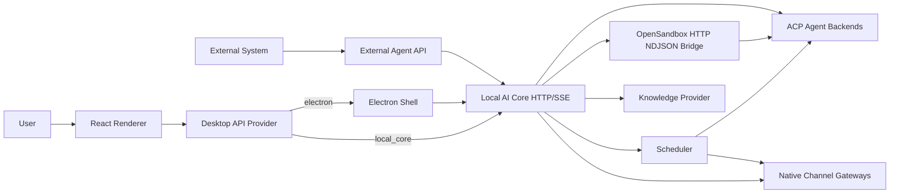

# AgentDock Architecture

## Summary

AgentDock now runs as a Local AI Core-first desktop app:

- Electron is only the desktop shell
- Local AI Core owns runtime, threads, streaming, knowledge, scheduler state, native channel ingress, sandbox launch, and external run mappings
- The renderer talks to Local AI Core APIs directly or through the Electron shell
- External systems can use Local AI Core APIs directly without driving renderer or Electron

There is no `cc-connect` runtime, management API, or bridge compatibility path in the active architecture.

## Top-Level Flow

## Main Layers

### Renderer

- lives in `src/`
- renders Dashboard, Workspace, Threads, Knowledge
- consumes Local AI Core runtime and SSE events

### Electron

- lives in `electron/`
- opens the desktop window
- starts Local AI Core as a local companion process
- does not own chat routing or platform gateway logic

### Local AI Core

- lives in `services/local-ai-core/`
- exposes `/api/local/v1/*`
- owns thread routing, SQLite persistence, ACP streaming, scheduler execution, channel ingress/delivery, sandbox launch, and external API mappings

Local AI Core exposes external run APIs under `/api/local/v1/external/*`:

- `POST /external/projects` creates or reuses an external workspace mapping.
- `POST /external/runs` ensures the workspace/thread, sends the prompt, and returns the run id and per-run SSE URL.
- `GET /external/runs/:runId/events` streams the run snapshot and bridge updates for that run.

Cloud sandbox mode is configured on projects and materialized at runtime:

- sandbox providers select OpenSandbox connection details and auth env.
- runtime images select the agent ACP image, bridge transport, ports, and mount paths.
- Local AI Core mounts workspace and agent state, starts the sandbox through OpenSandbox, and communicates with the container through HTTP NDJSON ACP.

Local AI Core keeps scheduler responsibilities split by lifecycle:

- `ScheduledJobApplicationService` resolves scheduled job create/update input and derives channel routes from thread bindings.
- `SchedulerService` owns due polling, run concurrency, and adapter selection.
- `ScheduledConversationExecutor` turns a scheduled job into an ACP conversation and injects the channel runtime environment for the run.
- `channel-execution-policy.ts` resolves same-thread or side-thread targets for channel jobs.
- `ScheduledBridgeSession` binds the scheduled ACP session to the channel route so Lark/Weixin process updates, tool progress, permission cards, and final replies stream through channel gateways.
- Platform scheduler adapters select delivery mode. Local uses `thread-only`; Lark/Weixin use `bridge-stream` while preserving instance ids for delivery.

See [Scheduled Delivery Architecture](scheduled-delivery.md) for the full route and delivery model.

See [Cloud Sandbox And External Agent API](cloud-sandbox-and-external-api.md) for sandbox launch, external workspace mapping, and per-run SSE details.

### Shared Packages

- `packages/contracts`: shared API and data contracts
- `packages/core-sdk`: Local AI Core browser client
- `packages/knowledge-api`: knowledge abstraction and `ai_vector` implementation
- `packages/plugin-sdk`: plugin, agent runtime, channel, scheduler, monitor, and sandbox launch contracts

## Runtime Model

The renderer uses one of two local providers:

- `electron`: desktop shell is available
- `local_core`: direct Local AI Core access is available

Both providers target the same Local AI Core API surface.
