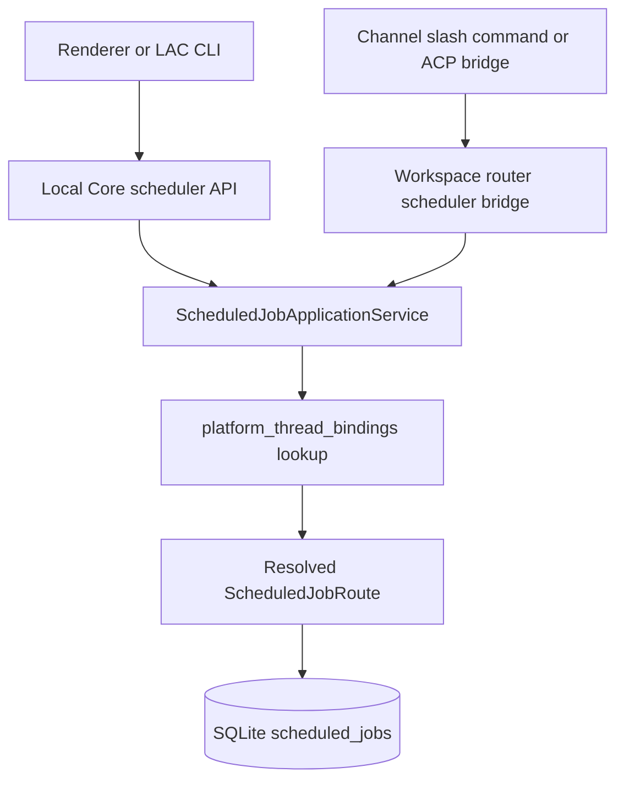
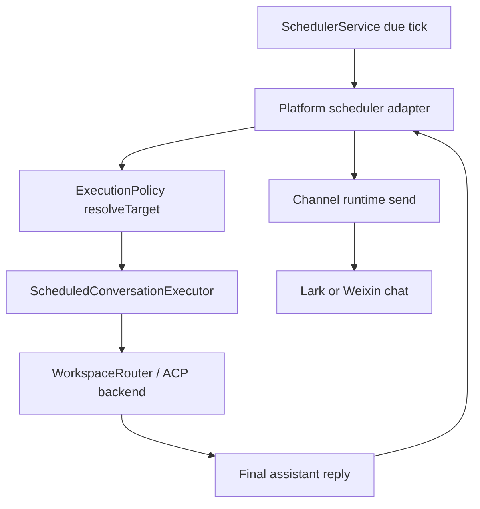

# Scheduled Delivery Architecture

This document describes how AgentDock creates, executes, and delivers scheduled jobs through Local AI Core. The goal is to keep scheduling, ACP execution, and channel delivery separate enough that Lark, Weixin, local threads, and future channels all follow the same invariants.

## Ownership

Scheduled jobs are Local AI Core state. Renderer, Electron, and channel gateways can request scheduled job operations, but they do not own route resolution or delivery policy.

| Area | Owner | Responsibility |
| --- | --- | --- |
| API entrypoints | `LocalCoreController` / `runtime/server.ts` | Parse HTTP requests and delegate scheduled job operations. |
| Application service | `ScheduledJobApplicationService` | Resolve create/update input, derive channel routes from thread bindings, and expose job operations to controller and router bridge callers. |
| Scheduler loop | `SchedulerService` | Poll for due jobs, prevent duplicate active runs, select a platform adapter, and trigger execution. |
| Run lifecycle | `SchedulerRunLifecycle` | Persist `scheduled_job_runs` transitions and update job run metadata. |
| Conversation execution | `ScheduledConversationExecutor` | Send the scheduled prompt into ACP, wait for completion, and return the final assistant reply. |
| Platform adapter | `local/lark/weixin` scheduler adapters | Resolve execution policy and deliver final output to the target platform when needed. |
| Channel gateway | Lark/Weixin channel runtime | Authenticate, upload/download content, and send platform messages. |

## Creation Flow

`ScheduledJobApplicationService` is the only layer that should decide the persisted delivery target for a new job.

Create input is resolved as follows:

- If the caller provides both `platform` and `route`, Local AI Core normalizes the route and preserves the platform instance in `route.instanceId`.
- If the caller provides a `threadId`, Local AI Core looks up `platform_thread_bindings` for that thread in the same workspace and derives the platform route from the binding.
- If no channel binding exists, the job falls back to local execution with `platform: 'local'` and `route.type: 'local.thread'`.

The persisted route should represent the delivery target, not a stale ACP thread binding. For explicit routes, thread ids are stripped before persistence. Execution policy can still choose whether to run in the same thread or in a dedicated side thread.

## Platform And Route Invariants

Channel platforms may be instance-qualified:

- `lark`
- `lark:<instanceId>`
- `weixin`
- `weixin:<instanceId>`

Scheduler adapter selection compares the platform base (`lark`, `weixin`, `local`) instead of requiring exact string equality. Delivery keeps the instance id so the channel runtime sends through the intended bot/account instance.

Core helpers in `scheduled-job-route.ts` own this normalization:

- `getChannelPlatformBase(platform)`
- `getChannelPlatformInstanceId(platform)`
- `platformMatches(candidate, expectedBase)`
- `routeTypeForPlatform(platform)`
- `routeWithPlatformInstance(route, platform)`
- `routeFromPlatformThreadBinding(binding)`

Do not duplicate platform string parsing in controllers, adapters, CLI commands, or channel gateways.

## Execution And Delivery Flow

`ScheduledConversationExecutor` injects runtime environment for scheduled ACP sessions based on the resolved target:

- `LOCAL_AI_PLATFORM`
- `LOCAL_AI_ROUTE_TYPE`
- `LOCAL_AI_PLATFORM_INSTANCE_ID`
- `LOCAL_AI_CHAT_ID`
- `LOCAL_AI_PLATFORM_USER_ID`

This lets CLI tools and ACP-side helpers know the scheduled run is executing for a channel context even when the ACP conversation itself runs in a side thread.

Lark and Weixin scheduler adapters are responsible for final platform delivery only. They should:

- accept instance-qualified platform ids by matching the base platform;
- use `routeWithPlatformInstance(withoutThreadRoute(job.route), job.platform)` before sending;
- use the shared channel outbound path for text/file delivery;
- keep same-thread and side-thread execution policy separate from platform send logic.

The local scheduler adapter runs the conversation and records the result, but does not perform channel delivery.

## State Boundaries

Persisted scheduler state lives in SQLite:

- `scheduled_jobs`: schedule, prompt, execution mode, platform, and delivery route.
- `scheduled_job_runs`: per-run lifecycle and error/output metadata.
- `platform_thread_bindings`: mapping from Local AI Core thread id to channel platform, chat id, platform user id, and latest platform message id.

The binding table is the bridge between inbound channel conversations and scheduled job delivery. A job created from a bound channel thread should preserve the binding's platform instance and chat/user ids. A job created without a binding should remain local unless the caller provides an explicit platform route.

## Change Rules

When changing scheduled delivery behavior:

- Add or update regression coverage in `tests/electron/workspace-task-store.test.ts`, `tests/electron/lac-cli.test.ts`, or `tests/integration/local-core-refactor.test.ts`.
- Verify instance-qualified platforms such as `lark:<id>` and `weixin:<id>`.
- Verify both `same-thread` and `side-thread` execution modes when channel delivery is affected.
- Keep route creation in `ScheduledJobApplicationService`; do not add new create-time route logic in controller, router bridge, or adapters.
- Keep platform string parsing in `scheduled-job-route.ts`.
