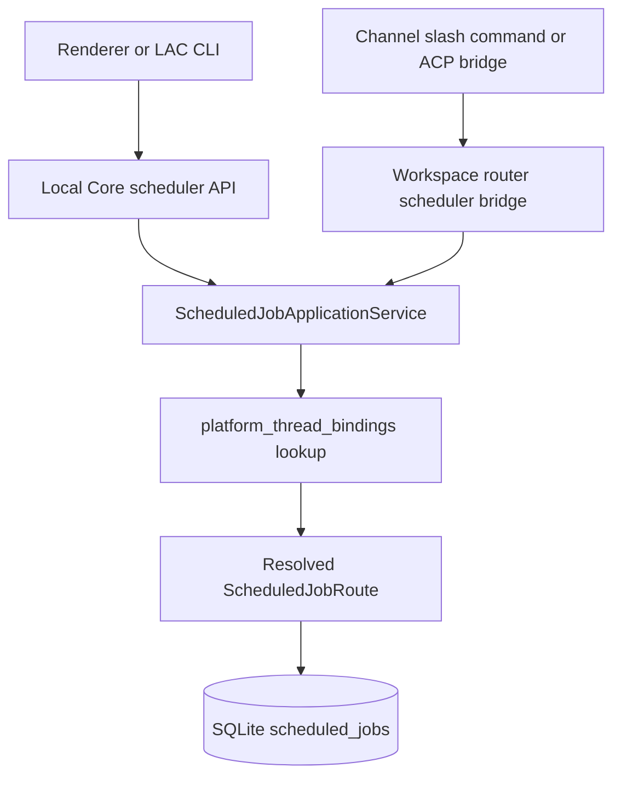
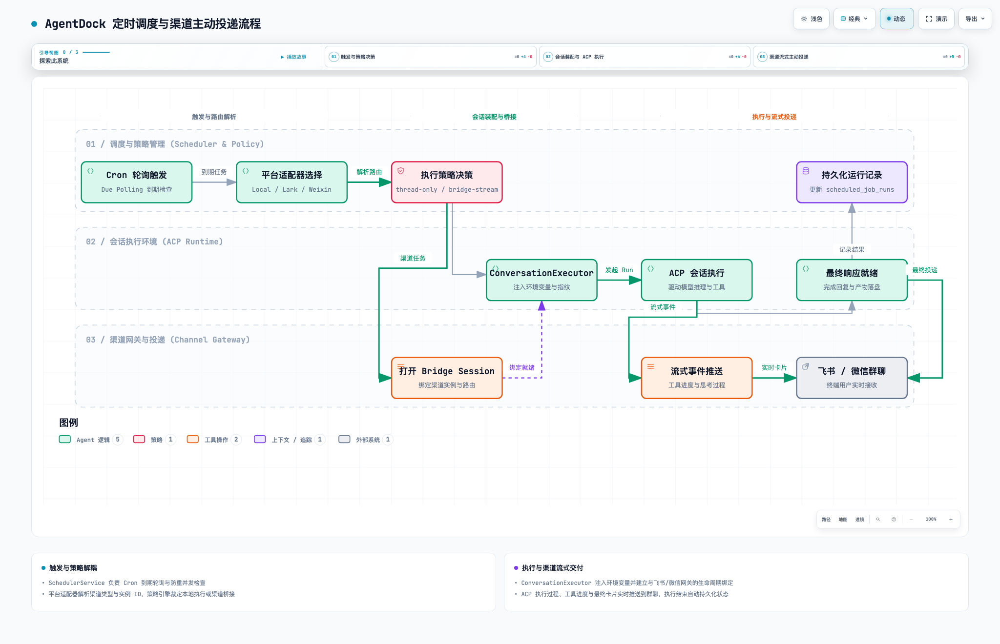

# Scheduled Delivery Architecture

> Compatibility status: scheduled jobs are exposed through the unified [Conditional Automation](conditional-automation.md) model. This document remains authoritative for legacy Scheduler routing and bridge delivery; activation, condition, and action state are separate Automation concerns.

This document describes how AgentDock creates, executes, and delivers scheduled jobs through Local AI Core. The goal is to keep scheduling, ACP execution, and channel delivery separate enough that Lark, Weixin, local threads, and future channels all follow the same invariants.

## Ownership

Scheduled jobs are Local AI Core state. Renderer, Electron, and channel gateways can request scheduled job operations, but they do not own route resolution or delivery policy. The legacy Scheduler facade maps time activation to an `always` condition; it must not become a second path for approved-script execution.

| Area | Owner | Responsibility |
| --- | --- | --- |
| API entrypoints | `runtime/server.ts` → `handlers/scheduler-handler.ts` | Parse HTTP requests and delegate scheduled job operations. |
| Application service | `ScheduledJobApplicationService` | Resolve create/update input, derive channel routes from thread bindings, and expose job operations to controller and router bridge callers. |
| Scheduler loop | `SchedulerService` | Poll for due jobs, prevent duplicate active runs, select a platform adapter, and trigger execution. |
| Run lifecycle | `SchedulerRunLifecycle` | Persist `scheduled_job_runs` transitions and update job run metadata. |
| Conversation execution | `ScheduledConversationExecutor` | Send the scheduled prompt into ACP, wait for completion, and return the final assistant reply. |
| Execution policy | `channel-execution-policy.ts` | Resolve same-thread or side-thread execution targets and open scheduled bridge sessions for channel jobs. |
| Bridge session | `scheduled-bridge-session.ts` | Temporarily bind the scheduled ACP session key to a channel route for process and final reply streaming. |
| Platform adapter | `local/lark/weixin` scheduler adapters | Select delivery mode and policy while keeping platform-specific code thin. |
| Channel gateway | Lark/Weixin channel runtime | Authenticate, upload/download content, and send bridge progress, permission, and final messages. |

## Creation Flow

`ScheduledJobApplicationService` is the only layer that should decide the persisted delivery target for a new job.

Create input is resolved as follows:

- If the caller provides both `platform` and `route`, Local AI Core normalizes the route and preserves the platform instance in `route.instanceId`.
- If the caller provides a `threadId`, Local AI Core looks up `platform_thread_bindings` for that thread in the same workspace and derives the platform route from the binding.
- If no channel binding exists, the job falls back to local execution with `platform: 'local'` and `route.type: 'local.thread'`.

The persisted route should represent the delivery target, not a stale ACP thread binding. For explicit routes, thread ids are stripped before persistence. Execution policy can still choose whether to run in the same thread or in a dedicated side thread.

## Platform And Route Invariants

Channel platforms may be instance-qualified:

- `lark`
- `lark:<instanceId>`
- `weixin`
- `weixin:<instanceId>`

Scheduler adapter selection compares the platform base (`lark`, `weixin`, `local`) instead of requiring exact string equality. Delivery keeps the instance id so the channel runtime sends through the intended bot/account instance.

Core helpers in `scheduled-job-route.ts` own this normalization:

- `getChannelPlatformBase(platform)`
- `getChannelPlatformInstanceId(platform)`
- `platformMatches(candidate, expectedBase)`
- `routeTypeForPlatform(platform)`
- `routeWithPlatformInstance(route, platform)`
- `routeFromPlatformThreadBinding(binding)`

Do not duplicate platform string parsing in controllers, adapters, CLI commands, or channel gateways.

## Execution And Delivery Flow

  <picture>
    <source media="(prefers-color-scheme: dark)" srcset="scheduled-delivery-workflow.dark.png">
    
  </picture>

> 💡 **交互式工作流**：可在浏览器中打开 [scheduled-delivery-workflow.html](scheduled-delivery-workflow.html)，体验动态事件流向轨迹、分步引导导览与深浅色切换。

`ScheduledConversationExecutor` injects runtime environment for scheduled ACP sessions based on the resolved target:

- `LOCAL_AI_PLATFORM`
- `LOCAL_AI_ROUTE_TYPE`
- `LOCAL_AI_PLATFORM_INSTANCE_ID`
- `LOCAL_AI_CHAT_ID`
- `LOCAL_AI_PLATFORM_USER_ID`

This lets CLI tools and ACP-side helpers know the scheduled run is executing for a channel context even when the ACP conversation itself runs in a side thread.

Delivery modes are explicit:

- `thread-only`: the run executes in a Local AI Core thread and does not send channel messages. This is used by local scheduled jobs.
- `bridge-stream`: the run opens a scheduled bridge session before ACP execution. ACP progress, tool status, permission cards, and the final reply are delivered through the existing channel gateway bridge. This is used by Lark and Weixin scheduled jobs.
- `final-message`: reserved for future targets that only support a final one-shot delivery.

Lark and Weixin scheduler adapters are thin wrappers around the shared channel execution policy. They should:

- accept instance-qualified platform ids by matching the base platform;
- use `ScheduledBridgeSession` for process and final reply delivery;
- keep same-thread and side-thread execution policy separate from gateway send logic;
- report `deliveryMode: 'bridge-stream'` and delivery status metadata through the scheduler run result.

The local scheduler adapter runs the conversation and records the result, but does not perform channel delivery.

`same-thread` and `side-thread` only choose the ACP execution thread. They do not change the persisted delivery route. Side-thread jobs reuse a platform-specific title such as `[Scheduled:Lark] ...` or `[Scheduled:Weixin] ...`, while still recognizing legacy `[Scheduled] ...` titles so existing jobs do not create duplicate threads.

## State Boundaries

Persisted scheduler state lives in SQLite:

- `scheduled_jobs`: schedule, prompt, execution mode, platform, and delivery route.
- `scheduled_job_runs`: per-run lifecycle plus delivery observability metadata.
- `platform_thread_bindings`: mapping from Local AI Core thread id to channel platform, chat id, platform user id, and latest platform message id.

The binding table is the bridge between inbound channel conversations and scheduled job delivery. A job created from a bound channel thread should preserve the binding's platform instance and chat/user ids. A job created without a binding should remain local unless the caller provides an explicit platform route.

`scheduled_job_runs` records both execution and delivery signals:

- `status`: scheduler run lifecycle, such as `queued`, `running`, `succeeded`, `failed`, or `skipped`.
- `threadId` / `runId`: the ACP execution target and Local AI Core run id.
- `deliveryMode`: `thread-only`, `bridge-stream`, or future delivery modes.
- `deliveryStatus`: platform delivery state, separate from run execution state.
- `deliveryError`: platform delivery failure detail when available.
- `lastBridgeEventAt`: latest bridge activity timestamp reported for the scheduled run.
- `platformMessageId` / `platformMessageIds`: platform message ids when the gateway exposes them.

These fields are diagnostic. Scheduler correctness should not depend on a platform message id being present because some bridge paths stream by patching or by sending multiple messages.

## Bridge Session Invariants

`ScheduledBridgeSession` is the boundary between scheduler execution and channel delivery. It:

- derives the ACP `sessionKey` from `WorkspaceRouter.getThreadSessionKey(threadId)`;
- calls `ChannelRuntime.registerScheduledThreadBridge` with the persisted delivery route and resolved execution thread id;
- sends an initial status notice before ACP execution, formatted as `⏰ <job description>`, so channel users can see which scheduled task just started before tool progress arrives;
- closes the temporary route after `ScheduledConversationExecutor` finishes;
- leaves gateway rendering, throttling, permission cards, message patching, and send budgets inside the channel gateway.

Channel gateways must use the scheduled route's `threadId` for card action context when it differs from the persisted platform binding thread. This keeps side-thread permission buttons and follow-up actions attached to the scheduled execution thread rather than the original chat binding.

## Change Rules

When changing scheduled delivery behavior:

- Add or update regression coverage in `tests/electron/workspace-task-store.test.ts`, `tests/electron/lac-cli.test.ts`, or `tests/integration/local-core-refactor.test.ts`.
- Verify instance-qualified platforms such as `lark:<id>` and `weixin:<id>`.
- Verify both `same-thread` and `side-thread` execution modes when channel delivery is affected.
- Verify process streaming as well as final replies for bridge-based channel jobs.
- Keep delivery observability fields backward-compatible through `LocalCoreAcpStore.ensureColumn` migrations.
- Keep route creation in `ScheduledJobApplicationService`; do not add new create-time route logic in controller, router bridge, or adapters.
- Keep platform string parsing in `scheduled-job-route.ts`.
