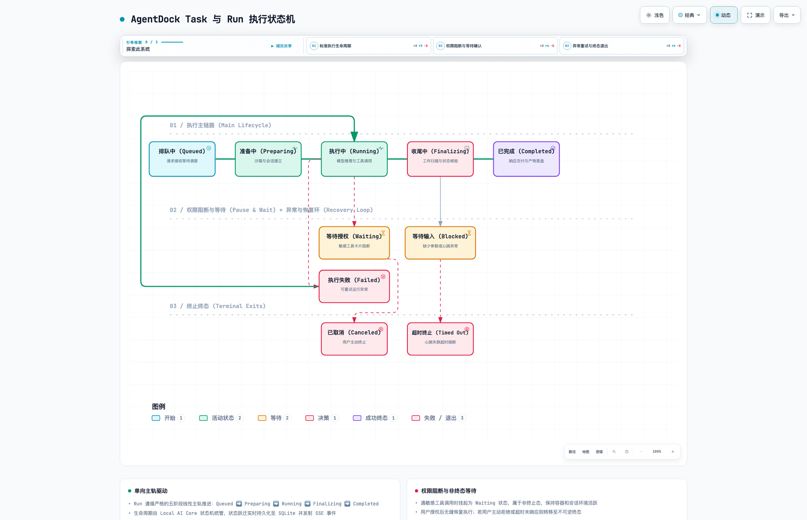

# State Ownership

Phase 0 establishes where core product state belongs so renderer, Electron, Local AI Core, and shared packages do not duplicate ownership.

## Ownership Table

| State | Owner | Shared Contract | Renderer Role | Electron Role |
| --- | --- | --- | --- | --- |
| Runtime detection | Local AI Core | `packages/contracts` | Display status, trigger refresh | Start Local AI Core |
| Runtime installation intent | Local AI Core | Reserved contract shape | Display action state when implemented | No installer ownership |
| Workspace registry | Local AI Core | `packages/contracts` | List, select, edit via APIs | No workspace ownership |
| Task lifecycle | Local AI Core | `packages/contracts` | Display and request actions | No task ownership |
| Run lifecycle | Local AI Core | `packages/contracts` | Display run status and request interrupts | No run ownership |
| Thread messages | Local AI Core | `packages/contracts` | Display and send messages | No routing ownership |
| Permission requests | Local AI Core | `packages/contracts` | Render pending request and submit chosen outcome | No permission ownership |
| Attachments | Local AI Core | `packages/contracts` | Render file/image metadata and request downloads or sends | No attachment ownership |
| Channel inbound content | Local AI Core channel adapters | `packages/contracts` | Display normalized thread messages | No platform parsing ownership |
| Channel outbound content | Local AI Core channel adapters | `packages/contracts` | Request sends through shared APIs | No platform delivery ownership |
| Device registry | Local AI Core | Future contract | Display presence and trust | Provide local device context |
| Approval requests | Local AI Core | Future contract | Prompt and resolve approvals | No policy ownership |
| Audit log | Local AI Core | Future contract | Display filtered history | No audit ownership |
| UI state | Renderer | Local component/store types | Own transient view state | None |
| Desktop window state | Electron | Electron-local types | None | Own shell lifecycle |

## Run 执行状态机生命周期 (Task & Run Lifecycle)

  <picture>
    <source media="(prefers-color-scheme: dark)" srcset="agent-run-lifecycle.dark.png">
    
  </picture>

> 💡 **交互式状态机**：可在浏览器中打开 [agent-run-lifecycle.html](agent-run-lifecycle.html)，体验动态状态跃迁轨迹、分步引导导览与深浅色切换。

## Boundary Rules

- Local AI Core owns durable product state and exposes it through `/api/local/v1/*`.
- Renderer owns transient UI state only: selected tabs, filters, optimistic loading flags, and view composition.
- Electron owns shell lifecycle only: window creation, app startup, and Local AI Core process startup.
- Shared packages define cross-process data shapes; duplicated ad hoc types should be avoided.
- Plugins declare capabilities, but Local AI Core remains the policy and persistence owner.

## Current Baseline

Runtime detection, workspace registry, and task records are already Local AI Core-owned. Device registry, approvals, and audit logs are planned but should follow the same ownership rule.
