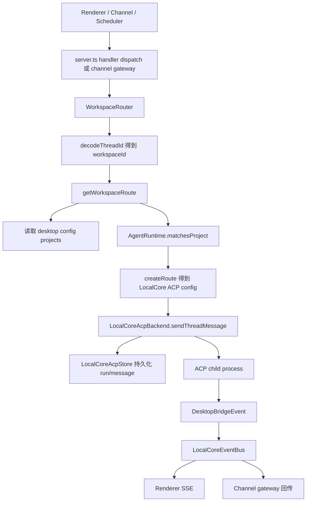
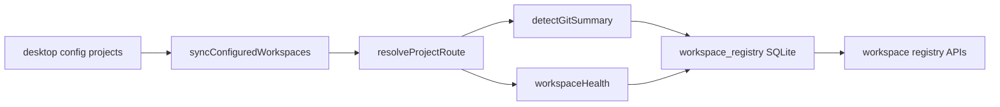
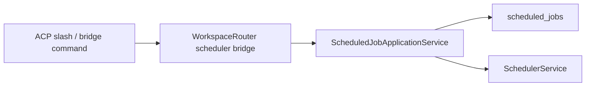

# Workspace Router Architecture

Workspace Router 是 Local AI Core 内部的工作区路由层。它把配置中的 project、agent runtime、thread、ACP backend、scheduler bridge 和 workspace registry 连接起来，确保 renderer、channel gateway、scheduler 走同一套线程和运行时入口。

## 职责边界

| 模块 | 关键文件 | 职责 |
| --- | --- | --- |
| Router | `services/local-ai-core/src/router/workspace-router.ts` | 解析 workspace route，管理线程操作、消息发送、approval、task、registry 和 bridge event。 |
| Route config | `services/local-ai-core/src/router/workspace-route-config.ts` | 归一化 project 配置，判断 Local Core ACP project。 |
| Thread id | `services/local-ai-core/src/thread/workspace-thread-id.ts` | workspace/thread id 编解码。 |
| ACP backend | `services/local-ai-core/src/acp/local-core-acp-backend.ts` | 执行 ACP 会话、流式事件、权限生命周期和持久化。 |
| Store | `services/local-ai-core/src/acp/local-core-acp-store.ts` | SQLite 持久化线程、消息、运行、approval、audit、channel binding。 |

## Thread 消息流程

## Workspace Registry 同步

## Scheduler Bridge

Workspace Router 只暴露 bridge，不保存 scheduler 业务规则。定时任务创建、路由解析和持久化由 `ScheduledJobApplicationService` 负责。

## 变更规则

- 新的 workspace route 规则应通过 agent runtime 的 `matchesProject` 和 `createRoute` 扩展。
- 线程、run、message、approval、audit 的持久化仍归 `LocalCoreAcpStore`，router 不应绕过 store 写状态。
- channel gateway 和 scheduler 需要发送消息时应通过 router 进入 ACP，不应直接创建 ACP backend。
- scheduler 相关命令只通过 bridge 调用应用服务，不在 router 内复制 route 解析。
