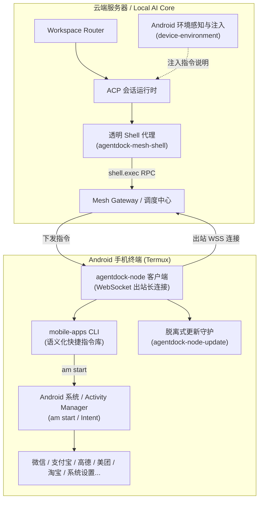

# Android / Termux 手机节点接入与移动端指令指南

本文档介绍如何将 Android 智能手机（如小米/Redmi、华为、OPPO、vivo 等 Android 8.0+ 设备）通过 Termux 接入 **AgentDock Mesh**，使云端部署的 Local AI Core 与大模型 Agent（Claude Code、Codex 等）能够无缝、安全地操控真实手机终端，执行各种文件系统操作与移动端 App 快捷指令。

---

## 1. 架构与设计原理



- **出站长连接（Outbound Only）**：手机节点通过 WebSocket 主动连接服务端网关（支持公共 HTTPS、Tailscale 或局域网），**手机端无需公网 IP、无需内网穿透、无需监听任何端口**。
- **透明无感代理（Transparent Proxy）**：大模型 Agent 运行在云端服务器，通过 `agentdock-mesh-shell` 将原生 Bash 工具命令透明代理至手机 Termux 执行。
- **免 Root 语义化快捷指令（`mobile-apps`）**：内置覆盖 37 个常用场景的高频 App 动作，通过标准 Android `am start` Intent 调起，无需手机 Root 或 Xposed。
- **脱离式独立自更新（Detached Self-Update）**：客户端通过独立的 Supervisor 守护进程更新 npm 包并平滑重启服务，避免远程执行更新命令时因连接断开导致流程失败。

---

## 2. 手机端接入模式选择

AgentDock 提供两种 Android 手机端接入形态：
1. **模式一：All-in-One 原生 APK 接入（推荐，零门槛）**：
   - 仅需安装单个 `agentdock-a11y.apk`（约 200KB），无需安装 Termux 或配置 Node.js；
   - 手机端**零本地监听端口（Zero-Listening-Port）**，采用加密出站长连接直连 Mesh Gateway；
   - 系统无障碍服务享有系统级前台保活，一键支持 `mobile-ui`、`mobile-apps` 以及兼容 `termux-api` 的全套硬件接口；
   - 配置方式：安装 APK ➔ 开启无障碍 ➔ 输入 Server 地址与配对 Token ➔ 点击连接即完成。
2. **模式二：Termux 开发者节点接入（极客模式）**：
   - 适用于需要在手机上编译代码、运行 Node.js/Python 脚本或执行复杂 Linux 工具链的开发者；
   - 按照下文 2.1 ~ 2.2 章节安装 Termux 并配置环境。

---

## 3. Termux 开发者节点准备（模式二）

### 3.1 安装 Termux
1. 请从 **[F-Droid](https://f-droid.org/packages/com.termux/)** 或 **[Termux GitHub Releases](https://github.com/termux/termux-app/releases)** 下载最新版 Termux APK 安装包（请勿使用 Google Play 商店的过时版本）。
2. 打开 Termux，更新软件包并安装基础依赖：
   ```bash
   pkg update -y
   pkg install nodejs-lts git -y
   ```
3. 检查 Node.js 版本（建议 Node.js 22+）：
   ```bash
   node -v
   ```

### 3.2 系统保活与权限配置（关键）
为了防止手机锁屏或息屏后 Android 系统终止 Termux 后台进程，请完成以下配置：

1. **申请 Termux 唤醒锁（Wake Lock）**：
   在 Termux 终端中执行：
   ```bash
   termux-wake-lock
   ```
   状态栏会出现 `Termux (wake lock held)` 图标。

2. **授予系统电池无限制权限**：
   - 进入系统 **设置 -> 应用管理 -> Termux -> 省电策略 / 电池优化**。
   - 选择 **无限制**（允许后台运行，不执行任何智能休眠省电策略）。

3. **允许后台弹出界面（针对小米 / HyperOS / MIUI 及国内定制 ROM）**：
   - 进入 **应用信息 -> 权限管理**。
   - 开启 **后台弹出界面** / **显示悬浮窗** 权限（确保终端调起支付宝、微信、地图等 App 时能直接前台展示界面）。
   - 允许 **自启动**。

---

## 3. 手机节点配对与接入步骤

### 3.1 在服务端创建配对凭据

可以通过 Web 控制台或管理员 CLI 创建单次配对令牌（有效期 10 分钟）：

- **Web 控制台方式**：
  1. 浏览器访问 AgentDock Web 控制台，进入 **Device Mesh** 页面。
  2. 点击 **Pair Device**，输入设备名称（如 `Xiaomi-13-Pro`）。
  3. 勾选 **Allow Shell**（允许执行终端命令）。
  4. 点击生成并下载 `pairing.json`。

- **CLI 方式**：
  ```bash
  agentdock-node pair \
    --server https://<your-server-domain> \
    --label Xiaomi-13-Pro \
    --allow-shell \
    --output /path/to/pairing.json
  ```

### 3.2 在手机端安装 AgentDock 客户端

在 Termux 中执行全局安装（推荐使用国内镜像源加速）：
```bash
npm install -g --registry=https://registry.npmmirror.com @kafca/agentdock
```

### 3.3 首次配对连接

将生成的 `pairing.json` 文件传输至手机（例如放置在 `/sdcard/xiaomi-pairing.json`）。

在 Termux 中运行配对连接命令：
```bash
agentdock-node connect \
  --server https://<your-server-domain> \
  --root /sdcard/agentdock-workspace \
  --pairing-file /sdcard/xiaomi-pairing.json \
  --allow-shell
```

**连接成功后**：
1. 客户端会自动将凭证安全落盘至 `$HOME/.agentdock/mesh-node.json`（权限严格受控为 `0600`）。
2. 配对令牌会被自动废弃，后续重新连接无需再提供 `--pairing-file`。

---

## 4. 后台常驻守护进程管理

为方便日常启停与自启动，建议在手机 `/sdcard/run-agentdock.sh` 放置常驻管理脚本：

```bash
#!/data/data/com.termux/files/usr/bin/bash
set -e

export PATH="/data/data/com.termux/files/usr/bin:$PATH"

mkdir -p "$HOME/.agentdock"
chmod 700 "$HOME/.agentdock"

if [ -f /sdcard/xiaomi-pairing.json ]; then
  cp -f /sdcard/xiaomi-pairing.json "$HOME/.agentdock/pairing.json"
  chmod 600 "$HOME/.agentdock/pairing.json"
fi

SERVER_URL="https://<your-server-domain>"
WORKSPACE_DIR="/sdcard/agentdock-workspace"
LOG_FILE="$HOME/.agentdock/node.log"

ACTION="${1:-foreground}"

case "$ACTION" in
  start|--daemon|-d)
    termux-wake-lock 2>/dev/null || true
    EXISTING_PID=$(pgrep -f "agentdock-node connect" || true)
    if [ -n "$EXISTING_PID" ]; then
      echo "=== AgentDock Mesh 已经在后台运行中 (PID: $EXISTING_PID) ==="
      exit 0
    fi

    PAIRING_ARG=""
    if [ ! -f "$HOME/.agentdock/mesh-node.json" ] && [ -f "$HOME/.agentdock/pairing.json" ]; then
      PAIRING_ARG="--pairing-file $HOME/.agentdock/pairing.json"
    fi

    nohup agentdock-node connect \
      --server "$SERVER_URL" \
      --root "$WORKSPACE_DIR" \
      $PAIRING_ARG \
      --allow-shell > "$LOG_FILE" 2>&1 &
    
    echo "✅ AgentDock Mesh 节点服务已在后台启动！"
    ;;

  stop)
    PID=$(pgrep -f "agentdock-node connect" || true)
    if [ -n "$PID" ]; then
      kill $PID
      echo "✅ 已停止服务 (PID: $PID)。"
    else
      echo "未检测到正在运行的服务。"
    fi
    ;;

  status)
    PID=$(pgrep -f "agentdock-node connect" || true)
    if [ -n "$PID" ]; then
      echo "✅ AgentDock Mesh 正在运行 (PID: $PID)"
    else
      echo "⭕ AgentDock Mesh 未运行"
    fi
    ;;

  restart)
    bash /sdcard/run-agentdock.sh stop || true
    sleep 1
    bash /sdcard/run-agentdock.sh start
    ;;

  update)
    agentdock-node-update
    ;;

  logs)
    tail -f "$LOG_FILE"
    ;;

  *)
    exec agentdock-node connect \
      --server "$SERVER_URL" \
      --root "$WORKSPACE_DIR" \
      --allow-shell
    ;;
esac
```

### 常用操作命令
```bash
bash /sdcard/run-agentdock.sh start    # 后台启动
bash /sdcard/run-agentdock.sh status   # 检查运行状态
bash /sdcard/run-agentdock.sh logs     # 实时查看日志
bash /sdcard/run-agentdock.sh stop     # 停止服务
bash /sdcard/run-agentdock.sh restart  # 重启服务
bash /sdcard/run-agentdock.sh update   # 脱离式平滑自更新
```

---

## 5. 移动端快捷指令库 (`mobile-apps`)

AgentDock 内置了针对 Android 常见生态的统一语义指令库 `mobile-apps`。无论是在手机终端直接输入，还是由大模型 Agent 通过云端代理发起，均可直接调用。

### 5.1 CLI 语法规范
```bash
mobile-apps list [--json]
mobile-apps open <app> [action] [options]
mobile-apps intent "<uri>"
```

支持全局附加 `--dry-run` 参数，仅输出将要执行的 `am start` 命令，不实际唤起手机界面，便于调试与测试。

### 5.2 支持的 37 项高频应用与动作速查

#### 支付与生活
| App 标识 | 动作名称 (`action`) | 命令示例 | 功能说明 |
|---|---|---|---|
| `alipay` | `pay` (默认) | `mobile-apps open alipay pay` | 调起支付宝付款码 |
| `alipay` | `scan` | `mobile-apps open alipay scan` | 调起支付宝扫一扫 |
| `alipay` | `bus` | `mobile-apps open alipay bus` | 调起乘车码（公交/地铁） |
| `alipay` | `collect` | `mobile-apps open alipay collect` | 调起个人收钱码 |
| `alipay` | `transfer` | `mobile-apps open alipay transfer` | 进入支付宝转账界面 |
| `wechat` | `scan` (默认) | `mobile-apps open wechat scan` | 调起微信扫一扫 |
| `wechat` | `pay` | `mobile-apps open wechat pay` | 调起微信个人收付款码 |

#### 地图与导航
| App 标识 | 动作名称 (`action`) | 命令示例 | 功能说明 |
|---|---|---|---|
| `amap` (高德) | `navigate` | `mobile-apps open amap navigate --destination="广州塔"` | 发起高德路线规划与导航 |
| `amap` (高德) | `search` | `mobile-apps open amap search --keyword="加油站"` | 搜索周边兴趣点 POI |
| `amap` (高德) | `traffic` | `mobile-apps open amap traffic` | 查看城市实时路况 |
| `baidumap` (百度) | `navigate` | `mobile-apps open baidumap navigate --destination="外滩"` | 发起百度地图导航 |
| `baidumap` (百度) | `search` | `mobile-apps open baidumap search --keyword="停车场"` | 搜索周边 POI |

#### 外卖与电商
| App 标识 | 动作名称 (`action`) | 命令示例 | 功能说明 |
|---|---|---|---|
| `meituan` (美团) | `open` | `mobile-apps open meituan` | 打开美团首页 |
| `meituan` (美团) | `search` | `mobile-apps open meituan search --keyword="火锅"` | 搜索外卖或团购美食 |
| `meituan` (美团) | `orders` | `mobile-apps open meituan orders` | 进入我的全部外卖订单 |
| `taobao` (淘宝) | `open` | `mobile-apps open taobao` | 打开淘宝首页 |
| `taobao` (淘宝) | `search` | `mobile-apps open taobao search --keyword="机械键盘"` | 搜索淘宝商品 |
| `taobao` (淘宝) | `cart` | `mobile-apps open taobao cart` | 直达淘宝购物车 |
| `taobao` (淘宝) | `orders` | `mobile-apps open taobao orders` | 直达我的订单 |
| `jd` (京东) | `open` | `mobile-apps open jd` | 打开京东首页 |
| `jd` (京东) | `search` | `mobile-apps open jd search --keyword="显示器"` | 搜索京东商品 |
| `jd` (京东) | `cart` | `mobile-apps open jd cart` | 打开京东购物车 |

#### 影音娱乐
| App 标识 | 动作名称 (`action`) | 命令示例 | 功能说明 |
|---|---|---|---|
| `netease-music` | `open` | `mobile-apps open netease-music` | 打开网易云音乐首页 |
| `netease-music` | `search` | `mobile-apps open netease-music search --keyword="周杰伦"` | 搜索单曲、歌手、专辑 |
| `netease-music` | `daily` | `mobile-apps open netease-music daily` | 播放每日歌曲推荐 |
| `bilibili` (B站) | `open` | `mobile-apps open bilibili` | 打开哔哩哔哩主页 |
| `bilibili` (B站) | `search` | `mobile-apps open bilibili search --keyword="科技评测"` | 搜索视频或 UP 主 |
| `bilibili` (B站) | `rank` | `mobile-apps open bilibili rank` | 直达全站热门视频榜单 |
| `douyin` (抖音) | `open` | `mobile-apps open douyin` | 打开抖音刷视频 |
| `douyin` (抖音) | `search` | `mobile-apps open douyin search --keyword="数码开箱"` | 搜索短视频内容与用户 |

#### 系统设置与辅助
| App 标识 | 动作名称 (`action`) | 命令示例 | 功能说明 |
|---|---|---|---|
| `system` | `settings` | `mobile-apps open system settings` | 打开安卓系统总设置页 |
| `system` | `wifi` | `mobile-apps open system wifi` | 打开 WLAN / WiFi 设置 |
| `system` | `bluetooth` | `mobile-apps open system bluetooth` | 打开蓝牙设置页 |
| `system` | `app-info` | `mobile-apps open system app-info --package="com.tencent.mm"` | 打开指定应用的管理详情页 |
| `system` | `browser` | `mobile-apps open system browser --url="https://agentdock.com"` | 默认浏览器打开目标网址 |
| `system` | `dial` | `mobile-apps open system dial --phone="10086"` | 调起拨号键盘并填入电话号码 |

---

## 6. 页面内感知与微观交互 (`mobile-ui`)

在第一阶段中，`mobile-apps` 解决了**“快速跳到目标页面”**；而 `mobile-ui` 解决了**“直达页面后的深度交互”**。

通过与运行在手机内部的极简无障碍桥接服务（`agentdock-a11y` Daemon，监听 `http://127.0.0.1:19832`，仅本机内部访问）通信，Agent 能够直接获取当前屏幕元素结构，并执行点击、输入和手势。

### 6.1 组合协同模式（Macro + Micro）
```bash
# 1. 宏观直达：秒级拉起美团搜索“咖啡”
mobile-apps open meituan search --keyword="咖啡"
sleep 2

# 2. 微观感知：查看搜索结果列表
mobile-ui dump

# 3. 精准交互：点击第 1 个搜索结果
mobile-ui click 1

# 4. 浏览详情：下滑半屏
mobile-ui scroll down
```

### 6.2 CLI 命令速查

| 命令 | 说明 | 示例 |
|---|---|---|
| `mobile-ui status` | 查看无障碍服务健康度与当前前台应用 | `mobile-ui status` |
| `mobile-ui dump [--json]` | 提取当前屏幕可见元素（带单调递增序号 `[1], [2]...`） | `mobile-ui dump` |
| `mobile-ui click <target>` | 智能点击（支持序号、文本匹配、viewId 或坐标） | `mobile-ui click 1` 或 `mobile-ui click "搜索"` |
| `mobile-ui input <text>` | 在输入框中输入文本（支持 `--target=<序号>`） | `mobile-ui input "特浓咖啡豆" --target=2` |
| `mobile-ui scroll [down\|up]` | 屏幕上下滑动翻页（默认 down 向下滑动） | `mobile-ui scroll down` |
| `mobile-ui back` | 触发系统物理返回键（Back） | `mobile-ui back` |
| `mobile-ui home` | 触发系统回到桌面（Home） | `mobile-ui home` |
| `mobile-ui wait <text>` | 确定性等待目标元素出现，解决页面加载时延 | `mobile-ui wait "商品列表" --timeout=5` |

### 6.3 紧凑文本输出示例 (`mobile-ui dump`)
默认输出经过人类视觉流排序（从上到下、从左到右），单行呈现且极度节省 Token：
```text
=== Screen: com.taobao.taobao (1080x2400) ===
[1] [Button] "搜索" (id: search_btn)
[2] [EditText] "搜索发现: 挂耳咖啡" (id: search_edit)
[3] [TextView] "综合排序" (selected)
[4] [ViewGroup] "云南高海拔日晒耶加雪菲咖啡豆 250g ¥48" (center: 520,450)
[5] [ViewGroup] "意式拼配深度烘焙咖啡豆 500g ¥69" (center: 520,850)
```

### 6.4 无障碍桥接服务 (`agentdock-a11y`) 配置
1. 在手机上安装微型桥接服务 APK（体积仅 ~200KB，无外部网络权限，纯本地服务）。
2. 进入系统 **设置 -> 更多设置 -> 无障碍（辅助功能）**。
3. 找到 **AgentDock Accessibility Service**，开启服务开关。
4. 在 Termux 中执行 `mobile-ui status`，确认返回 `Service enabled: true` 即可正常使用。

---

## 7. 客户端脱离式自更新（Self-Update）

当 AgentDock 发布新版本时，可以通过以下方式安全自更新手机客户端：

### 7.1 更新原理
更新命令通过独立 supervisor 子进程启动：
1. **防止请求超时掐断**：发起更新后，CLI 在 **~300ms** 内立即返回成功，避免长连接等待。
2. **并发更新锁**：创建 `$HOME/.agentdock/update.lock`，防止并发重复更新。
3. **镜像源加速**：通过国内 `npmmirror` 镜像源拉取 `@kafca/agentdock@latest`。
4. **平滑重载**：更新完成后自动调用重启脚本，节点在 2~3 秒内重新向 Mesh 网关报到。

### 7.2 触发方式
- **方式一（飞书 / 自然语言对 Agent 发送）**：
  直接发送：“更新手机上的 AgentDock 客户端”，Agent 会自动调用 `agentdock-node-update`。
- **方式二（手机端终端操作）**：
  ```bash
  agentdock-node-update
  # 或
  bash /sdcard/run-agentdock.sh update
  ```

---

## 8. 飞书 / Lark 协同实战

在云端 Local AI Core 中：
1. 创建绑定到该手机节点的 Workspace（例如名称为 `Xiaomi-Phone`，设备绑定为 `node:xxxx`）。
2. 在 Channel 设置中绑定飞书机器人。
3. 此时无需任何额外的工具配置，`device-environment` 会自动在云端工作区中生成针对该 Android 设备的环境提示词：
   - 告诉 Agent 当前操作的是真实的 Android 手机；
   - 自动提供 `mobile-apps` 与 `mobile-ui` 的操作示例与语法说明。

### 对话示例
- **用户**：“帮我出示支付宝乘车码”
  - **Agent 行为**：识别意图，执行 `mobile-apps open alipay bus`。
  - **手机响应**：手机屏幕自动点亮并跳转至乘车码界面。
- **用户**：“去淘宝搜咖啡，帮我打开第 1 个”
  - **Agent 行为**：
    1. 执行 `mobile-apps open taobao search --keyword="咖啡"`；
    2. 等待 2 秒后执行 `mobile-ui dump` 获取结果列表；
    3. 执行 `mobile-ui click 1` 打开第 1 个搜索结果。
  - **手机响应**：淘宝自动搜索并跳转至第一个商品详情页。
- **用户**：“导航到广州塔，用高德”
  - **Agent 行为**：执行 `mobile-apps open amap navigate --destination="广州塔"`。
  - **手机响应**：高德地图启动并规划好路线。
- **用户**：“打开系统 WiFi 设置看看”
  - **Agent 行为**：执行 `mobile-apps open system wifi`。

---

## 9. 常见问题与排查 (Troubleshooting)

### Q1: 手机锁屏一段时间后，服务端显示节点离线？
- **原因**：Android 系统的激进后台管理挂起了 Termux。
- **排查**：
  1. 确保在 Termux 中执行了 `termux-wake-lock`。
  2. 检查系统设置中 Termux 是否设为 **无限制** 电池策略。
  3. 小米/HyperOS 用户请将 Termux 加入 **任务卡片锁定**，并开启 **自启动**。

### Q2: 执行快捷指令提示 `am: Permission denied` 或 `Permission Denial: starting Intent`？
- **原因**：部分国产 ROM 拦截了未在前台的后台 Intent 启动。
- **解决**：在手机的 **应用设置 -> Termux -> 权限管理** 中，勾选 **后台弹出界面** 和 **显示悬浮窗**。

### Q3: 执行脚本提示 `/sdcard/...: Permission denied`？
- **原因**：Android 对外部共享存储 `/sdcard` 挂载了 `noexec` 标志，不能直接以可执行文件方式运行。
- **解决**：
  - 必须显式使用解释器运行，例如 `bash /sdcard/run-agentdock.sh`。
  - 二进制命令请安装在 Termux 原生路径 `$PREFIX/bin`（即 `/data/data/com.termux/files/usr/bin/`）。

### Q4: 如何查看运行状态与错误日志？
- 实时日志查看：
  ```bash
  tail -f $HOME/.agentdock/node.log
  ```
- 更新日志查看：
  ```bash
  cat $HOME/.agentdock/update.log
  ```
