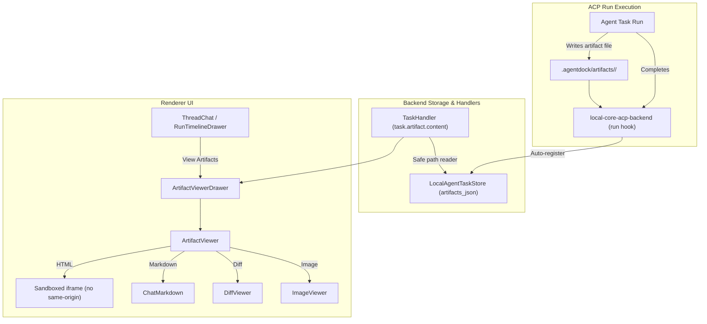

# Plan: Artifact Surface (Agent 产物渲染与沙箱预览)

- **Date**: 2026-08-30
- **Status**: Approved
- **Issue**: [#114](https://github.com/helloimcx/agentdock/issues/114)
- **Author**: Antigravity

---

## 拟议设计图

---

## 实施步骤（TDD 驱动）

### Phase 1: 契约与 SDK (Contracts & Core SDK)
1. **RED**: 在 `tests/contracts/local-core-contracts.test.ts` 中编写测试，验证 `AgentTaskArtifact` 的类型识别与辅助方法（`inferArtifactKind`, `getArtifactMimeType` 等）。
2. **GREEN**: 在 `packages/contracts/src/local-core.ts` 和 `packages/core-sdk/src/runtime.ts` 中实现对应接口与 SDK 方法。
3. **REFACTOR**: 导出清晰的类型守卫与常量。

### Phase 2: 后端目录自动登记与 Content API (Local AI Core)
1. **RED**: 在 `tests/electron/workspace-task-store.test.ts` 中编写测试：
   - 验证 run 完成时从 `.agentdock/artifacts/<runId>` 自动登记产物到 `agent_tasks.artifacts_json`。
   - 验证 `GET /api/local/v1/tasks/:taskId/artifacts` 与 `GET /api/local/v1/tasks/:taskId/artifacts/:artifactId/content` 端点。
   - 验证路径安全校验（拒绝越权/非法路径）。
2. **GREEN**:
   - 在 `services/local-ai-core/src/runtime/server-routes.ts` 注册路由。
   - 在 `services/local-ai-core/src/runtime/handlers/task-handler.ts` 实现端点。
   - 在 `services/local-ai-core/src/acp/local-core-acp-backend.ts` 添加 run 收尾产物扫描与自动登记。
3. **REFACTOR**: 保证只读安全，统一 MIME 格式解析。

### Phase 3: 前端组件与沙箱预览 (Renderer UI)
1. 实现 `src/components/artifacts/ArtifactViewer.tsx`：支持 Sandboxed iframe、Markdown、Diff、图片与代码文本。
2. 实现 `src/components/artifacts/ArtifactViewerDrawer.tsx`：支持多工件列表切换与全屏预览。
3. 在 `src/pages/Threads/ThreadChat.tsx` 顶部和 `src/components/traces/RunTimelineDrawer.tsx` 嵌入 Artifacts 入口。

### Phase 4: 全量测试与 QA
1. 运行 `pnpm test` 全量测试。
2. 运行 `pnpm typecheck`、`pnpm lint:circular`、`pnpm lint:duplicate`。
3. 更新 `README.md` 的 `New` 区域。
