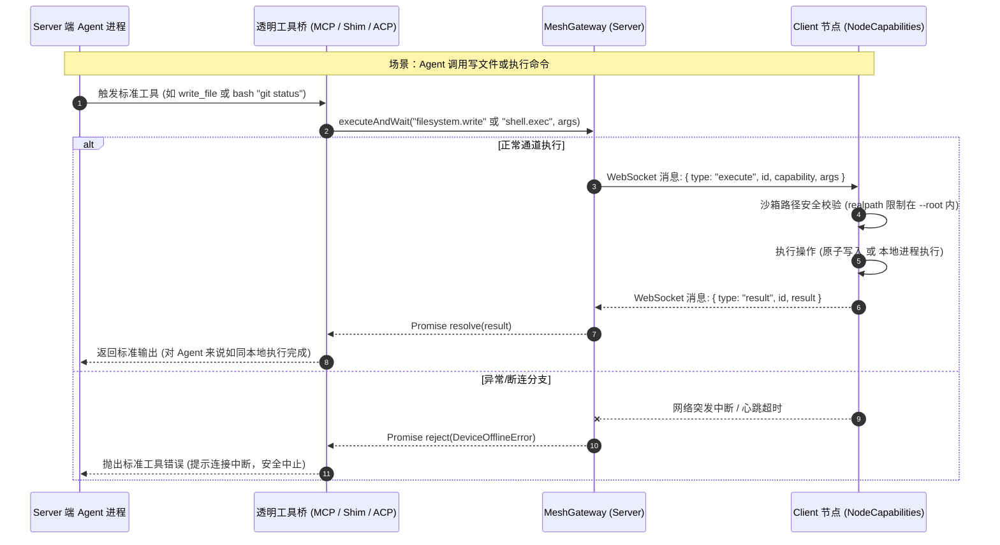

# Plan: 远程 Workspace 支持（Agent 运行在 Server，Toolcall 透明执行在 Client）

## 1. 架构影响分析（Architecture Impact Classification）

- **分类判定**：`Architecture Impact: Required`
- **判定依据**：
  1. 引入了新型的执行形态：在现有的 Local（本地执行）和 Sandbox（云端容器沙箱）之外，增加了 **Mesh Remote（端云分离受控执行）** 模式；
  2. 扩展了 Mesh 契约：从只读扩展为支持双向原子写入（`filesystem.write`）；
  3. 建立了跨进程透明工具执行桥梁：将 ACP / MCP 工具调用跨越 WebSocket 反向隧道分发到客户端。
- **架构治理要求**：
  1. 完成实现后同步更新 `docs/architecture/mesh.md`、`docs/architecture/system-architecture.json`、`README.md`；
  2. 运行 `pnpm lint:arch` 门禁，确保 showcase 校验 100% 通过；
  3. 创建并同步 `docs/architecture/changes/2026-10-03-remote-workspace-mesh-tools.md`。

---

## 2. 方案全景与时序图（Architecture & Sequence Diagram）

### 2.1 系统架构图

```mermaid
flowchart TD
    subgraph UI ["前端界面 (Renderer / Web)"]
        WSForm["Workspace 表单 (选择本机 vs Mesh 设备)"]
    end

    subgraph Server ["Server 端 (Local AI Core 宿主机)"]
        Router["WorkspaceRouter / ProjectRegistry"]
        ACP["LocalCoreAcpBackend / Coordinators"]
        AgentProc["Agent 进程 (Claude Code / Hermes / Pi / Codex)"]
        ShadowDir["虚拟影子目录 (Anchor Cwd)"]
        
        subgraph BridgeSubsystem ["透明工具代理子系统"]
            MeshMcp["内置动态 MeshMcpServer (bash, execute_command, read/write/list)"]
            AcpFsBridge["ACP fs/read & write 协议桥"]
        end
        
        Gateway["MeshGateway (executeAndWait 同步等待器)"]
    end

    subgraph Client ["Client 设备 (开发者机器 / 靶机)"]
        NodeAgent["NodeAgent (出站 WebSocket 长连接)"]
        NodeCaps["NodeCapabilities (安全沙箱)"]
        FileSystem["本地物理文件系统 (Approved Root)"]
        LocalShell["本地终端程序 (git, npm, python...)"]
    end

    UI -->|创建/更新 Workspace| Router
    Router -->|deviceId: 'node:id'| ACP
    ACP -->|启动并挂载| AgentProc
    AgentProc -->|物理 cwd 锚定| ShadowDir
    
    AgentProc -.->|MCP Toolcall (bash/fs)| MeshMcp
    AgentProc -.->|ACP fs/请求| AcpFsBridge
    
    MeshMcp --> Gateway
    AcpFsBridge --> Gateway
    
    Gateway ===|WSS 加密双向长连接| NodeAgent
    NodeAgent --> NodeCaps
    NodeCaps --> FileSystem
    NodeCaps --> LocalShell
```

### 2.2 核心执行时序图



---

## 3. 分阶段实施计划（Phased Execution Plan）

### 阶段 1：Mesh 协议扩展与 Client 端安全写能力
- **文件**：
  - `packages/contracts/src/mesh.ts`
  - `services/local-ai-core/src/mesh/node-capabilities.ts`
  - `services/local-ai-core/src/mesh/node-agent.ts`
- **动作**：
  1. 在 contracts 中追加 `'filesystem.write'` 及参数定义；
  2. 在 `NodeCapabilities` 中实现 `write()`，严格使用 `realpath` 做沙箱拦截，实现临时文件 + 原子 rename，支持递归自动创建缺失父目录；
  3. `NodeAgent` 握手能力列表包含 `filesystem.write`；
  4. 编写 `tests/electron/mesh-node-policy.test.ts` 测试用例，验证正常写、父目录创建以及越界拦截。

### 阶段 2：MeshGateway 同步执行桥梁 (`executeAndWait`)
- **文件**：
  - `services/local-ai-core/src/mesh/mesh-gateway.ts`
  - `services/local-ai-core/src/mesh/mesh-store.ts`
- **动作**：
  1. 在 `MeshGateway` 中增加 `executeAndWait(input: MeshExecutionInput, timeoutMs?: number, signal?: AbortSignal)`；
  2. 内部维护 `Map<requestId, { resolve, reject, timeoutId }>`；
  3. 收到客户端 `result` 或 `error` 时立即 resolve；
  4. 客户端连接断开时，批量 reject 该连接下的所有等待任务，防止请求挂起；
  5. 编写单元测试验证正常 resolve、超时 reject、掉线 reject。

### 阶段 3：远程执行后端与透明工具桥
- **文件**：
  - `services/local-ai-core/src/execution/agent-execution-backend.ts`
  - `services/local-ai-core/src/execution/remote-mesh/remote-mesh-backend.ts` **(新增)**
  - `services/local-ai-core/src/execution/remote-mesh/remote-mesh-mcp-server.ts` **(新增)**
  - `services/local-ai-core/src/router/workspace-route-config.ts`
  - `services/local-ai-core/src/acp/local-core-acp-session-coordinator.ts`
  - `services/local-ai-core/src/acp/local-core-acp-turn-coordinator.ts`
  - `services/local-ai-core/src/acp/local-core-acp-transport.ts`
- **动作**：
  1. 实现 `RemoteMeshExecutionBackend`：在 Server 分配持久化影子目录（带路径清洗安全防护）；
  2. 实现内置动态 `remote-mesh-mcp-server`，向 Agent 注入标准的 `read_file`, `write_file`, `list_directory`, `execute_command`, `bash` 工具，支持跨平台 shell 分发；
  3. 在 `local-core-acp-transport.ts` 中针对 remote workspace 宣告 `clientCapabilities.fs = { readTextFile: true, writeTextFile: true }`；
  4. 在 `local-core-acp-turn-coordinator.ts` 中拦截 `fs/read_text_file` 与 `fs/write_text_file` 并调用 `MeshGateway.executeAndWait`。

### 阶段 4：工作区数据持久化与前端表单交互
- **文件**：
  - `packages/contracts/src/workspace.ts`
  - `shared/desktop.ts`
  - `services/local-ai-core/src/runtime/workspace-project-registry.ts`
  - `src/pages/Desktop/Workspace.tsx`
  - `src/pages/Desktop/workspace-sections.tsx`
  - `src/pages/Desktop/workspace-model.ts`
- **动作**：
  1. 对齐前后端 `deviceId` 字段，支持绑定 `node:<uuid>`；
  2. 工作区创建/编辑弹窗增加设备选择器（展示本机与所有已配对在线的 Mesh 设备及其标签）；
  3. 完善 i18n 多语言文案（中、英）。

### 阶段 5：架构维护与质量门禁验收
- **动作**：
  1. 更新架构全景文档及规范文件；
  2. 运行 `pnpm lint:arch` 确保架构模型合规；
  3. 编写集成测试 `tests/integration/remote-workspace-mesh.test.ts`；
  4. 运行 `pnpm verify`（`typecheck`, `lint:gates`, `test`, `coverage`），确保全绿通过。
