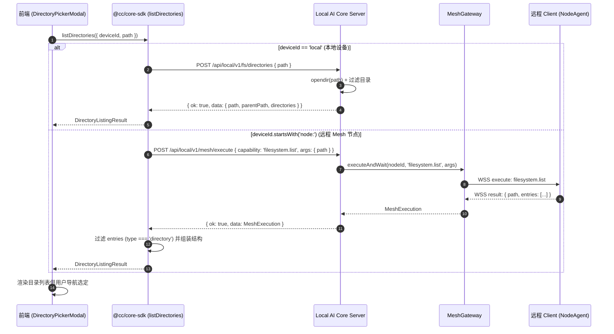

# Plan: 工作区本地与远程目录可视化选择（Directory Picker）

## 1. 架构影响分析（Architecture Impact Classification）

- **分类判定**：`Architecture Impact: None`
- **判定依据**：
  1. 不改变现有系统分层边界、部署拓扑或核心数据模型所有权；
  2. 仅在 Local AI Core 运行时新增一个只读目录遍历 HTTP 端点，并在前端桌面页面新增一个辅助选择器弹窗；
  3. 远程设备目录枚举复用已有的 Mesh `filesystem.list` 协议能力。

---

## 2. 方案数据流图（Mermaid）

---

## 3. 分阶段实施计划（Phased Execution Plan）

### 阶段 1：后端本地目录读取 API（TDD）
- **文件**：
  - `services/local-ai-core/src/runtime/server-routes.ts`
  - `services/local-ai-core/src/runtime/server.ts`
  - `tests/integration/fs-directories.test.ts`
- **动作**：
  1. 编写集成测试 `tests/integration/fs-directories.test.ts`，验证 `POST /api/local/v1/fs/directories` 支持默认路径、指定路径、父级路径提取及错误路径保护；
  2. 在 `server-routes.ts` 与 `server.ts` 实现安全目录遍历处理逻辑。

### 阶段 2：Core SDK 统一调用封装
- **文件**：
  - `packages/core-sdk/src/runtime.ts`
  - `packages/contracts/src/workspace.ts` 或 `packages/contracts/src/index.ts`
- **动作**：
  1. 声明 `DirectoryListingResult` 契约类型；
  2. 实现 `listDirectories({ deviceId, path })`，无缝衔接本地与远程 Mesh 调用。

### 阶段 3：前端目录选择模态框与表单集成
- **文件**：
  - `src/pages/Desktop/DirectoryPickerModal.tsx`
  - `src/pages/Desktop/workspace-components.tsx`
  - `src/pages/Desktop/workspace-sections.tsx`
- **动作**：
  1. 编写 `DirectoryPickerModal.tsx`，支持设备标签、路径输入/返回上一层、目录过滤、点击下钻及选定确认；
  2. 在新建 Workspace 弹窗与项目基础配置中的 `Host workspace path` 旁添加“浏览...”按钮触发弹窗；
  3. 控制函数圈复杂度 <= 15，符合 ESLint 门禁规范。

### 阶段 4：质量门禁与全量验证
- **动作**：
  1. 运行 `pnpm typecheck`；
  2. 运行 `pnpm lint:gates`（圈复杂度 <= 108，0 循环依赖，0 重复代码）；
  3. 运行 `pnpm test`（含新增集成测试与 BDD 套件）；
  4. 运行 `pnpm coverage`。
