# Plan: Android 无障碍桥接 APK 原生集成 AgentDock Mesh Client

## 1. 架构影响评估 (Architecture Impact)
- **结论**：`Architecture Impact: None`
- **理由**：该改造属于移动终端节点的端侧平滑演进与能力增强。服务端（Local AI Core / Mesh Gateway）既有数据模型、SQLite Schema、WebSocket 协议规范（`packages/contracts/src/mesh.ts`）与 ACP 运行时保持 100% 不变；npm 客户端（`agentdock-node`）继续完整保留；新增能力完全封装在 Android APK 内部，并且彻底移除 APK 原有的本地 HTTP 监听端口，实现纯出站安全长连接。

---

## 2. 方案架构图 (Mermaid)

```mermaid
flowchart TD
    subgraph Server["云端服务器 / Local AI Core"]
        Gateway["Mesh Gateway\n(WebSocket /api/local/v1/mesh)"]
        ACP["ACP 运行时 / Claude Code Agent"]
        ShellProxy["agentdock-mesh-shell\n(下发 shell.exec 请求)"]
        ACP --> ShellProxy
        ShellProxy --> Gateway
    end

    subgraph APK["Android 手机终端：agentdock-a11y.apk (零本地监听端口)"]
        MeshClient["MeshClient.java\n(RFC 6455 原生 WebSocket 出站长连接)"]
        Dispatcher["CommandDispatcher.java\n(虚拟 Shell 拦截器与命令行分发)"]
        Prefs["MeshPreferences.java\n(持久化配置与配对凭据)"]
        
        subgraph NativeEngines["原生功能执行引擎"]
            A11y["AgentDockAccessibilityService\n(屏幕 Dump / 双模点击 / 输入 / 手势)"]
            IntentEng["IntentEngine.java\n(原生 Intent 调起支付宝/微信/高德等)"]
            SysApis["SystemApiHandlers.java\n(TTS / 电池 / 剪贴板 / 振动 / 手电筒 / Toast)"]
            FallbackSh["ProcessBuilder\n(/system/bin/sh 降级执行基础命令)"]
        end
        
        UI["MainActivity.java\n(配对配置 / 状态看板 / 权限开关)"]
        
        Gateway <==>|WSS 出站连接\n心跳 10s & 断线重连| MeshClient
        UI -->|写入凭据| Prefs
        Prefs -->|读取凭据| MeshClient
        MeshClient -->|shell.exec 请求| Dispatcher
        Dispatcher -->|mobile-ui <args>| A11y
        Dispatcher -->|mobile-apps <args>| IntentEng
        Dispatcher -->|termux-* <args>| SysApis
        Dispatcher -->|其他通用系统指令| FallbackSh
    end
```

---

## 3. 实施顺序与关键里程碑

### Step 1: 原生 WebSocket Mesh 协议客户端实现 (`MeshClient.java` & `MeshPreferences.java`)
- 在 `tools/agentdock-a11y/src/main/java/com/agentdock/a11y/` 下新增 `MeshPreferences.java`，负责 `serverUrl`、`nodeId`、`token` 的存取与配对状态；
- 新增 `MeshClient.java`：纯 Java 实现轻量 RFC 6455 协议（包含握手 Upgrade、掩码打包、帧解析、`hello`、10s 心跳、45s 超时重连、`execute` 派发与 `result` 应答）；
- 支持 HTTP POST 调用 `/api/local/v1/mesh/enroll` 完成一键配对。

### Step 2: 虚拟 Shell 拦截与原生功能处理器 (`CommandDispatcher.java` & `SystemApiHandlers.java`)
- 新增 `SystemApiHandlers.java`：
  - TTS 语音：使用 `android.speech.tts.TextToSpeech`；
  - 电池状态：监听 `BatteryManager.EXTRA_*`，格式化为与 `termux-battery-status` 相同标准的 JSON；
  - 剪贴板：利用无障碍特权调用 `ClipboardManager`；
  - 硬件震动与手电筒：调用 `Vibrator` 与 `CameraManager.setTorchMode`；
  - Toast 提醒：主线程调用 `Toast.makeText`；
  - 音量控制：调用 `AudioManager`。
- 新增 `IntentEngine.java`：
  - 移植 `definitions.ts` 中最常用的 30+ 场景 Intent 映射表（支付宝、微信、美团、淘宝、高德、系统设置）；
  - 支持 `mobile-apps open <app> <action>` 与 `mobile-apps intent "<uri>"`。
- 新增 `CommandDispatcher.java`：
  - 识别传入命令字符串，精准路由到 `mobile-ui`、`mobile-apps`、`termux-*` 或系统 shell 降级。

### Step 3: 无障碍服务生命周期串联与移除本地 HTTP 服务
- 移除 `HttpServerBridge.java`，彻底关闭本地 19832 端口；
- 在 `AgentDockAccessibilityService.java` 中：
  - `onServiceConnected()` 时自动读取配置并启动 `MeshClient`；
  - `onDestroy()` 时安全断开长连接。
- 在 `MainActivity.java` 中：
  - 增加 Server 地址与 Pairing Token 输入区、配对接入按钮；
  - 实时展示 Mesh 连接状态标签（🟢 已连接 / 🔴 未配置 / 🟡 重连中）。

### Step 4: 契约测试与回归验证
- 在 `tests/contracts/` 下新增模拟测试 `android-a11y-mesh.test.ts`，验证：
  - MeshClient 协议交互时序（`hello` -> `welcome` -> `execute` -> `result`）；
  - 虚拟命令在各种边界输入下的格式正确性；
  - 运行既有所有契约与集成测试，确保零回归。

### Step 5: 更新文档指南
- 更新 `tools/agentdock-a11y/README.md` 与 `docs/operations/android-termux-mesh-guide.md`，添加 All-in-One 单 APK 接入指南。
