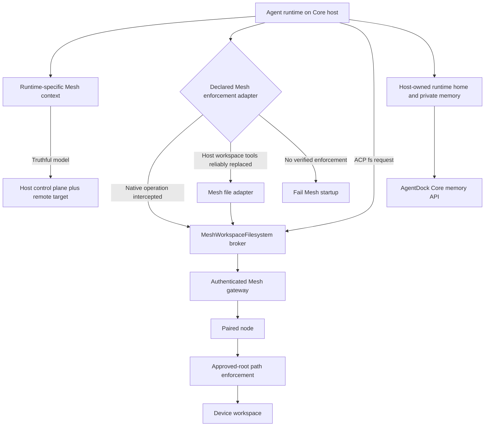

# Mesh workspace and runtime context plan

## Complexity and architecture impact

- Complexity: Complex. The change crosses Mesh authorization and dispatch, runtime-specific tool registration and instruction injection, ACP, workspace and memory storage ownership, and all registered agent types.
- Architecture Impact: Required. The execution prompt must reflect actual server/device boundaries; authoritative filesystem requests cross that boundary, and host-owned agent memory must remain separate.
- Approved implementation is in progress in the isolated Mesh worktree. The runtime inventory found ten registered types: Claude Code, OpenCode and Pi now have enforcement profiles; the other seven are explicitly gated until their provider-specific file-tool boundary is verified.

## Implementation steps

1. Inventory the live agent registry. For every runtime, trace (a) how system instructions are delivered and whether the runtime actually honors them, (b) how shell and native workspace file tools are registered/authorized/invoked, and (c) how agent-private memory/home paths are chosen. Record repository evidence and provider evidence separately.
2. Define a shared Mesh runtime context contract with two locations: **host control plane** (Agent process, runtime home/configuration, credentials, private durable memory) and **remote execution target** (paired node label/platform, approved-root workspace, and only operations proven to route there). The contract must never say the Agent process itself runs on the device.
3. For each runtime, select and document its supported instruction injection method and its filesystem/shell enforcement adapter. Build the agent-visible list of remote capabilities from this same profile. Do not assume generic ACP metadata, provider tool names, or prompt wording are sufficient proof. If the method cannot deliver minimum truthful context or securely control file paths, gate Mesh session startup with a runtime-specific explanation.
4. Use runtime-specific adapters over the authenticated Mesh file capabilities. The central MCP/Pi tool implementation bounds reads, writes, edits, directory listing and globbing to the approved root. Shell is a separate opt-in capability: it starts at that root as cwd but has the device user's normal OS permissions and is not root-confined or sandboxed. A shell denial or failure must not fall back to the host.
5. Keep runtime home/configuration and provider-private memory host-owned. Store Core workspace memory for a Mesh workspace under a stable namespace in Core user data, separate from the shadow directory. On first access, copy valid legacy Markdown memory without deleting its old copy; keep the existing SQLite index/API.
6. Implement an explicit enforcement and instruction-delivery profile for each runtime in the live registry. Startup validates routing, context delivery and memory path separation before launching the session. The current support table is documented in `docs/architecture/mesh-runtime-compatibility.md`.
7. Exercise enabled profiles and all registered gated runtimes, including context delivery, file routing, fail-closed startup, path rejection, Mesh errors and host-owned memory migration. Keep local and sandbox behavior unchanged.
8. Synchronize architecture facts, `docs/architecture/mesh.md`, one dated change record, the active Archify source/provider outputs, overview, README managed diagram block and README New section. Include the per-runtime compatibility matrix in a maintainable project document.
9. Review the implementation and report verified evidence and any runtimes deliberately still gated. Do not call the feature complete while any runtime can silently write to the host shadow or is told a false execution topology.

## Intended data flow

Architecture Impact is Required, so the expected workflow is rendered in [the Archify design artifact](../architecture/changes/2026-10-04-mesh-runtime-context.html), sourced from [its workflow specification](../architecture/changes/2026-10-04-mesh-runtime-context.workflow.json). This shows the planned host/target boundary, shared route, memory path, and fail-closed branch.

## CLI compatibility decision

Keep the existing `lac` command tree unchanged in this implementation. Mesh already has an operator-facing `agentdock-node execute --node <id> --capability <name> --args <JSON>` command, while the runtime adapters need structured tools and provider-specific disabling/routing to preserve each agent's file semantics. A CLI command invoked inside the intercepted agent Shell would execute on the Mesh node itself, so it cannot reliably act as the host-to-Mesh dispatcher. The node's shell starts in the approved root but can access other paths and network resources allowed to its OS user; the CLI is not a security boundary.

If we add a unified Mesh command under `lac` later, make it an additive host-side convenience over the same authenticated gateway, with an unambiguous form such as `lac mesh exec <node-id> -- df -h`. Preserve program and argument arrays (no shell-string evaluation), Mesh capability authorization, and existing `lac` argument parsing. This would improve operator/script compatibility but would not replace runtime adapters or enable an otherwise unsupported agent.

## Verification strategy

- Derive the matrix from the runtime registry and inspect each actual tool-control mechanism; provider docs are supporting evidence, not a substitute for checking the integration code.
- For every runtime, inspect the final rendered system context and verify the delivery mechanism is actually consumed; assert it distinguishes agent process location from remote workspace/execution location and does not claim unsupported capabilities.
- For each supported runtime, use a controlled Mesh node and host-shadow sentinel to demonstrate routing or fail-closed launch behavior for workspace file operations.
- Verify host-owned agent memory across session boundaries and confirm the Mesh node sees no corresponding writes.
- Check traversal, absolute path, symlink boundary, missing capability, disconnected node, and over-limit outcomes are explicit and do not fall back.
- Confirm local and sandbox execution retain their current path and tool behavior.
- Run relevant focused verification and architecture validation during implementation; record any unavailable provider/device checks accurately.

## Architecture synchronization

- Follow `docs/architecture/maintenance.md` and the existing Archify provider contract.
- Update the current architecture facts, Mesh flow documentation, one semantic change record, corresponding architecture spec source/output, overview, README diagram contract, and README New entry.
- Validate architecture outputs with the repository architecture gate. Preserve last-known-good outputs and state any tooling limitation honestly.
