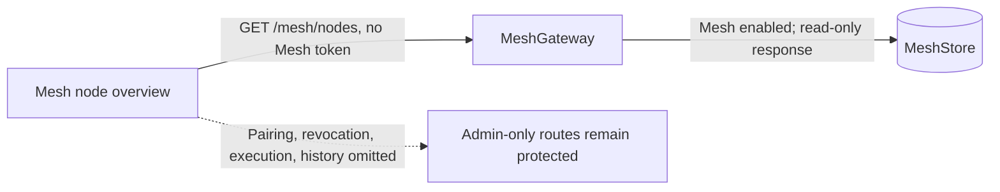

# Plan: 无凭据查看 Mesh 节点概况

## Architecture Impact

**Required** — 开放一个 Mesh HTTP 读取路由给无 Mesh 管理令牌的调用方，改变现有授权边界与公共 API 访问规则。配对、撤销、执行、请求历史及其他路由仍受管理员令牌保护；Mesh 未启用时仍返回 503。

## Expected change diagram

Archify Before / Delta / After comparison: [2026-10-04-mesh-node-overview.html](../architecture/changes/2026-10-04-mesh-node-overview.html). The comparison source is `docs/architecture/changes/2026-10-04-mesh-node-overview.candidate.json`, based on `04973dbb2c91213d7b123d729294dde03e5d8f40`.

## Implementation steps

1. In `services/local-ai-core/src/mesh/mesh-gateway.ts`, allow only `GET /nodes` to bypass the administrator authorization check, after the Mesh-enabled check.
2. In `packages/core-sdk/src/mesh.ts`, allow a credential-free read-only node-list call while preserving bearer authentication for existing administrative calls.
3. In `src/pages/Mesh/useMesh.ts` and `src/pages/Mesh/Devices.tsx`, remove the token gate and administrative sections; load and refresh node overview only, with loading/error/empty states.
4. Extend `tests/integration/mesh-auth.test.ts` to cover anonymous node listing, disabled Mesh, denied anonymous history and mutations, and continued administrator access.
5. Update `docs/architecture.md`, `docs/architecture/mesh.md`, `docs/architecture/system-architecture.json`, `docs/architecture/overview.md`, one semantic change record, and the README managed architecture block as required by `docs/architecture/maintenance.md`.

## Interface and data

No schema, stored data, WebSocket, or node protocol changes. The existing `GET /mesh/nodes` response and `MeshNode` contract remain unchanged. Only its authorization changes while Mesh is enabled. Every other route preserves its current authorization.

## Test and validation strategy

- RED/GREEN: add anonymous-node-read and protected-route assertions to `tests/integration/mesh-auth.test.ts`, observe the old behavior fail, implement the narrow route bypass, then confirm tests pass.
- Verify the affected integration test, `pnpm typecheck`, renderer build, backend build, and `pnpm lint:arch`.
- Inspect the UI through the available app entry if supported; otherwise record that live UI verification is blocked and verify renderer build plus route behavior.
- Review the final diff against this plan, verify all non-node routes remain protected, and record exact commands/results.

## Expected result

