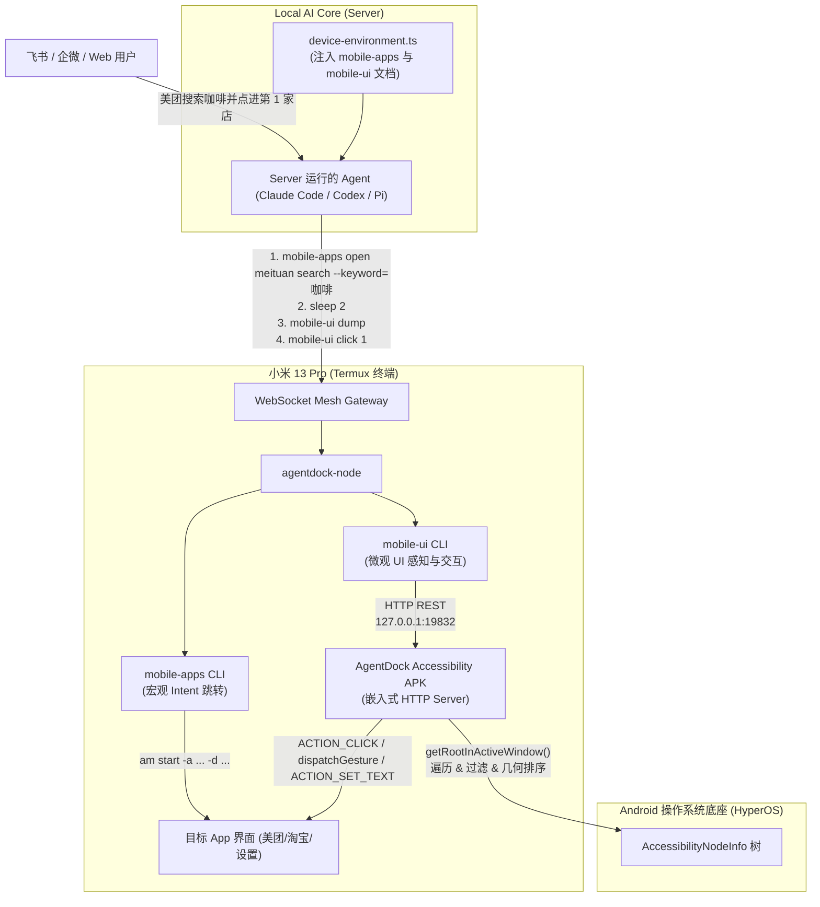

# Plan: 移动端页面内操作与免 ADB 无障碍桥接 (Mobile Accessibility Bridge)

## 1. 架构影响评估 (Architecture Impact)
- **结论**：`Architecture Impact: None`
- **理由**：该功能属于移动终端交互工具链与能力的平滑扩充（新增 `services/local-ai-core/src/mesh/mobile-ui/` 模块和 `mobile-ui` CLI 工具），不改变 Local AI Core 与 Electron 的核心进程边界、SQLite 数据库 Schema、ACP 协议交互流程或网络通信模型。

---

## 2. 方案架构与端到端交互拓扑 (Mermaid)

---

## 3. 实施顺序与关键里程碑

### Step 1: 声明数据契约与接口模型 (`types.ts`)
- 新建目录：`services/local-ai-core/src/mesh/mobile-ui/`
- 声明 `UIElement`、`UIDumpResult`、`UIStatusResult`、`ClickOptions`、`InputOptions`、`ScrollOptions` 等核心协议结构。

### Step 2: 实现与无障碍 Daemon 通信的客户端 (`client.ts`)
- 封装 `MobileUiClient` 类，管理 `http://127.0.0.1:19832` 基础 URL；
- 实现 `getStatus()`、`dump()`、`click()`、`input()`、`scroll()`、`action()`、`wait()`；
- 使用原生 `fetch` 与 `AbortSignal.timeout(3000)`，添加统一的错误分类、诊断与友好的故障自愈提示。

### Step 3: 实现 UI 紧凑文本排版格式化器 (`formatter.ts`)
- 将 `UIDumpResult` 格式化为大模型最容易理解、单行呈现、Token 最经济的紧凑格式；
- 打印设备信息、前台包名、序号 `[index]`、控件类型、主要文本/描述、控件 ID、中心坐标；
- 超长文本进行合理省略，多行文本压成单行。

### Step 4: 实现 CLI 命令行入口 (`cli.ts` & `bin/mobile-ui.mjs`)
- 实现 `runMobileUiCli()`，支持 `status`, `dump`, `click`, `input`, `scroll`, `back`, `home`, `wait` 参数解析与调度；
- 增加 `--json` 输出支持；
- 在 `bin/mobile-ui.mjs` 中提供可执行包装；
- 在根目录 `package.json` 的 `"bin"` 字段追加 `"mobile-ui": "bin/mobile-ui.mjs"`；
- 在 `services/local-ai-core/src/mesh/node-cli.ts` 增加 `agentdock-node ui <args>` 备用转发。

### Step 5: 云端透明代理与环境文档注入
- 更新 `services/local-ai-core/src/execution/remote-mesh/remote-mesh-backend.ts`：
  - 在 `provisionToolWrappers()` 中增加 `mobile-ui`，自动生成代理脚本至影子 `.bin` 目录。
- 更新 `services/local-ai-core/src/execution/remote-mesh/device-environment.ts`：
  - 在 `buildAndroidMobileInstructions()` 及 Prompt 模版中增加 `mobile-ui` 的命令用法、常见典型模式（“宏观跳转 -> sleep -> dump -> 序号点击/输入”）与注意事项。

### Step 6: 编写 Android Accessibility Bridge 规范与安装说明
- 在 `docs/operations/android-termux-mesh-guide.md` 中增加关于“页面内无障碍自动化桥接”的安装与系统授权指南（包括常驻通知、无限制电池策略与自启动配置）。

### Step 7: 自动化测试覆盖 (TDD)
- 新建 `tests/contracts/mobile-ui.test.ts`：
  - 使用内置 `node:http` 搭建本地 Mock A11y Server；
  - 测试全部 6 个 API 端点的请求拼装与响应解析；
  - 测试纯文本格式化输出的对齐与序号正确性；
  - 测试服务未启动或超时时的错误处理分支；
  - 验证 `device-environment.ts` 在 Android 平台成功注入 `mobile-ui` 提示。

### Step 8: 门禁检查与全量验证
- 运行 `pnpm typecheck`；
- 运行 `pnpm lint:gates` 验证圈复杂度 $\le 15$、无死代码、无循环引用；
- 运行 `pnpm test` 验证全量单测与 BDD 100% 通过。
