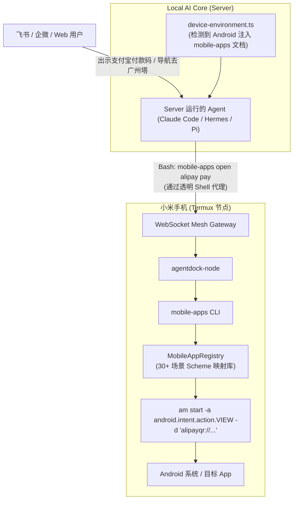

# Plan: 移动端常用 App 语义快捷指令库 (Mobile App Intent Library)

## 1. 架构影响评估 (Architecture Impact)
- **结论**：`Architecture Impact: None`
- **理由**：该功能属于工具能力库扩充（新增 `services/local-ai-core/src/mesh/mobile-apps/` 模块和 `mobile-apps` CLI），不改变 Local AI Core 与 Electron 的进程边界、数据库 Schema、ACP 协议交互流程或网络通信模型。

## 2. 方案架构与时序设计 (Mermaid)

## 3. 实施顺序与关键模块

### Step 1: 建立移动端意图注册表与组装引擎 (Registry & Builder)
- 新建目录：`services/local-ai-core/src/mesh/mobile-apps/`
- 文件 `types.ts`：声明 `MobileAppDefinition`、`MobileAppAction`、`IntentParams` 等核心契约。
- 文件 `definitions.ts`：维护 30+ 个高频应用场景（微信、支付宝、高德、百度、美团、淘宝、京东、网易云、B站、抖音、系统设置等）。
- 文件 `builder.ts`：实现 `buildAmStartCommand(appId, actionId, params, options)`，负责参数插值、URL 编码、转义安全处理及校验。

### Step 2: 实现 CLI 命令行入口 (`mobile-apps` & `agentdock-node-update`)
- 文件 `services/local-ai-core/src/mesh/mobile-apps/cli.ts`：实现参数解析，支持 `list`, `open`, `intent`, `--dry-run`。
- 文件 `bin/mobile-apps.mjs`：提供可以直接被 global npm 或终端调用的可执行包装脚本。
- 文件 `bin/agentdock-node-update.mjs`：提供异步脱离 Supervisor 自更新入口。
- 更新根目录 `package.json`：在 `"bin"` 字段追加 `"mobile-apps": "bin/mobile-apps.mjs"` 与 `"agentdock-node-update": "bin/agentdock-node-update.mjs"`。

### Step 3: 更新影子 Shell 与 Agent 提示词注入
- 更新 `services/local-ai-core/src/execution/remote-mesh/remote-mesh-backend.ts`：在准备影子目录 `.bin` 时，将 `mobile-apps` 和 `agentdock-node-update` 包装脚本软链接/生成至影子目录中，确保本地无论如何都能透明找到。
- 更新 `services/local-ai-core/src/execution/remote-mesh/device-environment.ts`：
  - 当 `node.platform === 'android'` 时，在 `buildDeviceClaudeMd` 与 `buildDeviceSystemPrompt` 中生成详细的移动端 App 快捷指令使用说明与场景样例，以及更新指令说明。

### Step 4: 编写测试用例 (TDD)
- 新增 `tests/contracts/mobile-apps-intent.test.ts`：
  - 校验所有预定义 App 的 Action 能正常生成合法的 `am start` 指令；
  - 验证必填参数校验（如地图导航必须有 destination，搜索必须有 keyword）；
  - 验证特殊字符注入防护（如包含引号、分号、管道符时的安全转义）；
  - 验证 `device-environment.ts` 在 Android 平台下能正确追加 `mobile-apps` 提示，而在 Darwin/Linux 平台下不会污染。

### Step 5: 验证门禁与真机端到端验收
- 运行 `pnpm test` 与 `pnpm lint:gates` 保证无复杂度超标、无死代码、无单测回归。
- 将打包后的脚本推送到小米真机实测（如 `mobile-apps open alipay pay --dry-run` 及真实唤起）。
