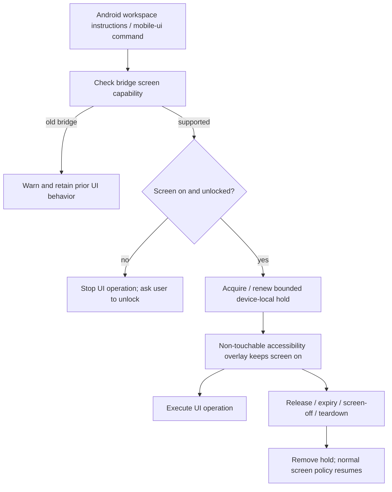

# Android automation screen keep-awake implementation plan

Status: Approved by user on 2026-10-04; implementation baseline. Date: 2026-10-04 (Asia/Shanghai).

## Classification / Baseline
Medium: bounded Android bridge feature with additive local protocol, CLI integration and local lifecycle state; no secure-unlock or credential handling.
Architecture Impact: Required — additive device-local screen-control protocol and lifecycle responsibility within the existing accessibility bridge. Read docs/architecture/maintenance.md before implementation (done). No new service/process/network boundary.
Base: origin/main 9e29e53d1d54396adc048b56c4207420776d3b45 after origin fetch.
Branch: codex/2026-10-04-mobile-screen-awake.
Worktree: isolated task checkout; preserve the host checkout.
Host workspace contains concurrent untracked Android sources and a modified mobile-ui client. Preserve all host files; import only reviewed required Java/resources/build source after approval. Recheck source drift before import and document its provenance. Exclude signing material/generated APK/store.

## Ordered Steps
1. Add smallest failing tests for screen lease acquire/renew/release/expiry and locked-state behavior. Use a pure Java lifecycle unit where feasible rather than source-text assertions; contract tests use HTTP mocks and meaningful behavioral assertions.
2. Import necessary bridge sources and add a focused device-local hold controller; wire bridge endpoint, main-thread dispatch, screen-off receiver, teardown and local release UI. Fail closed if overlay installation fails.
3. Add mobile-ui types, client support, validated CLI screen commands and automatic pre-operation refresh; preserve old bridge compatibility using explicit unsupported detection. Test against a real local HTTP fixture and run CLI calls with timings.
4. Update existing Android device-environment instructions and bridge operations guide plus README New note. Do not install skills globally or create executable skills in docs.
5. Synchronize current architecture facts, one semantic change record, affected typed specifications/provider outputs, overview and README managed diagram as required by maintenance policy. Read diagram-provider manifest; use existing Archify tooling. Expected plan diagram below remains design baseline; regenerate actual flow at delivery.
6. Run focused tests, TypeScript/build checks and pnpm lint:arch; independent subagent Spec Verifier + Cleaner review; fix validated findings and rerun affected checks.
7. Attempt APK build and formal CLI/API QA, then attached-device validation if available. Read review/QA/documentation-sync skill references at their respective steps. Record missing Android SDK or device access as BLOCKED. Before any commit/push, run pnpm verify as repository requires; user requested commit/push/PR on 2026-10-04; run the full gate before submission.

## API / State Changes
Additive /api/screen local bridge resource and mobile-ui screen commands. Device-local ephemeral lease; no database migration or global setting changes. 120s default, maximum 600s; explicit cleanup best effort with bounded idle fallback. No guaranteed immediate Core-run cleanup in this scope.

## Expected Flow

## Validation / Evidence
Contract tests: request ordering, unsupported versus genuine errors, locked guards, dry-run and invalid duration. Device controller tests: renewal, stale callbacks, idempotency, cleanup, overlay failure. True Android window effects require APK/device QA; HTTP mocks cannot establish them. Real CLI smoke measures elapsed time without arbitrary performance promises. True main path: other app stays interactive beyond configured 30s timeout, manual lock stops operations, release returns normal sleep behavior. Report each criterion with PASS/FAIL/BLOCKED and concrete commands. Relevant edge cases: long agent thinking pauses beyond lease, process death, repeated concurrent acquisition/release, OEM overlay restrictions, permission/service loss, screen-off during a request, and legacy APK.

## Architecture & Documentation Impact Analysis

Docs Impact: Required. Full diff includes the additive bridge protocol, Android lifecycle ownership and reviewed import of bridge source/build prerequisites. Updated current facts, one change record, provider matrix, L1 execution responsibility, dedicated L2 mobile-screen workflow, overview, README inline diagram/New note and bridge guide. L3 agent-run, ACP flow, scheduler and skill router retain their semantics; no run-completion callback is introduced. Worktree-local symlinks reuse existing node_modules and Archify tools without changing host/global installation. QA and environment limits are in the sibling QA document.

## Validated Review Fix

Independent review identified a High bug in the imported prerequisite: filtered dump renumbered nodes while click/input used unfiltered positions. Repair remains within bridge-source correctness: a pure Java NodeCatalog owns one sorted full-node index domain; filtering preserves assigned indices, and click/input use the same catalog. Filtered dumps may contain index gaps, documented in the device instructions and bridge guide. Java regression harness includes an empty container preceding an input/button and validates filtered/full selection identity. This does not add a new process or protocol endpoint. Android tests remain BLOCKED without JDK.
