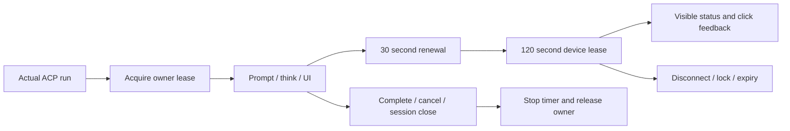

# Android screen session implementation plan

Approved: 2026-10-04. Complexity: complex, crossing ACP runtime, Mesh transport and Android UI lifecycle. Architecture Impact: Required, moving lease ownership from tool calls to ACP runs. Three independent planning reviews agreed on runPrompt try/finally, explicit cancellation hooks, independent owners and non-recreating renewal.

1. Android owner leases, renew API and visible overlay with truthful click feedback; pure Java regression tests.
2. CLI owner/renew commands; replace per-operation acquire with unlocked status validation; update focused contracts.
3. Independent runtime coordinator through existing executeMesh; start before prompt, serialized heartbeat, cancellation/close/finally cleanup and regression tests.
4. Update current architecture facts, workflow, L1 summary, README and one change record; deliver validated Archify canvas.
5. Independent review then fixes; build Android/Java/backend, formal CLI fixture, pnpm verify before updating existing PR.

Diagram: [session workflow](../architecture/changes/2026-10-04-mobile-screen-session.html).

Validation records will distinguish fixture tests from physical HyperOS verification; no APK deployment in this scope.
