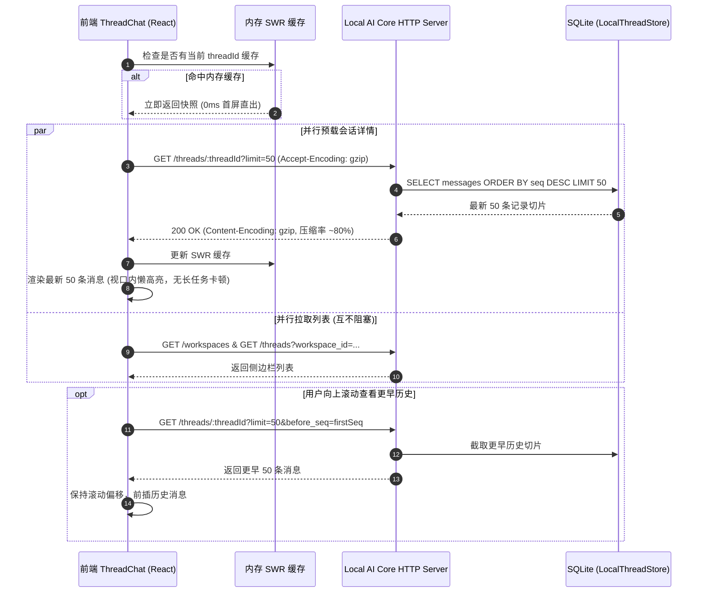

# Plan: 历史消息详情页面加载性能全链路优化

## 1. 架构影响分析（Architecture Impact Classification）

- **分类判定**：`Architecture Impact: None`
- **判定依据**：
  1. 系统的微服务与进程拓扑结构未发生变化（Electron 桌面端与 Local AI Core HTTP/WebSocket 守护进程边界不变）；
  2. 权限与安全信任边界、数据所有权和存储引擎（SQLite）不变；
  3. 属于局部性能治理：前端请求编排优化、HTTP 传输层压缩、REST API 可选分页参数扩展以及渲染管线按需懒渲染。
- **架构治理要求**：
  - 维持 `docs/architecture/` 规范与 `lint:arch` 门禁 100% 绿灯；
  - 变更记录记录为 `Docs Impact: None`。

---

## 2. 方案全景与时序图（Architecture & Sequence Diagram）

### 2.1 优化前后加载管线对比

```mermaid
flowchart TD
    subgraph Before ["优化前：多级串行瀑布流 + 全量拉取 + 同步全量渲染"]
        B1["URL 载入 (#/chat?project=...&session=...)"] --> B2["GET /runtime"]
        B2 --> B3["GET /workspaces"]
        B3 --> B4["遍历所有工作区串行 GET /threads?workspace_id=..."]
        B4 --> B5["等待全量列表就绪后触发 Effect"]
        B5 --> B6["GET /threads/:threadId (全量无压缩，可能高达数 MB)"]
        B6 --> B7["全量几百条消息一次性挂载 DOM + 同步代码高亮 (主线程冻结 2~5s)"]
    end

    subgraph After ["优化后：并行极速预载 + HTTP Gzip + 窗口分页 + 视口懒渲染"]
        A1["URL 载入 / 会话点击"] --> A_Fork{"并行发起请求"}
        A_Fork -->|立即预载会话详情| A2["GET /threads/:threadId?limit=50 (带 Gzip 压缩)"]
        A_Fork -->|并行获取列表| A3["GET /workspaces & 当前工作区列表"]
        A2 --> A4["命中/写入 SWR 内存缓存 (50ms 内首屏呈现)"]
        A4 --> A5["视口优先渲染 (仅高亮当前可见消息，旧消息懒加载)"]
        A5 --> A6["向上平滑滚动触发按需增量分页 (before_seq)"]
    end
```

### 2.2 核心执行时序图

---

## 3. 分阶段实施计划（Phased Execution Plan）

### 阶段 1：后端 HTTP Gzip 响应压缩支持
- **涉及文件**：
  - `services/local-ai-core/src/runtime/server-helpers.ts`
  - `services/local-ai-core/src/runtime/local-core-runtime-server.ts`
- **动作**：
  - 在 `json()` 和 `rawJson()` 中判断请求头 `req.headers['accept-encoding']` 是否包含 `gzip`；
  - 针对体积大于 1024 字节的 JSON 响应，使用 `node:zlib` 的 `gzipSync` 压缩输出，设置 `Content-Encoding: gzip`；
  - 编写集成测试验证 gzip 压缩响应的正确性与压缩比。

### 阶段 2：后端与契约支持窗口化分页查询
- **涉及文件**：
  - `packages/contracts/src/local-core.ts`
  - `packages/core-sdk/src/threads.ts`
  - `services/local-ai-core/src/acp/store/thread-store.ts`
  - `services/local-ai-core/src/runtime/handlers/thread-handler.ts`
- **动作**：
  - 在 `LocalThreadStore.get(threadId, selectedKnowledgeBaseIds, options?: { limit?: number; beforeSeq?: number })` 中，支持带 `LIMIT` 与 `seq < beforeSeq` 的切片查询；
  - 针对历史超大输出日志（如超过 32 KiB 的终端输出）做概要切片与保护；
  - 保持无分页参数调用 100% 向后兼容；
  - 补充单测与 API 测试。

### 阶段 3：前端请求解耦与并行预载（消除 Waterfall）
- **涉及文件**：
  - `src/pages/Threads/useThreadChatSessionBrowser.ts`
  - `src/pages/Threads/useThreadChatController.ts`
- **动作**：
  - 解除“必须先等待全部工作区和列表遍历完才触发详情”的串行依赖；
  - 在路由载入并获取到 `requestedThreadId` 时，立即发出 `loadActiveThread`，与侧边栏列表请求并发执行；
  - 建立前端 SWR 内存缓存映射（`threadDetailCache: Map<string, ThreadDetail>`），切换会话直接秒开。

### 阶段 4：前端视口懒渲染与语法高亮延迟优化
- **涉及文件**：
  - `src/pages/Threads/ThreadChatMessage.tsx`
  - `src/components/chat/ChatMarkdown.tsx`
- **动作**：
  - 优化 `HighlightedMarkdown` 与 `ChatMarkdown`：对大量历史消息中的代码块支持懒执行或视口判定，防止首屏同时运行上百次 `highlight.js` 正则引擎；
  - 针对长列表提供平滑的向上加载更多按钮或触顶滚动加载。

### 阶段 5：验证与验收
- **动作**：
  - 运行 `pnpm typecheck`；
  - 运行 `pnpm test` 与相关集成测试；
  - 运行 `pnpm lint:gates` 与 `pnpm lint:arch`；
  - 对比优化前后的网络传输体积、首包请求时间与主线程阻塞时间。
