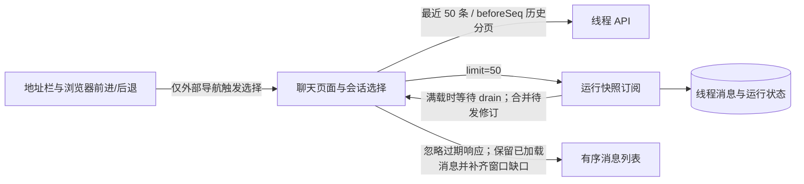

# 会话详情闪烁修复计划

状态：2026-10-31 用户批准。Architecture Impact: Required：订阅接口增加可选历史窗口，旧客户端保留完整快照语义。

```mermaid
flowchart LR
 UI[聊天页面与会话选择] -->|最近 50 条 / beforeSeq 历史分页| API[线程 API]
 UI -->|limit=50| SSE[运行快照订阅]
 SSE --> DB[(线程消息与运行状态)]
 SSE -->|满载时等待 drain；合并待发修订| UI
 UI -->|忽略过期响应；保留已加载消息并补齐窗口缺口| M[有序消息列表]
 URL[地址栏与浏览器前进/后退] -->|仅外部导航触发选择| UI
```

先建立分页、历史合并、背压和快速切换回归；实现后同步架构规范和变更记录，进行独立审查，运行相关验证并尝试真实入口 QA。线上数据不修改。
