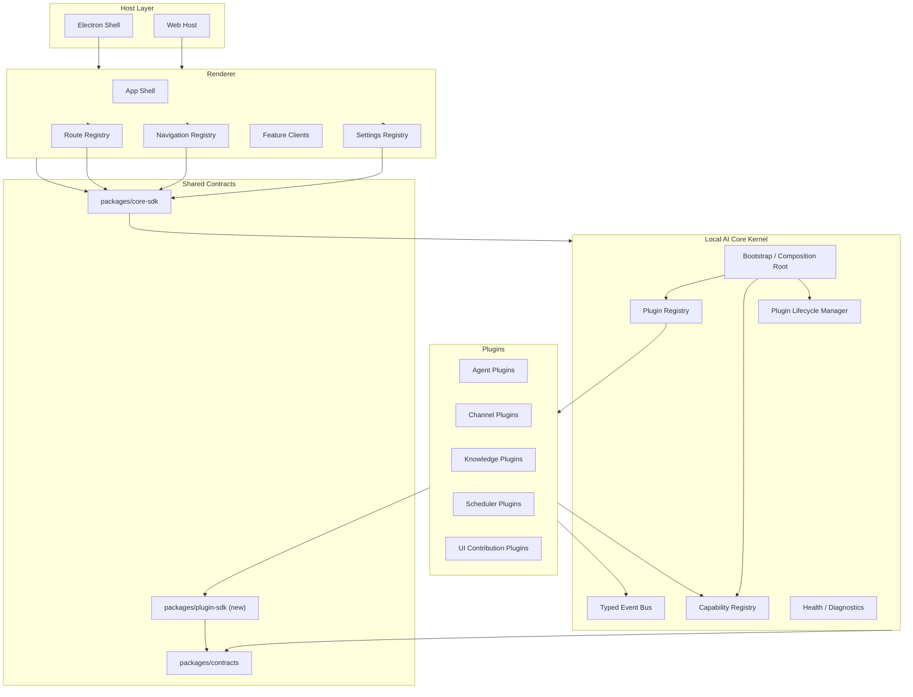
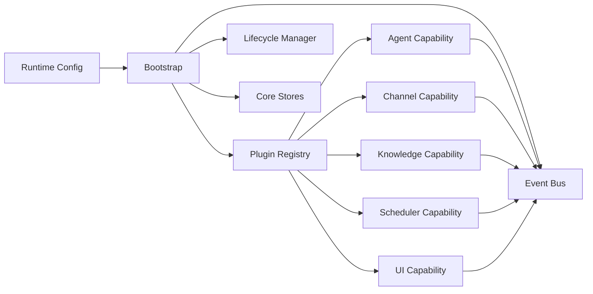
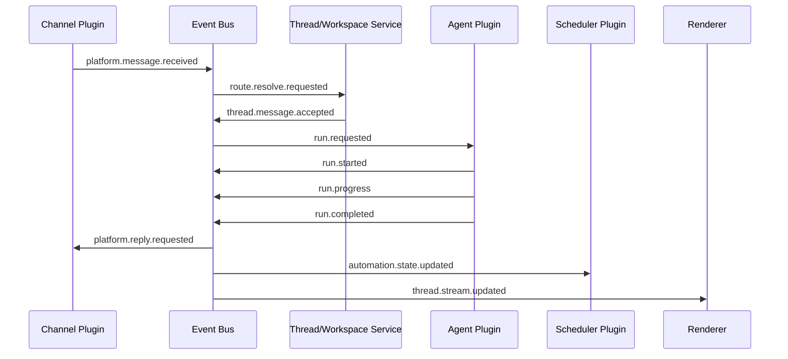
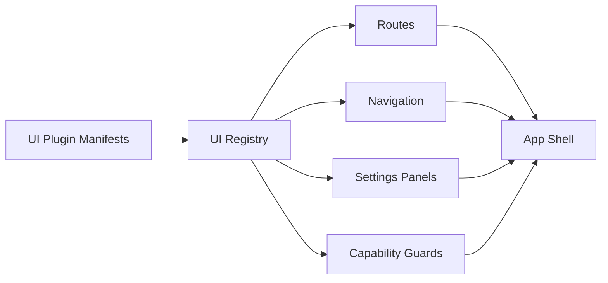

# Pluggable Target Architecture

## Goal

Make every major module pluggable at the architecture level, not just replaceable by editing core code.

The target state is:

- `services/local-ai-core` becomes a small kernel
- all business capabilities are provided through plugin registration
- renderer navigation, routes, settings panels, and feature switches are driven by plugin manifests
- Electron becomes only a host/runtime launcher
- packages under `packages/` define stable contracts, not concrete business bindings

## Design Principles

- Kernel depends only on contracts, registries, and lifecycle hooks
- Plugins declare capabilities instead of patching core code
- All cross-module collaboration goes through typed events or registered feature interfaces
- UI contribution is declarative
- A failed plugin should degrade its own capability, not crash the whole runtime

## Top-Level Target



## Layer Responsibilities

### 1. Host Layer

`electron/` and future web hosts only do:

- process lifecycle
- local core bootstrap
- native permission boundary
- preload or host-specific bridges

They do not own:

- chat orchestration
- platform routing
- scheduler rules
- feature composition

### 2. Kernel Layer

The kernel is the only always-on core. It owns:

- plugin loading
- lifecycle management
- capability registration
- typed event bus
- health reporting
- persistence primitives
- authentication and permission boundary primitives

The kernel does not know concrete implementations like Lark, ai-vector, or opencode.

### 3. Plugin Layer

Business modules are plugins:

- agent runtime plugins
- inbound/outbound channel plugins
- knowledge provider plugins
- scheduler trigger and delivery plugins
- renderer UI contribution plugins

Each plugin can contribute one or more capabilities and optional UI metadata.

### 4. Renderer Layer

The renderer becomes a shell that renders contributions:

- routes
- nav items
- settings sections
- feature pages
- capability-specific action panels

The renderer should not hardcode module existence through boolean helpers.

## Kernel Internals



Recommended kernel modules:

- `kernel/bootstrap.ts`
- `kernel/plugin-registry.ts`
- `kernel/capability-registry.ts`
- `kernel/event-bus.ts`
- `kernel/lifecycle-manager.ts`
- `kernel/diagnostics.ts`

## Plugin Model

### Manifest

Every plugin should expose a manifest similar to:

```ts
export interface PluginManifest {
  id: string;
  kind: 'agent' | 'channel' | 'knowledge' | 'scheduler' | 'ui' | 'composite';
  version: string;
  dependsOn?: string[];
  provides: string[];
  contributes?: {
    routes?: UiRouteContribution[];
    navItems?: UiNavContribution[];
    settingsPanels?: UiSettingsContribution[];
    commands?: CommandContribution[];
  };
}
```

### Runtime Factory

```ts
export interface RuntimePlugin {
  manifest: PluginManifest;
  init(ctx: PluginContext): Promise<void>;
  start?(): Promise<void>;
  stop?(): Promise<void>;
  healthCheck?(): Promise<PluginHealth>;
}
```

### Plugin Context

```ts
export interface PluginContext {
  bus: EventBus;
  capabilities: CapabilityRegistry;
  stores: CoreStores;
  logger: Logger;
  config: ConfigReader;
}
```

## Capability Model

Current code mixes capabilities with concrete implementations. The target is explicit interfaces.

### Agent Capability

```ts
export interface AgentRuntime {
  agentType: string;
  supportsWorkspace(workspace: WorkspaceConfig): boolean;
  createSession(input: CreateSessionInput): Promise<AgentSession>;
  sendMessage(input: SendMessageInput): Promise<RunHandle>;
  interruptRun(runId: string): Promise<void>;
}
```

### Channel Capability

```ts
export interface ChannelPlugin {
  platform: string;
  startBindings(): Promise<void>;
  stopBindings(): Promise<void>;
  sendMessage(route: ChannelRoute, payload: OutboundMessage): Promise<ChannelMessageRef>;
  parseInbound(event: unknown): Promise<InboundMessage | null>;
}
```

### Knowledge Capability

```ts
export interface KnowledgePlugin {
  sourceType: string;
  listSources(): Promise<KnowledgeSource[]>;
  search(input: KnowledgeSearchInput): Promise<KnowledgeSearchResult[]>;
  attachToThread(threadId: string, knowledgeBaseIds: string[]): Promise<void>;
}
```

### Scheduler Capability

```ts
export interface SchedulerPlugin {
  triggerType: 'cron' | 'once' | string;
  supports(job: ScheduledJob): boolean;
  execute(job: ScheduledJob): Promise<ScheduledJobRun>;
}
```

### UI Contribution Capability

```ts
export interface UiContributionPlugin {
  getRoutes(): UiRouteContribution[];
  getNavItems(): UiNavContribution[];
  getSettingsPanels(): UiSettingsContribution[];
}
```

## Event-Driven Collaboration

Instead of direct calls between modules, use typed domain events.



Recommended core events:

- `platform.message.received`
- `platform.user.paired`
- `thread.created`
- `thread.message.accepted`
- `run.requested`
- `run.started`
- `run.progress`
- `run.awaiting_permission`
- `run.completed`
- `run.failed`
- `knowledge.attached`
- `scheduler.job.created`
- `scheduler.job.triggered`

## Renderer Contribution Model

Current renderer still hardcodes routes and nav. Target model:



Example route contribution:

```ts
type UiRouteContribution = {
  id: string;
  path: string;
  feature: string;
  component: React.ComponentType;
  requires?: string[];
};
```

Example nav contribution:

```ts
type UiNavContribution = {
  id: string;
  labelKey: string;
  path: string;
  icon: string;
  order: number;
  requires?: string[];
};
```

## Target Repository Shape

Suggested target structure:

```text
docs/
electron/
packages/
  contracts/
  core-sdk/
  plugin-sdk/
services/
  local-ai-core/
    src/
      kernel/
      app/
      features/
      plugins/
        agents/
        channels/
        knowledge/
        scheduler/
        ui/
src/
  shell/
  registry/
  features/
  plugins/
shared/
```

Notes:

- `kernel/` is framework-like and stable
- `features/` holds orchestration services that use capabilities
- `plugins/` holds concrete implementations
- renderer `src/features/` renders feature contributions, not hardcoded modules

## Mapping From Current Code

### Current to Target

- `services/local-ai-core/src/runtime/local-core-controller.ts`
  Move from god-object composition to bootstrap plus registries
- `services/local-ai-core/src/router/workspace-router.ts`
  Keep as an orchestration service, but remove hardcoded agent/channel capability lists
- `services/local-ai-core/src/gateway/local-core-lark-gateway.ts`
  Convert into a `ChannelPlugin`
- `packages/knowledge-api/src/ai-vector-provider.ts`
  Convert into a `KnowledgePlugin`
- `services/local-ai-core/src/scheduler/lark-schedule-adapter.ts`
  Convert into a `SchedulerPlugin`
- `src/App.tsx`
  Replace hardcoded routes with route contributions
- `src/components/Layout/Sidebar.tsx`
  Replace hardcoded nav list with nav contributions
- `src/app/runtime.ts`
  Replace boolean feature switches with runtime capability snapshot

## Capability Snapshot API

Renderer should fetch a runtime snapshot like:

```ts
export interface RuntimeCapabilitySnapshot {
  providers: {
    runtime: 'electron' | 'local_core' | 'web';
  };
  features: string[];
  routes: Array<{
    id: string;
    path: string;
    feature: string;
  }>;
  navItems: Array<{
    id: string;
    path: string;
    labelKey: string;
    icon: string;
    order: number;
  }>;
  settingsPanels: Array<{
    id: string;
    titleKey: string;
    feature: string;
    order: number;
  }>;
}
```

This replaces front-end helpers that currently return fixed booleans.

## Suggested Initial Plugins

### Core Runtime Plugins

- `agent-opencode`
- `agent-claudecode`
- `agent-localcore-acp`
- `channel-lark`
- `knowledge-ai-vector`
- `scheduler-cron`
- `ui-workspace`
- `ui-chat`
- `ui-knowledge`
- `ui-system`

### Future Plugins

- `channel-slack`
- `channel-discord`
- `knowledge-local-fs`
- `knowledge-notion`
- `scheduler-webhook`
- `ui-admin`

## Phased Migration

### Phase 1: Composition Root

- create plugin manifest and plugin context types
- introduce registry and lifecycle manager
- keep existing implementations, but register them through bootstrap

### Phase 2: Capability Extraction

- turn Lark, ai-vector, scheduler adapter, and agent runtimes into plugins
- remove hardcoded capability arrays from router and controller

### Phase 3: Renderer Contributions

- replace `src/App.tsx` hardcoded routes with route registry
- replace sidebar hardcoded items with nav registry
- replace `src/app/runtime.ts` boolean flags with capability snapshot

### Phase 4: Event Bus

- replace direct cross-module callbacks with typed events
- keep orchestration in services, keep plugins isolated

### Phase 5: Isolation and Health

- add per-plugin health checks
- add plugin-scoped config schema
- add failure isolation and diagnostics UI

## Non-Goals

These do not need to happen in the first refactor:

- dynamic remote plugin download
- sandboxing each plugin in its own process
- marketplace packaging
- full hot-reload of runtime plugins

Static registration with clean contracts is enough to unlock most extensibility value.

## Definition of Done

The architecture is truly pluggable when:

- adding a new channel does not require editing kernel code
- adding a new knowledge source does not require editing router code
- adding a new feature page does not require editing `src/App.tsx`
- adding a new nav item does not require editing `Sidebar.tsx`
- the runtime can report installed capabilities from plugin manifests
- disabling one plugin removes only its own capabilities

